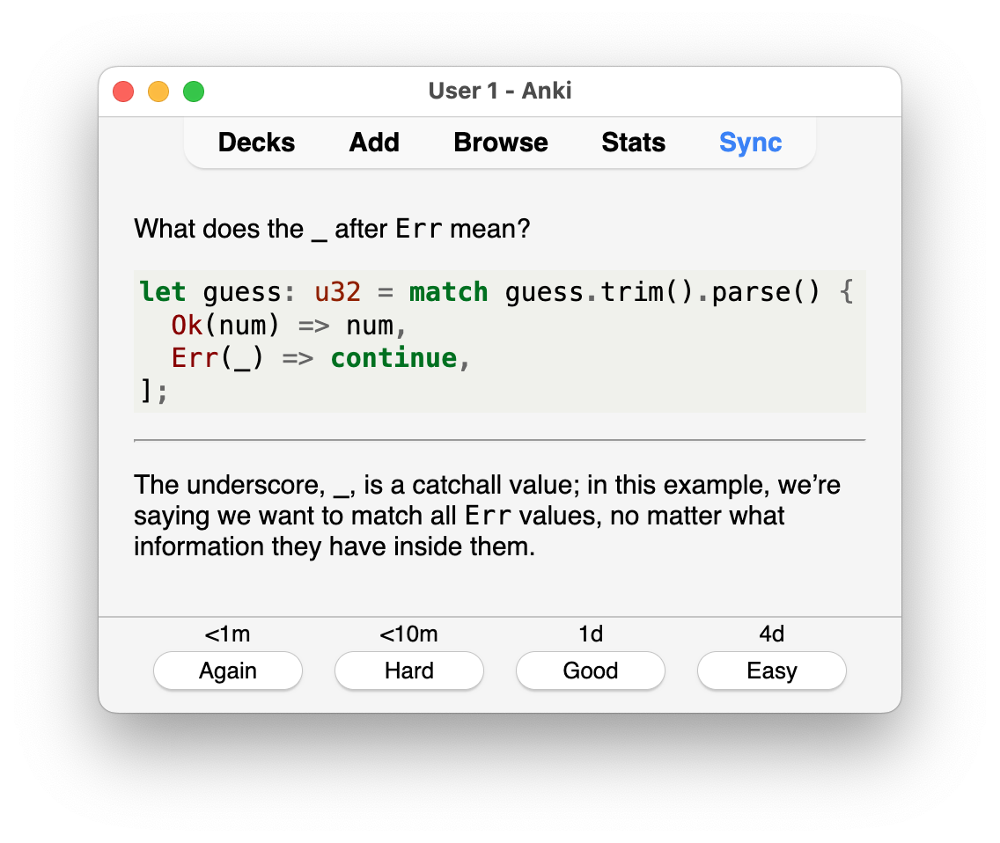

# Rust Flashcards

Over 550 flashcards to learn [Rust] from first principles.

 

The cards are written in markdown and based on the official [Rust Book].

Either get the [Anki] deck directly from
[AnkiWeb - Rust Flashcards](https://ankiweb.net/shared/info/1541471942)
or download the latest version from the
[releases page](https://github.com/ad-si/Rust-Flashcards/releases).

Credit to [u/WebDev193](https://www.reddit.com/user/WebDev193/) for doing the
[initial grunt work](https://ankiweb.net/shared/info/2045782265).

## Development

Run `nix develop` to enter the development environment
with [Anki Panky] and [Pandoc] installed.

Then run following [makefile](./makefile) targets to build the artifacts:

- `make cards.apkg` to generate the [Anki] deck
- `make cards.pdf` to generate the PDF file

[Anki Panky]: https://github.com/kamalsacranie/anki-panky
[Anki]: https://apps.ankiweb.net
[Pandoc]: https://pandoc.org
[Rust Book]: https://doc.rust-lang.org/book/
[Rust]: https://www.rust-lang.org
