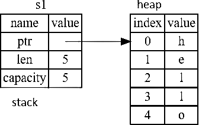
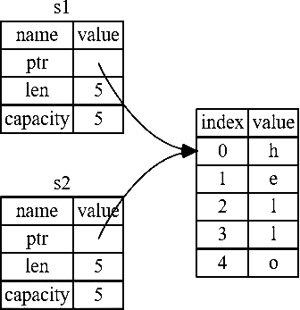
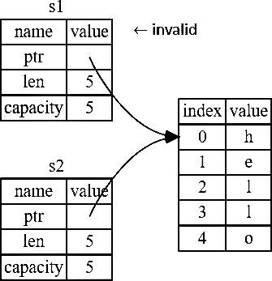
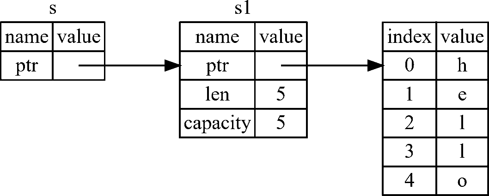
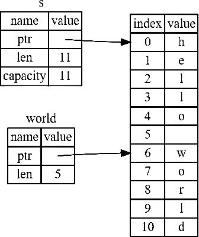
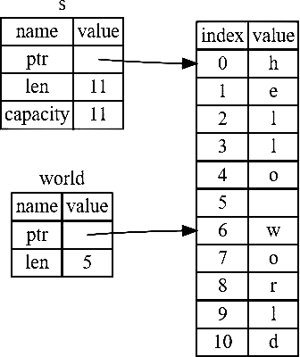

---

How do you create a new package named `hello_world`?

. . .

```sh
cargo new hello_world
```

---

What's the command to run a package?

. . .

```sh
cargo run
```

---

What is the command to build a project without producing a binary to **check
for errors**?

. . .

```sh
cargo check
```

---

How do we include the input/output functionality from the standard library?

. . .

```rust
use std::io;
```

---

Which command can you use to build documentation provided by all of your
dependencies locally and open it in your browser?

. . .

```sh
cargo doc --open
```

---

How do you create an infinite loop?

. . .

```rust
loop {
  …
}
```

---

How do you exit a loop forcibly?

. . .

`break;`

---

What does the `_` after `Err` mean?

```rust
let guess: u32 = match guess.trim().parse() {
  Ok(num) => num,
  Err(_) => continue,
];
```

. . .

The underscore, `_`, is a catchall value; in this example,
we're saying we want to match all `Err` values,
no matter what information they have inside them.

---

What's the command to tell the program to go to the next iteration of the loop?

. . .

```rust
continue;
```

---

How do you make a new variable **shadow** the first?

. . .

You can declare a new variable with the same name as a previous variable.
Rustaceans say that the first variable is shadowed by the second, which means
that the second variable is what the compiler will see when you use the name of
the variable.

---

What is the possible bit range of integers?

. . .

8 to 128 bit

| Length | Signed | Unsigned |
|--------|--------|----------|
| 8-bit  | `i8`   | `u8`     |
| 16-bit | `i16`  | `u16`    |
| 32-bit | `i32`  | `u32`    |
| 64-bit | `i64`  | `u64`    |
| 128-bit| `i128` | `u128`   |
| arch   | `isize`| `usize`  |

---

In this table of integer types, what do the `isize` or `usize` variants (in the
arch row) stand for?

| Length | Signed | Unsigned |
|--------|--------|----------|
| 8-bit  | `i8`   | `u8`     |
| 16-bit | `i16`  | `u16`    |
| 32-bit | `i32`  | `u32`    |
| 64-bit | `i64`  | `u64`    |
| 128-bit| `i128` | `u128`   |
| arch   | `isize`| `usize`  |

. . .

Architecture. The `isize` and `usize` types depend on the architecture of the
computer your program is running on, which is denoted in the table as "arch":
64 bits if you're on a 64-bit architecture and 32 bits if you're on a 32-bit
architecture.

---

What's the integer type variant that gets the size of the bits of the
architecture the program is running on?

(64 bits if you're on a 64-bit architecture and 32 bits if you're on a 32-bit
architecture)

. . .

The variant with 'size' after its integer type (signed or unsigned,
respectively).

| Length | Signed | Unsigned |
|--------|--------|----------|
| arch   | `isize`| `usize`  |

---

How do you create a signed integer with 128 bits named `hello_world`?

. . .

`let hello_world: i128;`

---

How do you create an unsigned integer with 128 bits named `hello_world`?

. . .

`let hello_world: u128;`

---

What is the range of numbers that can be stored using signed two's complement
representation (as a function of $n$)?

. . .

Each signed variant can store numbers from $[(-2^{n-1}), (2^{n-1}-1)]$.

---

What is the range of numbers that can be stored using unsigned two's complement
representation (as a function of $n$)?

. . .

Each unsigned variant can store numbers from $0$ to $2^{n}-1$.

---

What is the range of number that an `i8` signed integer can store?

. . .

It can store numbers from $-128$ to $127$.

---

What is the range of number that a `u8` unsigned integer can store?

. . .

It can store numbers from $0$ to $255$.

---

How to write a **number literal** that is an 8 bit unsigned integer
with the value `57`?

. . .

Simply by adding to the literal a type suffix, like so: `57u8`

---

How do you write a hexadecimal literal?

. . .

`0` and the number separated by `x`

For example:

```rust
assert_eq!(0x2A, 42);
```

---

How can you make decimal literals more readable?

. . .

Using `_` as the thousands separator.

For example:

```rust
let x = 28_222;
```

---

How do you make an octal base number literal?

. . .

`0` and the number separated by an `o`

For example:

```rust
assert_eq!(0o77, 63);
```

---

How do you write a binary literal?

. . .

`0` and the number separated by `b`

For example:

```rust
assert_eq!(0b101, 5);
```

---

What's the only integer type suitable for Byte representation?

. . .

`u8` (e.g. `b'A'`)

---

How do you represent a Byte literal?

. . .

`b`, and then its ASCII char (`0`-`255`) enclosed by single quotes.

For example:

```rust
b'A'
```

---

What is the primary situation in which you'd use `isize` or `usize`?

| Length | Signed | Unsigned |
|--------|--------|----------|
| 8-bit  | `i8`   | `u8`     |
| 16-bit | `i16`  | `u16`    |
| 32-bit | `i32`  | `u32`    |
| 64-bit | `i64`  | `u64`    |
| 128-bit| `i128` | `u128`   |
| arch   | `isize`| `usize`  |

. . .

When indexing some sort of collection.

---

How to write an unsigned floating point literal?

. . .

You can't. All floating-point types are signed.

---

What's the default floating point type?

. . .

`f64`

Reason:
It's roughly the same speed as `f32` but capable of more precision.

```rust
fn main() {
  let x = 2.0; // f64
  let y: f32 = 3.0; // f32
}
```

---

What's the precision degree of `f64`?

. . .

Double precision

`f32` is single precision and both are represented
according to the [IEEE-754](https://en.wikipedia.org/wiki/IEEE_754) standard.

---

How do you define a boolean and how much space in memory does it occupy?

. . .

Booleans are one byte in size.
The Boolean type in Rust is specified using `bool`.

```rust
fn main() {
  let t = true;
  let f: bool = false; // With explicit type annotation
}
```

---

How much space in memory does a char occupy?

. . .

Rust's char type is **four bytes in size** and represents a Unicode Scalar
Value, which means it can represent a lot more than just ASCII.

```rust
fn main() {
  let c = 'z';
  let z: char = 'Z'; // With explicit type annotation
  let heart_eyed_cat = '\u{1F63B}';
}
```

---

What's the difference between how to define strings
and how to define char literals?

. . .

We specify char literals with **single quotes**, as opposed to string literals,
which use **double quotes**.

```rust
fn main() {
  let c = 'z';
  let z: char = 'Z'; // With explicit type annotation
  let heart_eyed_cat = '\u{1F63B}';
}
```

---

What are compound types?

. . .

Compound types can group multiple values into one type.

---

What primitive compound types does Rust have?

. . .

Rust has 2 primitive compound types:

- Tuples:

    ```rust
    fn main() {
      let tup: (i32, f64, u8) = (500, 6.4, 1);
    }
    ```

- Arrays:

    ```rust
    fn main() {
      let arr: [u32; 10] = [1, 2, 3, 4, 5, 6, 7, 8, 9, 10];
    }
    ```

---

How can you create a tuple?

. . .

A tuple is created by writing a comma-separated list of values
inside parentheses:

```rust
fn main() {
  let tup: (i32, f64, u8) = (500, 6.4, 1);
}
```

---

How can we get the individual values out of a tuple? (2 ways)

. . .

- Destructuring via pattern matching:

    ```rust
    fn main() {
      let tup = (500, 6.4, 1);
      let (x, y, z) = tup;
      println!("The value of y is: {y}");
    }
    ```

- Dot notation with indexes:

    ```rust
    fn main() {
      let x: (i32, f64, u8) = (500, 6.4, 1);
      let five_hundred = x.0;
      let six_point_four = x.1;
      let one = x.2;
    }
    ```

---

What's the name of a tuple without any value?
When does it come up?

. . .

The tuple without any values has the special name **"unit"**.
This value and its corresponding type are both written `()`
and represent an empty value or an empty return type.

Expressions implicitly return the unit value
if they don't return any other value.

---

What can we say about the size of arrays?

. . .

Unlike arrays in some other languages, arrays in Rust have a fixed length.

```rust
fn main() {
  let a = [1, 2, 3, 4, 5];
}
```

---

Name 2 good uses of arrays

. . .

Arrays are useful in the following situations:

- When you want your data allocated **on the stack** rather than the heap.
- When you want to ensure you always have a **fixed number of elements**.

---

What can we say about arrays in relation to vectors?

. . .

- Arrays aren't as flexible as vectors
- A vector **is** allowed to **grow or shrink in size**
- Vectors are collection type provided by the standard library

If you're unsure whether to use an array or a vector,
chances are you should use a vector.

---

Name 2 ways to initialize an array.

. . .

- Define each element individually:

    ```rust
    let a: [i32; 5] = [1, 2, 3, 4, 5];
    ```

- Define them all at once:

    ```rust
    let a = [3; 5];
    ```

    Which is same as:

    ```rust
    let a = [3, 3, 3, 3, 3];
    ```

---

What's the difference between statements and expressions?

. . .

Statements are instructions that perform some action and do not return a value.
Expressions evaluate to a resulting value.

---

What's the difference between arguments and parameters?

. . .

Parameters are the variable definitions in the top area of the function,
arguments are the **concrete values**

---

Statement or expression?

Creating a variable and assigning a value to it with the `let` keyword.

```rust
fn main() {
  let y = 6;
}
```

. . .

Statement

---

Statement or expression?

Function definitions

. . .

Statement

```rust
fn main() {
  let y = 6;
}
```

---

Statement or expression?

Calling a function

. . .

Expression

---

Statement or expression?

Calling a macro

. . .

Expression

---

Statement or expression?

A new scope block created with curly brackets

. . .

Expression

For example:

```rust
fn main() {
  let y = {
    let x = 3;
    x + 1
  };

  println!("The value of y is: {y}");
}
```

`y = 4`, in this case

---

```rust
fn main() {
  let y = {
    let x = 3;
    x + 1
  };

  println!("The value of y is: {y}");
}
```

Why doesn't `x + 1` have a semicolon at the end?

. . .

It is an expression and not a statement.
Expressions do not include ending semicolons.
If you add a semicolon to the end of an expression, you turn it
into a statement, and it will then not return a value.

---

How do we declare a function's type?

. . .

With an arrow:

```rust
fn five() -> i32 {
  5
}
```

---

Statement or expression?

```rust
if … { … } else { … }
```

. . .

Expression.

Because `if` is an expression, we can use it on the right side of a `let`
statement to assign the outcome to a variable:

```rust
fn main() {
  let condition = true;
  let number = if condition { 5 } else { 6 };

  println!("The value of number is: {number}");
}
```

---

What does `continue;` in a loop do?

. . .

It makes the program skip over any remaining code in this iteration of the loop
and go to the next iteration.

---

Inside a loop, how can you return a value OUT of the loop
so you can use it after the `break;` expression
you use to stop the loop?

. . .

One can simply add the desired expression to be returned after the break:

```rust
fn main() {
  let mut counter = 0;

  let result = loop {
    counter += 1;
    if counter == 10 {
      break counter * 2;
    }
  }

  println!("The result is {result}");
}
```

---

If you have loops within loops, how can you break / continue a specific loop
instead of the innermost loop?

. . .

With **loop labels**.
Loop labels must begin with a single quote.

```rust
fn main() {
  let mut count = 0;
  'counting_up: loop {
    println!("Count = {}", count);
    let mut remaining = 10;
    loop {
      println!("Remaining = {}", remaining);
      if remaining == 9 {
        break;
      }
      if count == 2 {
        break 'counting_up;
      }
      remaining -= 1;
    }
    count += 1;
  }
  println!("End count = {}", count);
}
```

---

We want to use `while` to loop the program three times,
counting down each time, and then, after the loop,
print a message and exit.
Fill out the black blank.

```rust
fn main() {
  let mut number = 3;

  ########## {
    println!("{number}!");
    number -= 1;
  }

  println!("LIFTOFF !!!");
}
```

. . .

```rust
while number != 0
```

---

```rust
fn main() {
  let arr = [10, 20, 30, 40, 50];
  let mut index = 0;
  while index < 5 {
    println!("The value is: {}", arr[index]);
    index += 1;
  }
}
```

Looping through a collection like this is a bad idea.
Give 2 reasons why.

. . .

- It's error prone
- It's slow (due to bound checking)

**Detailed Explanation:**

It's error prone because it could cause the program to panic if the index
value or test condition are incorrect.
For example, if you changed the definition of the a array to have four
elements but forgot to update the condition to while `index < 4`, the code
would panic.

It's slow because the compiler adds runtime code to perform the conditional
check of whether the index is within the bounds of the array on every iteration
through the loop.

---

```rust
fn main() {
  let arr = [10, 20, 30, 40, 50];
  let mut index = 0;
  while index < 5 {
    println!("The value is: {}", arr[index]);
    index += 1;
  }
}
```

What is a better and more concise alternative to loop over the array?

. . .

To use a `for` loop:

```rust
fn main() {
  let arr = [10, 20, 30, 40, 50];

  for element in arr {
    println!("The value is: {}", element);
  }
}
```

The safety and conciseness of `for` loops
make them the most commonly used loop construct in Rust.

---

Even in situations in which you want to run some code a certain number of times,
as in the countdown example that used a `while` loop,
most Rustaceans would use a `for` loop.

```rust
fn main() {
  let mut number = 3;
  while number != 0 {
    println!("number: {}" number);
    number -= 1;
  }
  println!("LIFTOFF !!!");
}
```

How would you do this with a `for` loop instead?

. . .

Using a **Range**, provided by the standard library:

```rust
fn main() {
  for number in (1..4).rev() {
    println!("number: {}", number);
  }
  println!("LIFTOFF !!!");
}
```

---

What are the 3 rules of ownership?

. . .

- Each value in Rust has an owner.
- There can only be one owner at a time.
- When the owner goes out of scope, the value will be dropped.

---

Why is a string literal not the best fit for some things?

. . .

String literals are convenient,
but they aren't suitable for every situation in which we may want to use text.

- One reason is that they're immutable.
- Another is that not every string value can be known when we write our code.

For example, what if we want to take user input and store it?
For these situations, Rust has a second string type, `String`.

---

What is the difference between the `String` type and the `string` literal?

. . .

The `String` type manages data allocated **on the heap** and as such is able to
store an amount of text that is **unknown to us** at compile time.

```rust
let mut greet = String::from("Hello");
greet.push_str(", world!"); // Appends a literal to a String
println!("{}", greet); // Prints "Hello, world!"
```

---

With a `String` type, besides the contents of the string,
which data are created and where are they stored?

. . .

A String is made up of three parts (shown on the left): \

- Pointer to the memory that holds the contents of the string
- Length
- Capacity

This group of data is stored on the stack.
On the right is the memory on the heap that holds the contents.



---

```rust
let s1 = String::from("Hello");
let s2 = s1;
```

What happens in terms of the heap and stack
when we assign `s1` to `s2` in line 2?

. . .

The String data is copied, meaning we copy:

- Pointer
- Length
- Capacity

that are on the stack.

We **do not** copy the data on the heap that the pointer refers to.



---

```rust
let s1 = String:from("Hello");
let s2 = s1;

println!("{}, world!", s1);
```

What happens to `s1` in this case?

. . .

Compile-time error!

In this example, we would say that `s1` was moved into `s2`,
as Rust considers `s1` as no longer valid.

Because Rust invalidates the first variable,
instead of calling it a shallow copy, it's known as a move.
So what actually happens is shown here:



---

```rust
let s2 = s1.clone();
```

What could be a red flag?

. . .

This works just fine and explicitly produces the behavior where
**the heap data does get copied**.

And yet, when you see a call to clone, you know that some arbitrary code is
being executed and **that code may be expensive**.
It's a visual indicator that something different is going on.

---

How do you reference an object?

. . .

With an ampersand:

```rust
fn main() {
  let s1 = String::from("Hello");
  let len = calculate_length(&s1);
  println!("The length of '{}' is {}", s1, len);
}

fn calculate_length(s: &String) -> usize {
  s.len()
}
```

These ampersands represent references,
and they allow you to refer to some value without taking ownership of it.

---

What is one guarantee that a reference has and a conventional pointer doesn't?

. . .

Unlike a pointer, a reference is guaranteed to point to a valid value of a
particular type for the life of that reference.



---

How do we call the action of **creating a reference**?

. . .

Borrowing

---

What is not possible **by default** when borrowing?

. . .

Mutating.

Just as variables are immutable by default, so are references.
We're not allowed to modify something we have a reference to.

---

```rust
fn main() {
  let s = String::from("Hello");
  change(&s);
}

fn change(some_string: &String) {
  some_string.push_str(", world");
}
```

How can you make this reference mutable?

. . .

Put `&mut s` as parameter instead of `&s` and `&mut String` as parameter type
instead of `&String`.

```rust
fn main() {
  let mut s = String::from("Hello");
  change(&mut s);
}

fn change(some_string: &mut String) {
  some_string.push_str(", world");
}
```

---

What's the restrictions that mutable references have?

. . .

If you have a mutable reference to a value, you can have no other
(mutable or otherwise) references to that value.

This will fail, for example:

```rust
let mut s = String::from("Hello");

let r1 = &mut s;
let r2 = &mut s;

println!("{}, {}", r1, r2);
```

This as well:

```rust
let mut s = String::from("Hello");

let r1 = &s; // No problem
let r2 = &s; // No problem
let r3 = &mut s; // BIG PROBLEM

println!("{}, {}, and {}", r1, r2, r3);
```

---

What's the benefit of the restriction preventing multiple mutable references to
the same data at the same time?

. . .

The benefit of having this restriction is that Rust can **prevent data races at
compile time**.

It allows for mutation but in a very controlled fashion.
It's something that new Rustaceans struggle with,
because most languages let you mutate whenever you’d like.

---

What are the 3 preconditions for a data race to occur?

. . .

A data race happens when these three behaviors occur:

- Two or more pointers access the same data at the same time.
- At least one of the pointers is being used to write to the data.
- There's no mechanism being used to synchronize access to the data \
    (Note: A data race is similar to a race condition)

---

What's a workaround we can use to allow multiple mutable references to the same
data?

. . .

We can use curly brackets to create a new scope,
allowing for multiple mutable references,
just not simultaneous ones:

```rust
fn main() {
  let mut s: String = String::from("Hello");
  {
    let r1: &mut String = &mut s;
    // r1 goes out of scope here,
  }
  // So we can make a new reference with no problems
  let r2: &mut String = &mut s;
}
```

---

```rust
fn main() {
  let mut s: String = String::from("Hello");

  let r1: &String = &s;
  let r2: &String = &s;
  let r3: &String = &mut s;

  println!("{}, {}, and {}", r1, r2, r3);
}
```

What's going to happen with this code?

. . .

Compile-time error!

Since Rust enforces a similar rule as the restriction preventing multiple
mutable references to the same data at the same time for combining mutable and
immutable references, this code results in an error:

```rust
let mut s = String::from("Hello");

let rl = &s; // No problem
let r2 = &s; // No problem
let r3 = &mut s; // BIG PROBLEM

println!("{}, {}, and {}", r1, r2, r3);
```

---

Why are mutable references not allowed to co-exist with other references while
multiple immutable references are allowed?

. . .

Because users of an immutable reference don't expect the value to suddenly
change out from under them! However, multiple immutable references are allowed
because no one who is just reading the data has the ability to affect anyone
else's reading of the data.

---

```rust
fn main()
  let mut s: String = String::from("Hello");

  let r1: &String = &s;
  let r2: &String = &s;
  println!("{} and {}", r1, r2);

  let r3: &mut String = &mut s;
  println!("{}", r3);
}
```

Why will this not trigger compile-time errors
involving mutable and immutable rules?

. . .

Because a reference's scope starts from where it is introduced and continues
**through the last time that reference is used**. Therefore, this code will
compile because the last usage of the immutable references, the `println!`,
occurs before the mutable reference is introduced.
These scopes don't overlap, so this code is allowed

```rust
let mut s = String::from("Hello");

let r1 = &s; // No problem
let r2 = &s; // No problem
println!("{} and {}", r1, r2);
// Variables r1 and r2 will not be used after this point

let r3 = &mut s; // No problem
println!("{}", r3);
```

See also: Non-Lexical Lifetimes or NLL

---

What's a "dangling pointer"?

. . .

It's a pointer **pointing to an invalid value.**

In other words: it's a pointer that references a location in memory that may
have been given to someone else, by freeing some memory while preserving a
pointer to that memory.

---

What guarantee do we have regarding "dangling pointers"?

. . .

In Rust, the compiler guarantees that references will never be dangling
references: if you have a reference to some data, the compiler will ensure that
the data will not go out of scope before the reference to the data does.

This will not compile:

```rust
fn main() {
  let reference_to_nothing = dangle();
}

// Returns a reference to a String
fn dangle() -> &String {
  let s = String::from("Hello"); // s is a new String

  &s // Return a reference to the String `s`
}
// Here, s goes out of scope, and is dropped.
// Its memory goes away.
// Danger!
```

---

What's the problem with this code?

```rust
fn dangle() -> &String {
  let s = String::from("Hello");
  &s
}

fn main() {
  let reference_to_nothing = dangle();
}
```

What could be a solution?

. . .

```rust
// Returns a reference to a String
fn dangle() -> &String {
  let s = String::from("Hello"); // s is a new String

  &s // Returns a reference to the String `s`
}
// Here, s goes out of scope, and is dropped.
// Its memory goes away.
// Danger!
```

Because s is created inside dangle, when the code of dangle is finished,
`s` will be **deallocated**.
But we tried to return a reference to it.
That means this reference would be pointing to an invalid String.
That's no good!
Rust won't let us do this.
The solution here is to return the String directly:

```rust
fn no_dangle() -> String {
  let s = String::from("Hello");
  s
}
```

This works without any problems.
Ownership is moved out, and nothing is deallocated.

---

What are the 2 rules of references that are enforced by the compiler?

. . .

- At any given time, you can have either one mutable reference
    or any number of immutable references.
- References must always be valid (and not 'dangling').

---

What's the `Slice` type?

. . .

Slices let you reference a **contiguous sequence of elements in a collection**
rather than the whole collection.

---

What are the `Slice` type's ownership properties?

. . .

A slice is a kind of reference, so it does not have ownership.

---

What's a string Slice?
What does it look like in action (on a string named `s`)?

. . .

A string slice is **a reference to part of a `String`**, and it looks like this:

```rust
let s = String::from("Hello world");

let hello = &s[0..5];
let world = &s[6..11];
```

Rather than a reference to the entire `String`,
`hello` is a reference to a portion of the `String`,
specified in the extra `[0..5]` bit.



---

How do you create slices?



. . .

You create slices using a range within brackets by specifying
`[starting_index..ending_index]`,
where `starting_index` is the first position in the slice
and `ending_index` is one more than the last position in the slice.

```rust
let s = String::from("Hello world");

let hello = &s[0..5];
let world = &s[6..11];
```

---

```rust
let s = String::from("Hello");

let slice1 = &s[0..2];
let slice2 = &s[..2];
```

What can you say about those 2 values?

. . .

With Rust's `..` range syntax,
if you want to start at index zero,
you can drop the value before the two periods.

In other words, **they are equal**.

---

```rust
let s = String::from("Hello");
let len = s.len();

let slice1 = &s[3..len];
let slice2 = &s[3..];
```

What can you say about those 2 values?

. . .

With Rust's `..` range syntax,
if your slice includes the last byte of the String,
you can drop the trailing number.

In other words, **they are equal**.

---

```rust
let s = String::from("Hello");
let len = s.len();

let slice = &s[0.. len];
let slice = &s[..];
```

What can you say about those 2 values?

. . .

With Rust's `..` range syntax,
you can drop both values to take a slice of **the entire string**.

In other words, **they are equal**.

---

What's a possible error inducing operation on string slice range indices?

. . .

String slice range indices must occur at valid UTF-8 character boundaries.
If you attempt to create a string slice in the middle of a multi-byte character,
your program will exit with an error.

```rust
fn first_word(s: &String) -> usize {
  let bytes = s.as_bytes();

  for (i, &item) in bytes.iter().enumerate() {
    if item == b' ' {
      return i;
    }
  }

  s.len()
}
```

---

```rust
fn main() {
  let mut s = String::from("Hello world");
  let word = first_word(&s);
  s.clear();
  println!("The first word is: {}", word);
}
```

What's going to happen with this code?

. . .

Compile-time error!

**Detailed Explanation:**

If we have an immutable reference to something,
we cannot also take a mutable reference.
Because clear needs to truncate the `String`,
it needs to get a mutable reference.
The `println!` after the call to clear uses the reference in word,
so the immutable reference must still be active at that point.
Rust disallows the mutable reference in clear and the immutable
reference in word from existing at the same time, and compilation fails.
Not only has Rust made our API easier to use,
but it has also eliminated an entire class of errors at compile time!

---

```rust
fn first_word(s: &String) -> &str {
```

How can we improve upon this function signature?

. . .

Knowing that you can take slices of literals and `String` values
leads us to an improvement on the function signature:

```rust
fn first_word(s: &str) -> &str {
```

That's how a more experienced Rustacean would write the signature shown instead
because it allows us to use the same function first_word on both &String values
and &str values.

---

```rust
let word = first_word(&my_string[..]);
```

What is equal to `&my_string[..]`?

. . .

`&my_string`

```rust
let word = first_word(&my_string[..]);

// `first_word` also works on references to `String`s,
// which are equivalent to whole slices of `String`s

let word = first_word(&my_string);
```

---

How do you output assembly?

. . .

You can use Cargo's `cargo rustc` command to send arguments to rustc directly:

```sh
cargo rustc -- --emit asm
ls target/debug/deps/<crate_name>-<hash>.s
```

---

How do you output optimized assembly?

. . .

You can use Cargo's `cargo rustc` command to send arguments to rustc directly,
for optimized assembly:

```sh
cargo rustc --release -- --emit asm
ls target/release/deps/<crate_name>-<hash>.s
```

---

What can you do if you see multiple `<crate_name>-<hash>-<hash>.rcgu.s` files
instead of a single `<crate_name>-<hash>.s` file when outputting assembly?

. . .

Disable incremental compilation by setting the environment variable
`CARGO_INCREMENTAL=0`

---

What can you do if you just want to look at the assembly output instead of
saving it, e.g. to judge if it's well-optimized?

. . .

An easy option is to check out [rust.godbolt.org](https://rust.godbolt.org/).

(Don't forget to add `-O` to the compiler options box.)

---

```rust
let a = [1, 2, 3, 4, 5];
let slice = &a[1..3];
assert_eq!(slice, &[2, 3]);
```

What type does this slice have?

. . .

This slice has the type `&[i32]`.

It works the same way as string slices do, by storing a reference to the first
element and a length.
You'll use this kind of slice for all sorts of other collections.

---

How do we use a struct after we've defined it?

```rust
struct User {
  active: bool,
  username: String,
  email: String,
  sign_in_count: u64,
}
```

. . .

We create an instance by stating the name of the struct and then add curly
brackets containing `key: value` pairs, where the keys are the names of the
fields and the values are the data we want to store in those fields.

```rust
fn main() {
  let user1 = User {
    email: String::from("someone@example.com"),
    username: String::from("someusername123"),
    active: true,
    sign_in_count: 1,
  };
}
```

---

```rust
let mut user1 = User {
  email: String::from("someone@example.com"),
  username: String::from("someusername123"),
  active: true,
  sign_in_count: 1,
};
```

How do we access this user's email address or change its value?

. . .

We use dot notation:

```rust
fn main() {
  let mut user1 = User {
    email: String::from("someone@example.com"),
    username: String::from("someusername123"),
    active: true,
    sign_in_count: 1,
  };
  user1.email = String::from("another.email@example.com");
};
```

Note: \
The entire instance must be mutable.
Rust doesn't allow us to mark only certain fields as mutable.

---

```rust
fn build_user(email: String, username: String) -> User {
  User {
    email: email,
    username: username,
    active: true,
    sign_in_count: 1,
  }
}
```

How can we somewhat shorten this?

. . .

Using the **field init shorthand syntax**.

Because the parameter names and the struct field names can sometimes be exactly
the same, we can use the field init shorthand syntax to make it so that it
behaves exactly the same but doesn't have the repetition.

```rust
fn build_user(email: String, username: String) -> User {
  User {
    email,
    username,
    active: true,
    sign_in_count: 1,
  }
}
```

---

```rust
fn main() {
  // …

  let user2 = User {
    active: user1.active,
    username: user1.username,
    email: String::from("another@example.com"),
    sign_in_count: user1.sign_in_count,
  };
}
```

How do we shorten all these values in `user2` taken straight from `user1`?

. . .

With 2 dots, a.k.a the **struct update syntax**.

It's often useful to create a new instance of a struct that includes most of
the values from another instance, but changes **some**.

```rust
fn main() {
  // …

  let user2 = User {
    email: String::from("another@example.com"),
    ..user1
  };
}
```

Notes:

- It's only 2 dots, not 3
- The syntax must come last to specify that any remaining fields should get
    their values from the corresponding fields in `user1`, but we can choose to
    specify values for as many fields as we want in any order, regardless of the
    order of the fields in the struct's definition.

---

```rust
let mut user1 = User {
  email: String::from("someone@example.com").
  username: String rom("someusername123") ,
  active: true,
  sign_in_count: 1,
}

fn main() {
  // …

  let user2 = User {
    email: String::from("another@example.com"),
    ..user1
  };
}
```

What can we say about `user1`?

. . .

In this example, ****we can no longer use `user1` after creating `user2`****
because the String in the username field of `user1` was moved into `user2`.

Note that the struct update syntax uses `=` like an assignment.
This is because it moves the data.
If we had given `user2` new String values for both email and username,
and thus only used the `active` and `sign_in_count` values from `user1`,
then `user1` would still be valid after creating `user2`.

---

```rust
struct Color(i32, i32, i32);
struct Point(i32, i32, i32);
```

What are these called?

. . .

These are structs that look similar to tuples, called **tuple structs**.

---

What could tuple structs be useful for? (3 use cases)

. . .

Tuple structs are useful when:

- You want to give the whole tuple a name
- Make it a **different type** from other tuples
- Naming each field as in a regular struct would be verbose or redundant.

```rust
struct Color(i32, i32, i32);
struct Point(i32, i32, i32);

fn main() {
  let black = Color(0, 0, 0);
  let origin = Point(0, 0, 0);
}
```

Tuple structs have the **added meaning** the struct name provides but don't
have names associated with their fields.
Rather, they just have the types of the fields.

---

```rust
struct Color(i32, i32, i32);
struct Point(i32, i32, i32);

fn main() {
  let black = Color(0, 0, 0);
  let origin = Point(0, 0, 0);
}
```

Can `Color` and `Point` here be interchangeable?

. . .

No.

The black and origin values are different types,
because they're instances of different tuple structs.

Each struct you define is its own type,
even though the fields within the struct might have the same types.

---

Which type of structs are destructurable?

. . .

Both structs and tuple structs.

```rust
struct Point {
  x: i32,
  y: i32,
}

fn main() {
  let p = Point { x: 0, y: 7 };
  let Point { x: a, y: b } = p;
  assert_eq!(0, a);
  assert_eq!(7, b);
}
```

---

With which type of structs can you use a `.`
followed by the index to access an individual value?

. . .

With both structs and tuple structs.

---

What are unit-like structs?

. . .

They are structs that don't have any fields. These are called unit-like structs
because they behave similarly to `()`.

```rust
struct AlwaysEqual;

fn main() {
  let subject = AlwaysEqual;
}
```

Unit-like structs can be useful when you need to implement a trait on some type
but don't have any data that you want to store in the type itself.

---

```rust
struct Rectangle {
  width: u32,
  height: u32,
}

fn main() {
  let rect1 = Rectangle {
    width: 30,
    height: 50,
  };
  println!("rect1 is {}", rect1);
}
```

Why will this not print?

. . .

With structs, Rust doesn't try to guess what we want,
and structs don't have a provided implementation of `Display`
to use with `println!` and the `{}` placeholder.

---

```rust
println!("rect1 is {:?}", rect1);
```

What does putting the specifier `:?` inside the curly brackets change?

. . .

Putting the specifier `:?` inside the curly brackets tells `println!` we want
to use an output format called `Debug` (instead of the default `Display`).

The `Debug` trait enables us to print our struct in a way that is useful for
developers so we can see its value while we're debugging our code.

---

```rust
struct Rectangle {
  width: u32,
  height: u32,
}

fn main() {
  let rect1 = Rectangle {
    width: 30,
    height: 50,
  };

  println!("rect1 is {:?}", rect1);
}
```

What's missing for this to print?

. . .

Adding the outer attribute `#[derive(Debug)]`
just before the struct definition.

Rust does include functionality to print out debugging information,
but we have to explicitly opt-in
to make that functionality available for our struct.

```rust
#[derive(Debug)]
struct Rectangle {
  width: u32,
  height: u32,
}

fn main() {
  let rect1 = Rectangle {
    width: 30,
    height: 50,
  };

  println!("rect1 is {:?}", rect1);
}
```

---

```rust
println!("rect1 is {:?}", rect1);
```

```text
Running `target/debug/rectangles`
rect1 is Rectangle { width: 30, height: 50 }
```

When we have larger structs,
in order to have output that's a bit easier to read, what can we do?

. . .

We can use `{:#?}` instead of `{:?}` in the `println!` string.
In this example, using the `{:#?}` style will output:

```text
     Running `target/debug/rectangles`
rect1 is Rectangle {
    width: 30,
    height: 50,
}
```

---

What's another way to print out a value using the `Debug` format besides using
`println!` with `{:?}` or `{:#?}`?

. . .

Using the `dbg!` macro.

```rust
#[derive(Debug)]
struct Rectangle {
  width: u32,
  height: u32,
}

fn main() {
  let scale = 2;
  let rect1 = Rectangle {
    width: dbg!(30 * scale),
    height: 50,
  };
  dbg!(&rect1);
}
```

```text
$ cargo run
  Compiling rectangles v0.1.0 (file:///projects/rectangles)
   Finished dev [unoptimized + debuginfo] target(s) in 0.61s
    Running `target/debug/rectangles`
[src/main.rs:10] 30 * scale = 60
[src/main.rs:14] &rect1 = Rectangle {
    width: 60,
    height: 50,
}
```

---

```rust
let arr = [1, 2, 3, 4, 5];
```

How can we slice `2` and `3` out of `arr`?

. . .

```rust
let a = [1, 2, 3, 4, 5];
let slice = &a[1..3];
```

---

What's similar between methods and functions?

. . .

- They are declared with the `fn` keyword and a name
- They can have parameters and a return value
- They contain some code that's run
    when the method is called from somewhere else

---

What's different between methods and functions?

. . .

Unlike functions, methods are

- Defined within the context of a struct (or an `enum` or a trait object)
- Their first parameter can be self,
    which represents the instance of the struct the method is being called on

---

How do we define the function area within the context of `Rectangle`?

. . .

We start an implementation block for `Rectangle`.
Everything within this `impl` block will be associated with the Rectangle type.
Then we change the first (and in this case, only) parameter to be self.

```rust
struct Rectangle {
  width: u32,
  height: u32,
}

impl Rectangle {
  fn area(&self) -> u32 {
    self.width * self.height
  }
}
```

---

What is `&self` (in method syntax) actually short for?

. . .

The `&self` is actually short for `self: &Self`.

Note: \
We still need to use the `&` in front of the self shorthand to indicate
this method borrows the `Self` instance,
just as we did in `rectangle: &Rectangle`.
Methods can take ownership of `self`,
borrow `self` immutably as we've done here,
or borrow `self` mutably, just as they can any other parameter.

---

When would we have a method that takes ownership of the instance by using just
`self` (instead of `&self` or `&mut self`)?

. . .

It is **rare**!
This technique is usually used when the method transforms self
into something else and you want to
**prevent the caller from using the original**
instance after the transformation.

---

Can you give a method the same name as one of the struct's field?

. . .

Yes.

For example, we can define a method on `Rectangle` also named `width`:

```rust
struct Rectangle {
  width: u32,
  height: u32,
}

impl Rectangle {
  fn width(&self) -> bool {
    self.width > 0
  }
}
```

---

Does rust implement getter methods to struct fields?

. . .

No.

Sometimes, when we give methods with the same name as a field we want it to
only return the value in the field and do nothing else.
Rust does not implement these getters automatically for struct fields
as some other languages do.

Getters are useful because you can make the field private but the method public
and thus enable read-only access to that field as part of the type's public API.

---

In C and C++, two different operators are used for calling methods: you use `.`
if you're calling a method on the object directly and `->` if you're calling
the method on a pointer to the object and need to dereference the pointer first.
In other words, if object is a pointer,
`object->something()` is similar to `(*object).something()`.

What about Rust?

. . .

Rust doesn't have an equivalent to the `->` operator.
Instead, Rust has what is called **automatic referencing and dereferencing**.

In other words, the following are the same:

```rust
p1.distance(&p2);
(&p1).distance(&p2);
```

Note: \
this automatic referencing behavior works because methods have a clear
receiver-the type of `self`.
Given the receiver and name of a method,
Rust can figure out definitively whether the method is reading (`&self`),
mutating (`&mut self`), or consuming (`self`).

---

What are associated functions?

. . .

All functions defined within an `impl` block are called associated functions
because they're associated with the type named after the `impl`.

```rust
struct Rectangle {
  width: u32,
  height: u32,
}

impl Rectangle {
  fn area(&self) -> u32 {
    self.width * self.height
  }
}
```

---

What are associated functions **that aren't methods**
and what's a common use for them?

. . .

We can define associated functions that don't have `self` as their first
parameter (and thus are not methods) because they don't need an instance of the
type to work with
(such as `String::from` function that's defined on the `String` type).

Associated functions that aren't methods are often used for
**constructors that will return a new instance of the struct**.
These are often called new, but new isn't a special name
and isn't built into the language.

```rust
struct Rectangle {
  width: u32,
  height: u32,
}

impl Rectangle {
  fn unit() -> Rectangle {
    Rectangle {
      width: 1,
      height: 1,
    }
  }
}

let unitRect = Rectangle::unit();
```

---

```rust
impl Rectangle {
  fn square(size: u32) -> Self {
    Self {
      width: size,
      height: size,
    }
  }
}
```

What is the `Self` keywords in the return type?

. . .

The `Self` keywords in the return type and in the body of the function are
**aliases for the type that appears after the `impl` keyword**,
which in this case is `Rectangle`.

---

```rust
impl Rectangle {
  fn square(size: u32) -> Self {
    Self {
      width: size,
      height: size,
    }
  }
}
```

How do we call this function with size of 3?

. . .

To call this associated function,
**we use the `::` syntax with the struct name**:

```rust
let sq = Rectangle::square(3);
```

---

What is the `::` syntax used for?

. . .

The `::` syntax is used for both associated functions:

```rust
impl Rectangle {
  fn square(size: u32) -> Self {
    Self {
      width: size,
      height: size,
    }
  }
}

let sq = Rectangle::square(3);
```

… and namespaces created by modules:

```rust
use std::io;

io::stdin()
  .read_line(&mut guess)
  .expect("Failed to read line");
```

---

What is the numerical limit on `impl` blocks of structs?

. . .

None.

Each struct is allowed to have multiple `impl` blocks.

For example;

```rust
impl Rectangle {
  fn area(&self) -> u32 {
    self.width * self.height
  }

  fn can_hold(&self, other: &Rectangle) -> bool {
    self.width > other.width &&
    self.height > other.height
  }
}
```

is equivalent to:

```rust
impl Rectangle {
  fn area(&self) -> u32 {
    self.width * self.height
  }
}

impl Rectangle {
  fn can_hold(&self, other: &Rectangle) -> bool {
    self.width > other.width &&
    self.height > other.height
  }
}
```

---

What are enumerations (enums)?

. . .

Enums allow you to define a type by enumerating its possible variants.
In other words, they give you a way of saying
**a value is one of a possible set of values**.

---

```rust
enum IpAddrKind {
  V4,
  V6,
}
```

How do we create instances of these 2 variants?

. . .

With the `::` syntax

```rust
let four = IpAddrKind::V4;
let six = IpAddrKind::V6;
```

---

```rust
enum IpAddrKind {
  V4,
  V6,
}
```

Why is it useful that the variants of the `enum`
are namespaced under its identifier?

. . .

This is useful because now both values `IpAddrKind::V4` and `IpAddrKind::V6`
are of the same type: `IpAddrKind`.
We can then, for instance, define a function that takes any `IpAddrKind`:

```rust
fn route(ip_kind: IpAddrKind) {
  …
}
```

---

```rust
enum IpAddrKind {
  V4,
  V6,
}

struct IpAddr {
  kind: IpAddrKind,
  address: String,
}

let home = IpAddr {
  kind: IpAddrKind::V4,
  address: String::from("127.0.0.1"),
};
```

How do we represent the same concept using just an `enum`?

. . .

Using just an `enum` is more concise:
Rather than an `enum` inside a struct,
**we can put data directly into each `enum` variant**.

```rust
enum IpAddr {
  V4(String),
  V6(String),
}

let home = IpAddr::V4(String::from("127.0.0.1"));
```

This new definition says that both `V4` and `V6` variants
will have associated `String` values.

---

```rust
enum IpAddr {
  V4(u8, u8, u8, u8),
  V6(String),
}
```

How do enums with data attached to them work **under the hood**?

. . .

The name of each `enum` variant that we define also **becomes a function**
that **constructs an instance of the enum**.

That is, `IpAddr::V4()` is a function call that takes a `String` argument and
returns an instance of the `IpAddr` type.
We automatically get this constructor function defined as a `result`
of defining the `enum`.

---

```rust
enum IpAddrKind {
  V4,
  V6,
}

struct IpAddr {
  kind: IpAddrKind,
  address: String,
}
```

What could be a potential advantage to using an `enum` here
rather than a struct?

. . .

Let's say if each variant had
**different types and amounts of associated data**.
Enums handle this case with ease:

```rust
enum IpAddr {
  V4(u8, u8, u8, u8),
  V6(String),
}
```

In this case:
Version four type IP addresses will always have four numeric
components that will have values between `0` and `255`.
If we wanted to store `V4` addresses as four `u8` values,
but still express `V6` addresses as one `String` value,
we wouldn't be able to with a struct.

---

```rust
enum Message {
  Quit,
  Move { x: i32, y: i32 },
  Write(String),
  ChangeColor(i32, i32, i32),
}
```

This `enum` has four variants with different types.
Explain the syntax used by `Move` and `Quit` here.

. . .

Move has named fields like a struct does.
`Quit` has no data associated with it at all.

---

```rust
enum Message {
  Quit,
  Move { x: i32, y: i32 },
  Write(String),
  ChangeColor(i32, i32, i32),
}
```

How would you define these `enum` variants as structs?

. . .

```rust
struct QuitMessage; // Unit struct
struct MoveMessage {
  x: i32,
  y: i32,
};
struct WriteMessage(String); // Tuple struct
struct ChangeColorMessage(i32, i32, i32); // Tuple struct
```

---

```rust
enum Message {
  Quit,
  Move { x: i32, y: i32 },
  Write(String),
  ChangeColor(i32, i32, i32),
}
```

What else can we define on `enum`s?

. . .

**Methods**

Just as we're able to define methods on `struct`s (using `impl`),
we're also able to define methods on `enum`s.

```rust
impl Message {
  fn call(&self) {
    // …
  }
}

let m = Message::Write(String::from("Hello"));
m.call();
```

---

> I call it my billion-dollar mistake.
> At that time, I was designing the first comprehensive type
> system for references in an object-oriented language.
> My goal was to ensure that all use of references should be absolutely safe,
> with checking performed automatically by the compiler.
>
> But I couldn't resist the temptation to put in a null reference,
> simply because it was so easy to implement.
> This has led to innumerable errors, vulnerabilities, and system crashes,
> which have probably caused a billion dollars of pain and damage
> in the last forty years.

Rust does not have nulls.
What does it have instead?

. . .

The `enum` `Option<T>`.
It's an `enum` that can encode the concept of a value being present or absent.
It is defined by the standard library as follows:

```rust
enum Option<T> {
  None,
  Some(T),
}
```

Note: \
the `Option<T>` `enum` is so useful that it's even included in the prelude;
you don't need to bring it into scope explicitly.

---

```rust
let mut user1 = User {
  email: String::from("someone@example.com"),
  username: String::from("someusername123"),
  active: true,
  sign_in_count: 1,
}
```

How can we mark specific struct fields as mutable?

. . .

We can't.

The entire instance must be mutable.
Rust doesn't allow us to mark only certain fields as mutable.

Note: \
An alternative workaround could be to use public getters with private
fields while having the rest of the fields be mutable.

---

What is `match`?

. . .

Rust has an extremely powerful control flow construct called `match` that allows
you to **compare a value against a series of patterns**
and then **execute code** based on which pattern matches.

Note: \
The power of match comes from the expressiveness of the patterns and the
fact that the compiler confirms that all possible cases are handled.

---

```rust
enum Coin {
  Penny,
  Nickel,
  Dime,
  Quarter,
}

fn value_in_cents(coin: Coin) -> u8 {
  ##########
}
```

See if you can restore the blacked out code using `match`.

. . .

First, we list the `match` keyword followed by an expression.

Next are the `match` arms.
An arm has two parts:
A pattern and some code, and the `=>` operator
that separates the pattern and the code to run.
Each arm is separated from the next with a comma.

```rust
enum Coin {
  Penny,
  Nickel,
  Dime,
  Quarter,
}

fn value_in_cents(coin: Coin) -> u8 {
  match coin {
    Coin::Penny => 1,
    Coin::Nickel => 5,
    Coin::Dime => 10,
    Coin::Quarter => 25,
  }
}
```

---

When following an `if`, an expression needs to return a `Boolean` value.
What comes after we use the `match` keyword?

. . .

An expression that can return **any** type.

```rust
enum Coin {
  Penny,
  Nickel,
  Dime,
  Quarter,
}

fn value_in_cents(coin: Coin) -> u8 {
  match coin {
    Coin::Penny => 1,
    Coin::Nickel => 5,
    Coin::Dime => 10,
    Coin::Quarter => 25,
  }
}
```

The type of coin in this example is the `Coin` enum defined on the first line.

---

```rust
fn value_in_cents(coin: Coin) -> u8 {
  match coin {
    Coin::Penny => {
      println!("Lucky penny!");
      1
    } // No comma here
    Coin::Nickel => 5,
    Coin::Dime => 10,
    Coin::Quarter => 25,
  }
}
```

Why is there no comma here?

. . .

If you want to run multiple lines of code in a match arm,
you must use curly brackets,
and **the comma following the arm is then optional**.
But we don't typically use curly brackets if the match arm code is short.

---

```rust
enum UsState {
  Alabama,
  Alaska,
  // …
}

enum Coin {
  Penny,
  Nickel,
  Dime,
  Quarter(UsState),
}
```

How we can extract values out of `enum` variants (`UsState` in this case)?

. . .

We add a variable (called `state`, in this case) to the pattern
that matches values of the variant `Coin::Quarter`.

```rust
fn value_in_cents(coin: Coin) -> u8 {
  match coin {
    Coin::Penny => 1,
    Coin::Nickel => 5,
    Coin::Dime => 10,
    Coin::Quarter(state) => {
      println!("State quarter from {:?}!", state);
      25
    }
  }
}
```

Then we can use state in the code for that arm.

---

```rust
let dice_roll = 9;

match dice_roll {
  3 => add_fancy_hat(),
  7 => remove_fancy_hat(),
  other => move_player(other),
}

fn add_fancy_hat() { … }
fn remove_fancy_hat() { … }
fn move_player(num_spaces: u8) { … }
```

What happens here?

. . .

We take special actions for a few particular values,
but for all other values take one default action
(using the so called catch-all pattern).

---

What pattern can we use when we want a catch-all,
but don't want to use the value in the catch-all pattern?

. . .

```rust
let dice_roll = 9;
match dice_roll {
  3 => add_fancy_hat(),
  7 => remove_fancy_hat(),
  _ => reroll(),
}

fn add_fancy_hat() { … }
fn remove_fancy_hat() { … }
fn reroll() { … }
```

`_` is a special pattern that matches any value and does not bind to that value.
This tells Rust we aren't going to use the value,
so Rust won't warn us about an unused variable.

---

How can we have one arm of a `match` **do nothing** if its pattern matches?

. . .

By returning the unit value `()`.

```rust
let dice_roll = 9;

match dice_roll {
  3 => add_fancy_hat(),
  7 => remove_fancy_hat(),
  _ => (),
}

fn add_fancy_hat() { … }
fn remove_fancy_hat() { … }
```

Here, we're telling Rust explicitly that we aren't going to use any other value
that doesn't match a pattern in an earlier arm, and we don't want to run any
code in this case.

---

```rust
let config_max = Some(3u8);

match config_max {
  Some(max) => println!("The maximum is set to {}", max),
  _ => (),
}
```

How can we shorten this annoying boilerplate?

. . .

Instead, we could write this in a shorter way using `if let`:

```rust
let config_max = Some(3u8);

if let Some(max) = config_max {
  println!("The maximum is set to {}", max);
}
```

The syntax `if let` takes a pattern and an expression
separated by an equal sign.
It works the same way as a `match`, where the expression is given to the `match`
and the pattern is its first arm.

---

What is the `if let` syntax?

. . .

You can think of if let as syntax sugar for a `match` that runs code when the
value **matches one pattern and then ignores** all other values.

Note: \
Choosing between `match` and `if let` depends on whether gaining conciseness
is an appropriate trade-off for losing the exhaustive checking of `match`.

---

Can we include an `else` with an `if let`?

. . .

Yes.

```rust
let mut count = 0;

if let Coin::Quarter(state) = coin {
  println!("State quarter from {:?}!", state);
}
else {
  count += 1;
}
```

---

What are the 2 forms of a crate?

. . .

A binary crate or a library crate

Most of the time when Rustaceans say "crate", they mean library crate, and they
use "crate" interchangeably with the general programming concept of a "library".

---

What's a package?

. . .

A package is a bundle of one or more crates that provides a set of
functionality.
It also contains a `Cargo.toml` file that describes how to build those crates.

---

What can a package contain?

. . .

A package can contain as many binary crates as you like, but at most
**only one library crate**.
Either way, a package must contain at least one crate,
whether that's a library or binary crate.

---

What is cargo's convention for the crate root file of a binary crate with the
same name as the package?

. . .

```text
src/main.rs
```

---

What is cargo's convention for the crate root file of a library crate with the
same name as the package?

. . .

```text
src/lib.rs
```

---

What does it mean if a package contains `src/main.rs` and `src/lib.rs`?

. . .

It means that it has (at least) two crates:
A binary and a library, both with the same name as the package.

---

What's the limit on the number of binary crates a package can have?

. . .

A package can have **multiple** binary crates.

Note: \
This can be done by placing files in the `src/bin` directory:
Each file will be a separate binary crate.

---

What's the purpose of the `use` keyword?

. . .

To bring a path into scope

---

When compiling a crate, where does the compiler usually start from?

. . .

It starts from the **crate root**.

When compiling a crate, the compiler first looks in the crate root file
(usually `src/lib.rs` for a library crate or `src/main.rs` for a binary crate)
for code to compile.

---

```rust
mod garden;
```

What's the order of lookups (performed by the compiler) when declaring a
module, say, named `garden` in the root crate?

. . .

- Inline, within curly brackets that replace the `;` following `mod garden`
- In the file `src/garden.rs`
- In the file `src/garden/mod.rs`

---

In any file other than the crate root, you can declare submodules.

For example, you might declare `mod vegetables;` in `src/garden.rs`.
In what order will the compiler look for the submodule's code?

. . .

- Inline, directly following `mod vegetables`,
    within curly brackets instead of the `;`
- In the file `src/garden/vegetables.rs`
- In the file `src/garden/vegetables/mod.rs`

---

Code within a module is private from its parent modules by default.
How do you make a module public?

. . .

Declare it with `pub mod` instead of `mod`.

---

How do you make items within a public module public as well?

. . .

Use `pub` before their declarations.

---

What is the `use` keyword for?

. . .

Within a scope, the use keyword creates **shortcuts to items** to reduce
repetition of long paths.

In any scope that can refer to `crate::gardens::vegetables::Asparagus`
you can create a shortcut with `use crate::gardens::vegetables::Asparagus;`.
From then on you only need to write `Asparagus`
to make use of that type in the scope.

---

Why are the files `src/main.rs` and `src/lib.rs` called crate roots?

. . .

The reason for their name is that the contents of either of these two files
form a **module named crate** at the root of the crate's module structure,
known as the module tree.

Filename: `src/lib.rs`

```rust
mod front_of_house {
  mod hosting {
    fn add_to_waitlist() { … }
    fn seat_at_table() { … }
  }
  mod serving {
    fn take_order() { … }
    fn serve_order() { … }
    fn take_payment() { … }
  }
}
```

```text
crate
\-- front_of_house
    |-- hosting
    |   |-- add_to_waitlist
    |   \-- seat_at_table
    \-- serving
        |-- take_order
        |-- serve_order
        \-- take_payment
```

---

What are paths for?

. . .

To show Rust where to find an item in a module tree, we use a path in the same
way we use a path when navigating a filesystem.
To call a function, we need to know its path.

---

What are the 2 forms of a path?

. . .

- An absolute path is the full path starting from a crate root.
    For code from an external crate,
    the absolute path begins with the crate name, and for code
    from the current crate, it starts with the literal crate.
- A relative path starts from the current module and uses `self`, `super`, or an
    identifier in the current module.

Note: \
Both absolute and relative paths are followed
by one or more identifiers separated by double colons (`::`).

---

When debating between relative and absolute paths,
what is our likely preference?

. . .

Our preference in general is to **specify absolute paths** because it's more
likely we'll want to move code definitions and item calls independently of each
other.

Generally speaking, choosing whether to use a relative or absolute path is a
decision you'll make based on your project, and depends on whether you're more
likely to move item definition code separately from or together with the code
that uses the item.

---

What is the default access modifier / privacy rule for all items
(functions, methods, structs, enums, modules, and constants)?

. . .

In Rust, all items (functions, methods, structs, enums, modules, and constants)
are private to parent modules by default.
If you want to make an item like a function or struct private,
you simply put it in a module.

---

What is the accessibility relationship between parent and child modules?

. . .

Items in a parent module can't use the private items inside child modules,
but items in child modules can use the items in their ancestor modules.

**Explanation:**

This is because child modules wrap and hide their implementation
details, but the child modules can see the context in which they're defined.
To continue with our metaphor, think of the privacy rules
as being like the back office of a restaurant:
What goes on in there is private to restaurant customers,
but office managers can see and do everything in the restaurant they operate.

---

What do we have to do in order to hide inner implementation details with
modules?

. . .

Nothing.

Rust chose to have the module system function this way so
that **hiding inner implementation details is the default**.

That way, you know which parts of the inner code you can change without
breaking outer code.

---

How do we expose certain inner parts of child modules' code?

. . .

Even though not by default, Rust does give you the option to expose inner parts
of child modules’ code to outer ancestor modules
**by using the `pub` keyword to make an item public**.

---

```rust
mod front_of_house {
  pub mod hosting {
    fn add_to_waitlist() { … }
  }
}

pub fn eat_at_restaurant() {
  // Absolute path
  crate::front_of_house::hosting::add_to_waitlist();

  // Relative path
  front_of_house::hosting::add_to_waitlist();
}
```

What's going to happen here?

. . .

Compile-time error.

**Explanation:**

The `pub` keyword on a module only lets code in its ancestor modules
refer to it, but the contents of the module are still private.
**Making the module public doesn't make its contents public.**
(Because modules are containers,
there's not much we can do by only making the module public.)

---

How do we construct relative paths that **begin in the parent module**,
rather than the current module or the crate root?

. . .

By using `super` at the start of the path.
(This is like starting a filesystem path with the `..` syntax.)

```rust
fn deliver_order() { … }

mod back_of_house {
  fn fix_incorrect_order() {
    cook_order();
    super::deliver_order();
  }

  fn cook_order() { … }
}
```

---

```rust
fn deliver_order() { … }

mod back_of_house {
  fn fix_incorrect_order() {
    cook_order();
    super::deliver_order();
  }

  fn cook_order() { … }
}
```

What is the meaning of `super` here?

. . .

It allows us to construct **relative paths that begin in the parent module**,
rather than the current module or the crate root.
(Like starting a filesystem path with the `..` syntax.)

---

What's the extra few details we want to be aware of around the usage of `pub`
with structs?

. . .

We use `pub` before a struct definition, we make the struct public,
but **the struct's fields will still be private**.
We can make each field public or not on a case-by-case basis.

```rust
pub struct Breakfast {
  pub toast: String,
  seasonal_fruit: String,
}
```

---

```rust
mod back_of_house {
  pub struct Breakfast {
    pub toast: String,
    seasonal_fruit: String,
  }

  impl Breakfast {
    pub fn summer(toast: &str) -> Breakfast {
      Breakfast {
        toast: String::from(toast),
        seasonal_fruit: String::from("peaches"),
      }
    }
  }
}
```

If we didn't have `summer` here, what could have been a consequence?

. . .

Because of the private field, the struct needs to
**provide a public associated function
that constructs an instance of Breakfast**
(AKA `summer`).

If `Breakfast` didn't have such a function,
we couldn't create an instance of `Breakfast` in `eat_at_restaurant`,
because we couldn't set the value of the private
`seasonal_fruit` field in `eat_at_restaurant`.

---

```rust
mod back_of_house {
  pub enum Appetizer {
    Soup,
    Salad,
  }
}
```

What's the default access modifier / privacy rule for `enum` variants?

. . .

Public.

Enums aren't very useful unless their variants are public.
It would be annoying to have to annotate all `enum` variants
with `pub` in every case,
so the default for `enum` variants is to be public.

---

What's the default access modifier / privacy rule for struct fields?

. . .

Private.

Structs are often useful without their fields being public,
so struct fields follow the general rule of everything being private by default
unless annotated with `pub`.

---

```rust
mod front_of_house {
  pub mod hosting {
    pub fn add_to_waitlist() { … }
  }
}

use crate::front_of_house::hosting;
```

How can we call `add_to_waitlist`?

. . .

Since we've brought the module into the scope,
we only have to **specify `hosting::add_to_waitlist` to call the function**.

```rust
mod front_of_house {
  pub mod hosting {
    pub fn add_to_waitlist() { … }
  }
}

use crate::front_of_house::hosting;

pub fn eat_at_restaurant() {
  hosting::add_to_waitlist();
}
```

Hosting is now a valid name in that scope,
just as though the hosting module had been defined in the crate root.

---

```rust
mod front_of_house {
  pub mod hosting {
    pub fn add_to_waitlist() { … }
  }
}

use crate::front_of_house::hosting;

mod customer {
  pub fn eat_at_restaurant() {
    hosting::add_to_waitlist();
  }
}
```

What happens here?

. . .

Compile-time error!

Note that use only creates the shortcut for the particular scope in which the
use occurs.

Since the child module named customer is a different scope than the use
statement, the function body won't compile.
The error will let it be known that the shortcut does not apply
within the customer module.

---

```rust
mod front_of_house {
  pub mod hosting {
    pub fn add_to_waitlist() { … }
  }
}

use crate::front_of_house::hosting;

mod customer {
  pub fn eat_at_restaurant() {
    hosting::add_to_waitlist();
  }
}
```

How can we fix the scope related compilation error induced here?

. . .

We can move the use within the customer module too, or reference the shortcut
in the parent module with `super::hosting` within the child customer module.

---

```rust
mod front_of_house {
  pub mod hosting {
    pub fn add_to_waitlist() { … }
  }
}

use crate::front_of_house::hosting;

pub fn eat_at_restaurant() {
  hosting::add_to_waitlist();
}
```

Why did we specify `use hosting`
and then called `hosting::add_to_waitlist` rather than
specifying the use path all the way out to the `add_to_waitlist` function
to achieve the same result?

. . .

This is the idiomatic way to bring a function into scope with `use`.

The following code, on the other hand:

```rust
mod front_of_house {
  pub mod hosting {
    pub fn add_to_waitlist() { … }
  }
}

use crate::front_of_house::hosting::add_to_waitlist;

pub fn eat_at_restaurant() {
  add_to_waitlist();
}
```

… is unclear as to where `add_to_waitlist` is defined.

Bringing the function's parent module into scope with use means we have to
specify the parent module when calling the function.
Specifying the parent module when calling the function
makes it clear that the function isn't locally defined
while still minimizing repetition of the full path.

---

```rust
use crate::front_of_house::hosting;

mod customer {
  pub fn eat_at_restaurant() {
    hosting::add_to_waitlist();
  }
}
```

When do we diverge from this idiom of
**bringing the function's parent module into scope**
(in order to have to specify the parent module when calling the function)?

. . .

When bringing in structs, enums, and other items with `use`,
it's instead idiomatic to specify the full path.

```rust
use std::collections::HashMap;

fn main() {
  let mut map = HashMap::new();
  map.insert(1, 2);
}
```

There's no strong reason behind this idiom:
It's just the convention that has emerged,
and folks have gotten used to reading and writing Rust code this way.

---

```rust
use std::collections::HashMap;

fn main() {
  let mut map = HashMap::new();
  map.insert(1, 2);
}
```

What's the exception to this idiom of specifying the full path
when bringing in structs, enums, and other items with `use`?

. . .

The exception to this idiom is if we're bringing two items with the same name
into scope with `use` statements, because Rust doesn't allow that.

```rust
use std::fmt;
use std::io;

fn function1() -> fmt::Result { … }

fn function2() -> io::Result<()> { … }
```

---

```rust
use std::fmt;
use std::io;

fn function1() -> fmt::Result { … }

fn function2() -> io::Result<()> { … }
```

What's an alternative solution to bringing two types of the same name
into the same scope?

. . .

By renaming one of the two `Result` types using as.

```rust
use std::fmt::Result;
use std::io::Result as IoResult;

fn functionl() -> Result { … }

fn function2() -> IoResult<()> { … }
```

---

```rust
use std::fmt;
use std::io;

fn function1() -> fmt::Result { … }

fn function2() -> io::Result<()> { … }
```

```rust
use std::fmt::Result;
use std::io::Result as IoResult;

fn functionl() -> Result { … }

fn function2() -> IoResult<()> { … }
```

Which of these 2 is considered an idiomatic way
of importing two types of the same name?

. . .

Both. The choice is up to you.

---

How can we re-export a name we brought into scope?

. . .

By combining `pub` and `use`.

```rust
mod front_of_house {
  pub mod hosting {
    pub fn add_to_waitlist() { … }
  }
}

pub use crate::front_of_house::hosting;

pub fn eat_at_restaurant() {
  hosting::add_to_waitlist();
}
```

When we bring a name into scope with the `use` keyword,
the name available in the new scope is private.
To enable the code that calls our code to refer to that name
as if it had been defined in that code's scope, we can combine `pub` and `use`.

---

When is re-exporting names useful?

. . .

Re-exporting is useful when the internal structure of your code is different
from how programmers calling your code would think about the domain.

For example, in a restaurant metaphor, the people running the restaurant think
about "front of house" and "back of house."
But customers visiting a restaurant probably won't think
about the parts of the restaurant in those terms.
With `pub use`, we can write our code with one structure,
but expose a different structure

---

Is there anything specific we need to do when using the standard library?

. . .

We do need to **refer to it with `use`** to bring items from there into our
package's scope, since the standard `std` library is also a crate
that's external to our package.

On the other hand, we do not need to change `Cargo.toml` to include `std`,
since the standard library is shipped with the Rust language.

```rust
use std::collections::HashMap;
```

---

```rust
// …
use std::cmp::Ordering;
use std::io;
// …
```

How can we shorten this?

. . .

With curly brackets:

```rust
// …
use std::{cmp::0rdering, io};
// …
```

---

```rust
use std::io;
use std::io::Write;
```

How can we shorten this?

. . .

By using `self`:

```rust
use std::io::{self, Write};
```

This line brings both `std::io` and `std::io::Write` into scope.

---

How do we bring **all** public items defined in `std::collections` into scope?

. . .

With the glob operator `*`

```rust
use std::collections::*;
```

Warning: \
Be careful when using the glob operator!
**Glob can drastically reduce readability** by making it harder to tell
what names are in scope and where a name used in your program was defined.

---

```rust
use std::collections::*;
```

What is a common use for the glob operator?

. . .

When **testing**, to bring everything under test into the tests module.

---

How often should we load a file using a `mod` declaration?

. . .

Note that you only need to load a file using a `mod` declaration **once**
in your module tree.

```rust
mod front_of_house;

pub use crate::front_of_house::hosting;

pub fn eat_at_restaurant() {
  hosting::add_to_waitlist();
}
```

Once the compiler knows the file is part of the project
(and knows where in the module tree the code resides,
because of where you've put the `mod` statement),
other files in your project should refer to the loaded file's code
using a path to where it was declared.

In other words, `mod` is not an "include" operation
that you may have seen in other programming languages.

---

For a module named `front_of_house` declared in the crate root,

- `src/front_of_house.rs`
- `src/front_of_house/mod.rs`

Which of the paths above is idiomatic for the compiler to look for?

. . .

1 is idiomatic, 2 is an older style but is still supported.

The main downside to the style that uses files named `mod.rs` is
that your project can end up with many files named `mod.rs`,
which can get confusing when you have them open in your editor at the same time.

---

For a module named hosting that is a submodule of front_of_house,

- `src/front_of_house/hosting/mod.rs`
- `src/front_of_house/hosting.rs`

which of the paths above is idiomatic for the compiler to look for?

. . .

2 is idiomatic, 1 is an older style but still supported.

The main downside to the style that uses files named `mod.rs` is,
that your project can end up with many files named `mod.rs`,
which can get confusing when you have them open in your editor at the same time.

---

What's the `Vec<T>` collection type?

. . .

Vectors allow you to store more than one value in a single data structure
that puts all the values next to each other in memory.

Vectors can only store values of the same type.

---

What's an example use for vectors?

. . .

They are useful when you have a list of items,
such as the lines of text in a file
or the prices of items in a shopping cart.

---

How do you initialize an empty vector?

. . .

Call the `Vec::new` function:

```rust
let v: Vec<i32> = Vec::new();
```

---

How do you initialize a vector with pre existing initial values?

. . .

With the `vec!` macro:

```rust
let v = vec![1, 2, 3];
```

---

How can you add elements to a vector?

. . .

You can use the `push` method:

```rust
let mut v = Vec::new();

v.push(5);
v.push(6);
v.push(7);
v.push(8);
```

---

```rust
let v = Vec::new();

v.push(5);
v.push(6);
v.push(7);
v.push(8);
```

What happens here?

. . .

Compile-time error!

As with any variable, if we want to be able to change its value,
we need to make it mutable using the `mut` keyword.

---

What are the two ways to reference a value stored in a vector?

. . .

- Via indexing
- Using the `get` method

```rust
let v = vec![1, 2, 3, 4, 5];

let third: &i32 = &v[2];
println!("The third element is {}", third);

let third: Option<&i32> = v.get(2);

match third {
  Some (third) => println!("The third element is {}", third),
  None => println!("There is no third element."),
}
```

---

```rust
let v = vec![1, 2, 3, 4, 5];

let does_not_exist = &v[100];
let does_not_exist = v.get(100);
```

What's the difference between these two ways to reference an element
(besides the syntax)?

. . .

```rust
let does_not_exist = &v[100];
```

When we run this code, the method will cause the program to panic,
because it references a nonexistent element.

```rust
let does_not_exist = v.get(100);
```

When this method is passed an index that is outside the vector,
it returns `None` without panicking.
Your code will then have logic to handle having either
`Some(&element)` or `None`.

---

```rust
let does_not_exist = &v[100];
```

When would we prefer this way of referencing a vector's element?

. . .

This method is best used when you want your program to crash if there's an
attempt to access an element past the end of the vector.

---

```rust
let does_not_exist = v.get(100);
```

When would we prefer this way of referencing a vector's element?

. . .

You would use this method if accessing an element beyond the range of the
vector may happen occasionally under normal circumstances.

---

```rust
let v = vec![100, 32, 57];
########## {
  println!("{}" );
}
```

How do we use a for loop to get immutable references to each element
in a vector of `i32` values and print them?

. . .

With a `for in` and an immutable ref:

```rust
let v = vec![100, 32, 57];
for i in &v {
  printin! ("{}", i);
}
```

---

```rust
#### #### v = vec![100, 32, 57];
#### i #### {
  #### += 50;
}
```

How do we iterate over mutable references to each element in a mutable vector
in order to make changes to all the elements?

. . .

With `for in`, a mutable ref, and the dereference operator:

```rust
let mut v = vec![100, 32, 57];
for i in &mut v {
  *i += 50;
}
```

---

```rust
let v = vec![100, 32, 57];

for i in &v {
  println!("{}", i);
}
```

What is a borrow checker's consequence of the ref to the vector
that the `for` loop holds?

. . .

The reference to the vector that the for loop holds
**prevents simultaneous modification of the whole vector**.

Iterating over a vector, whether immutably or mutably, is safe because of the
borrow checker's rules.
If we attempted to insert or remove items in the for loop body,
we would get a compile-time error.

---

How do we store 'multiple types' in a sense with vectors?

. . .

Using Enums.

```rust
enum SpreadsheetCell {
  Int(i32),
  Float(f64),
  Text(String),
}

let row = vec![
  SpreadsheetCell::Int(3),
  SpreadsheetCell::Text(String::from("blue")),
  SpreadsheetCell::Float(10.12),
];
```

Vectors can only store values that are the same type.
Fortunately, the variants of an `enum` are defined under the same `enum` type,
so when we need one type to represent elements of different types,
we can define and use an `enum`!"

---

```rust
enum SpreadsheetCell {
  Int(i32),
  Float(f64),
  Text(String),
}

let row = vec![
  SpreadsheetCell::Int(3),
  SpreadsheetCell::Text(String::from("blue")),
  SpreadsheetCell::Float(10.12),
];
```

At what point in time does Rust need to know what types will be in the vector?

. . .

Rust needs to know what types will be in the vector at **compile-time**,
so it knows exactly how much memory on the heap will be needed
to store each element.

---

Of the `String` and string slices (`&str`) types, which are UTF-8 encoded?

. . .

Both.

---

How is `String` actually implemented?

. . .

`String` is actually implemented as a **wrapper around a vector of bytes**,
namely around `Vec<u8>`.
(Albeit with some extra guarantees, restrictions, and capabilities.)

---

What do strings have to do with collections?

. . .

Strings are **implemented as a collection of bytes**, plus some methods to
provide useful functionality when those bytes are interpreted as text.

---

How do we create a new string?

. . .

With the new function, just like a vector.

```rust
let mut s = String::new();
```

---

What are 2 ways that let us bootstrap a String directly from a literal?

. . .

- With the `to_string()` method
- The `String::from(…)` function:

    ```rust
    let data = "Initial contents";
    let s = data.to_string();

    // The method also works on a literal directly:
    let s = "Initial contents".to_string();
    ```

Note: \
This method is available on any type that implements the `Display` trait.

```rust
let s = String::from("Initial contents");
```

---

Convenient way to concatanate strings?

. . .

You can use:

- The `+` operator to concatenate `String` values:

    ```rust
    let s1 = String::from("Hello, ");
    let s2 = String::from("world!");
    let s3 = s1 + &s2; // s1 has been moved here and can no longer be used
    ```

- The `format!` macro:

    ```rust
    let s1 = String::from("tic");
    let s2 = String::from("tac");
    let s3 = String::from("toe");

    let s = format!("{}-{}-{}", s1, s2, s3);
    ```

---

How can we grow a string?

. . .

By using the `push_str()` method.

```rust
let mut s1 = String::from("foo");
let s2 = "bar";
s1.push_str(s2);
println!("s1 is {}", s1);
// s1 is foobar
```

---

What does the string concatanation `+` operator uses under the hood?

. . .

The `+` operator uses the `add` method,
whose signature looks something like this:

```rust
fn add(self, s: &str) -> String
```

---

```rust
let s1 = String::from("Hello, ");
let s2 = String::from("world!");
let s3 = s1 + &s2; // s1 has been moved here and can no longer be used

fn add(self, s: &str) -> String { … }
```

Why does this work even though the second parameter to add is of `&str` type
and not `&String` type?

. . .

The reason this works is that **the compiler can coerce**
the `&String` argument into a `&str`.

Rust uses a deref coercion, which here turns `&s2` into `&s2[..]`

---

If we need to concatenate multiple strings,
the behavior of the `+` operator gets unwieldy.

```rust
let s1 = String::from("tic");
let s2 = String::from("tac");
let s3 = String::from("toe");

let s = s1 + "-" + &s2 + "-" + &s3;
```

With all of the `+` and ` characters, it's difficult to see what's going on.
For more complicated string combining, what could be a better alternative?

. . .

The `format!` macro

```rust
let s1 = String::from("tic");
let s2 = String::from("tac");
let s3 = String::from("toe");

let s = format!("{}-{}-{}", s1, s2, s3);
```

Note: \
The version of the code using `format!` is much easier to read
(compared to concatanating),
and the code generated by the `format!` macro uses references so
that this call doesn't take ownership of any of its parameters.

---

```rust
let s1 = String::from("Hello");
let h = s1[0];
```

What happens here?

. . .

Compile-time error!

Rust strings don't support indexing.

---

Rust strings don't support access by indices.
But why not?

. . .

Since an index into the string's bytes will not always correlate to a valid
Unicode scalar value.
(Since some unicode scalar values (e.g. `©`) take 2 bytes,
others can take 1, etc …).

---

What are the three ways to look at strings from Rust's perspective?

. . .

```rust
let word = "®ßðƒ";
for c in word.chars() {
  println!("{}", c.escape_unicode());
}
```

- A collection of bytes:

    ```rust
    [224, 164, 168, 224, 164, 174, 224, 164, 184,
    224, 165, 141, 224, 164, 164, 224, 165, 135]
    ```

    That's 18 bytes and is how computers ultimately store this data.

- Unicode scalar values: \
    (Diacritics that don't make sense on their own
    also count as one value in this case)

    ```rust
    ['®', 'e', '◌̀']
    ```

- Grapheme clusters:

    ```rust
    ['®', 'è']
    ```

---

How can you create a string slice containing particular bytes out of a string?

. . .

With square brackets and a range.
```rust
let hello = "привет";
let s = &hello[0..4];
```

---

```rust
let hello = "привет";
let s = &hello[0..4];
```

Why is this a bad idea?

. . .

You should use ranges to create string slices with caution,
because doing so **can crash your program**.

If we were to try to slice only part of a character's bytes with something like
`&hello[0..1]`, Rust would panic at runtime in the same way as if an invalid
index were accessed in a vector.

---

```rust
let hello = "привет";
let s = &hello[0..4];
```

What's a better way than risking panic at runtime like this?

. . .

The best way to operate on pieces of strings is to
**be explicit about whether you want characters or bytes**.

- For individual Unicode scalar values, use the chars method:

    ```rust
    for c in "ив".chars() {
      println!("{}", c);
    }
    ```

- Alternatively, the bytes method returns each raw byte,
    which might be appropriate for your domain.

    ```rust
    for b in "ив".bytes() {
      println!("{}", b);
    }
    ```

Note: \
Be sure to remember that valid Unicode scalar values
may be made up of more than 1 byte.

---

When can hash maps be useful?

. . .

Hash maps are useful when you want to look up data not by using an index, as
you can with vectors, but by **using a key that can be of any type**.

For example, in a game, you could keep track of each team's score in a hash map
in which each key is a team's name and the values are each team's score.
Given a team name, you can retrieve its score.

---

How can we initialize a new Hash Map?

. . .

With `Hashmap::new()`

```rust
use std::collections::HashMap;

let mut scores = HashMap::new();

scores.insert(String::from("Blue"), 10);
scores.insert(String::from("Yellow"), 50);
```

---

How can we add a new element to a `HashMap`?

. . .

With the `insert()` method:

```rust
use std::collections::HashMap;

let mut scores = HashMap::new();

scores.insert(String::from("Blue"), 10);
scores.insert(String::from("Yellow"), 50);
```

Note: \
We need to first bring it into scope by using the `HashMap` from the
`collections` portion of the standard library.
Of our three common collections (the other two being vectors and strings),
this one is the least often used,
so it's not included in the features brought into scope automatically
in the prelude.

---

Where do hash maps store their data?

. . .

Just like vectors, hash maps store their data on the heap.

---

```rust
use std::collections::HashMap;

let mut scores = HashMap::new();

scores.insert(String::from("Blue"), 10);
scores.insert(String::from("Yellow"), 50);

let team_name = String::from("Blue");
let score = scores.get(&team_name).copied().unwrap_or(0);
```

Explain the `copied()` method here

. . .

The get method returns an `Option<&V>`.
If there's no value for that key in the hash map, get will return `None`.
This program handles the `Option` by calling `copied()`
to get an `Option<i32>` rather than an `Option<&i32>`.

---

```rust
use std::collections::HashMap;

let mut scores = HashMap::new();

scores.insert(String::from("Blue"), 10);
scores.insert(String::from("Yellow"), 50);

let team_name = String::from("Blue");
let score = scores.get(&team_name).copied().unwrap_or(0);
```

Explain the `unwrap_or(…)` method here

. . .

The get method returns an `Option<&V>`.
If there's no value for that key in the hash map, get will return `None`.
This program handles the `Option` by calling copied to get an `Option<i32>`
rather than an `Option<&i32>`, then `unwrap_or(0)` to
**set the score to 0 if scores doesn't have an entry** for the key.

---

```rust
use std::collections::HashMap;

let mut scores = HashMap::new();
```

How do we iterate over each key-value pair in this hash map?

. . .

With a `for` loop on a reference, not unlike we do with vectors.

```rust
use std::collections::HashMap;
let mut scores = HashMap::new();

scores.insert(String::from("Blue"), 10)
scores.insert(String::from("Yellow"), 5)

for (key, value) in &scores {
  println!("{}: {}", key, value);
}
```

---

```rust
use std::collections::HashMap;

let field_name = String::from("color");
let field_value = String::from("blue");

let mut map = HashMap::new();
```

Which types are copied and which types are moved into the hashmap,
making it the owner of those values?

. . .

For types that implement the `Copy` trait, like `i32`,
the values are copied into the hash map.
For owned values like `String`, the values will be moved and the
hash map will be the owner of those values.

```rust
use std::collections::HashMap;

let field_name = String::from("color");
let field_value = String::from("blue");

let mut map = HashMap::new();
map.insert(field_name, field_value);
// `field_name` and `field_value` are invalid at this point
```

---

In a hash map, how do we return a mutable reference to a particular key,
but if the key doesn't exist, insert it first?

. . .

Using the `or_insert(…)` on `Entry`

```rust
use std::collections::HashMap;

let mut scores = HashMap::new();
scores.insert(String::from("Blue"), 10);
scores.entry(String, from("Yellow")).or_insert(50);
scores.entry(String::from("Blue")).or_insert(50);

println!("{:?}", scores);
// {"Yellow": 50, "Blue": 10}
```

The `or_insert()` method on `Entry` is defined to return a mutable reference
to the value for the corresponding `Entry` key if that key exists, and if not,
inserts the parameter as the new value for this key
and returns a mutable reference to the new value.

---

```rust
use std::collections::HashMap;

let text = "hello world wonderful world";
let mut map = HashMap::new();

for word in text.split_whitespace() {
  let count = map.entry(word).or_insert(0);
  *count += 1;
}
println!("{:?}", map);
```

Why do we deref here?

. . .

The `or_insert` method returns a mutable reference (`&mut V`)
to the value for the specified key.
Here we store that mutable reference in the `count` variable, so
in order to assign to that value, we must first dereference `count` using `*`.

---

What's the default hashing function of `HashMap`?
What's the advantage?
What's the trade off?

. . .

- By default, `HashMap` uses a hashing function called `SipHash`
    that can provide resistance to Denial of Service (DoS) attacks
    involving hash tables.
- This is not the fastest hashing algorithm available,
    but the trade-off for better security
    that comes with the drop in performance is worth it.

    Note: \
    If you profile your code and find that the default hash function
    is too slow for your purposes,
    you can switch to another function by specifying a different hasher.

---

What are the 2 kinds of errors?

. . .

Rust groups errors into two major categories:
**Recoverable and unrecoverable errors**.

For a recoverable error, such as a file not found error, we most likely just
want to report the problem to the user and retry the operation.
Unrecoverable errors are always symptoms of bugs,
like trying to access a location beyond the end of an array,
and so we want to immediately stop the program.

---

What do we have instead of exceptions handling?

. . .

Rust doesn't have exceptions.
Instead, it has the type `Result<T, E>` for recoverable errors
and the `panic!` macro that stops execution when the program encounters
an unrecoverable error.

Most languages don't distinguish between these two kinds of errors
and handle both in the same way, using mechanisms such as exceptions.

---

How do we iterate over characters of a string?

. . .

For individual Unicode scalar values, use the `chars()` method.

```rust
for c in "ив".chars() {
  println!("{}", c);
}
```

---

What are the two ways to cause a panic in practice?

. . .

By taking an action that causes our code to panic
(such as accessing an array past the end)
or by explicitly calling the `panic!` macro.

```rust
fn main() {
  panic!("Crash and burn!");
}
```

---

When a panic occurs, what happens by default?
What's the alternative?

. . .

- The **program starts unwinding**, which means Rust walks back up the stack
    and cleans up the data from each function it encounters.
    However, this walking back and cleanup is a lot of work.
- If in your project you need to make the resulting binary as small as
    possible, Rust, therefore, allows you to choose
    **the alternative of immediately aborting**,
    which ends the program without cleaning up.

---

How can you switch to aborting, instead of unwinding, upon a panic?

. . .

By adding `panic = "abort"` to the appropriate `[profile]` sections
in your `Cargo.toml` file.
For example, if you want to abort on panic in release mode, add this:

```toml
[profile.release]
panic = "abort"
```

---

What are the 2 possible variants of a `Result` type enum?

. . .

`Ok(result)` and `Err(error)`

```rust
enum Result<T, E> {
  Ok(T),
  Err(E),
}
```

---

What is the `unwrap_or_else()` method?

. . .

A method that can be used on `Result<T, E>` types - and is cleaner to read -
instead of the long match expression.

```rust
use std::fs::File;
use std::io::ErrorKind;

fn main() {
  let greeting file = File::open("hello.txt")
    .unwrap_or_else(|error| {
      if error.kind() == ErrorKind::NotFound {
        File::create("hello.txt")
          .unwrap_or_else(|error| {
              panic!("Problem creating the file: {:?}", error);
          })
      }
      else {
        panic!("Problem opening the file: {:?}", error);
      }
    });
}
```

---

What might deter one from using the **match** expression all the time?

. . .

Using match works well enough,
but it can be a bit verbose and doesn't always communicate intent well.

Note: \
The `Result<T, E>` type has many helper methods defined on it
to do various, more specific tasks.

---

What is the `unwrap()` method?

. . .

The `unwrap()` method is a shortcut method
implemented just like the `match` expression.

```rust
use std::fs::File;

fn main() {
  let greeting_file = File::open("hello.txt").unwrap();
}
```

**Explanation:**

If the `Result` value is the `Ok` variant,
`unwrap()` will return the value inside the `Ok`.
If the `Result` is the `Err` variant,
`unwrap()` will call the `panic!` macro for us.

---

How is the **expect** method different than the **unwrap** method?

. . .

The expect method lets us **choose the `panic!` error message**.
Using `expect()` instead of `unwrap()` and providing good error messages
can convey your intent and make tracking down the source of a panic easier.

```rust
use std::fs::File;

fn main() {
  let greeting file = File::open("hello.txt")
        .expect("hello.txt should be included in this project");
}
```

---

What is often most preferred in production quality code,
`unwrap()` or `expect()`?
(For operations that are expected to always succeed.)

. . .

In production-quality code, **most Rustaceans choose expect**
rather than unwrap and give more context
about why the operation is expected to always succeed.

That way, if your assumptions are ever proven wrong,
you have more information to use in debugging.

---

What is the longer way to propagate errors **upwards**?

. . .

By returning a `Result<T, E>`:

```rust
use std::fs::File;
use std::io::{self, Read};

fn read_username_from_file() -> Result<String, io::Error> {
  let username_file_result = File::open("hello.txt");

  let mut username_file = match username_file_result {
    Ok(file) => file,
    Err(e) => return Err(e),
  }
  let mut username = String::new();

  match username_file.read_to_string(&mut username) {
    Ok(_) => Ok(username),
    Err(e) => Err(e),
  }
}
```

Explanation: \
This is known as propagating the error and gives more control to
the calling code, where there might be more information or logic that dictates
how the error should be handled than what you have available in the context of
your code.

---

What is the shortcut for propagating errors upward?

. . .

The pattern of propagating errors is so common in Rust that Rust provides
**the question mark operator `?`** to make this easier.

```rust
use std::fs::File;
use std::io::{self, Read};

fn read_username_from_file() -> Result<String, io::Error> {
  let mut username_file = File::open("hello.txt")?;
  let mut username = String::new();
  username_file.read_to_string(&mut username)?;
  Ok(username)
}
```

Explanation: \
The `?` placed after a `Result` value is defined to work in almost the
same way as a match expression.
If the value of the `Result` is an `Ok`,
the value inside the `Ok` will get returned from this expression,
and the program will continue.
If the value is an Err, the `Err` will be returned from the whole function
as if we had used the return keyword
so the error value gets propagated to the calling code.

---

```rust
let username_file_result = File::open("hello.txt");

let mut username_file = match username_file_result {
  Ok(file) => file,
  Err(e) => return Err(e),
}
```

```rust
let mut username_file = File::open("hello.txt")?;
```

What can you say about these statements?

. . .

**They are equivalent, except in one specific difference**:
Error values that have the `?` operator called on them
go through the `from` function, defined in the `From` trait
in the standard library,
which is used to convert values from one type into another.

This is useful when a function returns one error type
to represent all the ways a function might fail,
even if parts might fail for many different reasons.

---

```rust
fn read_username_from_file() -> Result<String, OurError> {
  let mut username_file = File::open("hello.txt")?;
  …
}
```

How can we allow the `?` operator to convert from the `io:Error` type
to the `OurError` type?

. . .

If we define `impl From<io::Error>` for `OurError`
to construct an instance of `OurError` from an `io::Error`.
Then the `?` operator calls in the body of `read_username_from_file`
will call `from` and convert the error types without needing
to add any more code to the function.

---

Where can the `?` operator be used?

. . .

The `?` operator can only be used in functions whose
**return type is compatible with the value the `?` is used on**.

This is because the `?` operator is defined to perform an early return
of a value out of the function, in the same manner as a match expression.

---

What are the alternatives to using the `?` operator?

. . .

The other technique is to use a match or one of the `Result<T, E>` methods
to handle the `Result<T, E>` in whatever way is appropriate.

---

How can you do the conversion of a `Result` to an `Option` or vice versa?
(Which a `?` operator cannot do.)

. . .

You can use methods like the `ok()` method on `Result`
or the `ok_or()` method on `Option` to do the conversion explicitly.

---

What can `main()` return besides `()`?

. . .

Main can also return a `Result<(), E>`

```rust
use std::error::Error;
use std::fs::File;

fn main() -> Result<(), Box<dyn Error>> {
  let greeting file = File::open("hello.txt")?;
  Ok(())
}
```

---

```rust
use std::error::Error;
use std::fs::File;

fn main() -> Result<(), Box<dyn Error>> {
  let greeting file = File::open("hello.txt")?;
  Ok(())
}
```

What does `Box<dyn Error>` mean here?

. . .

The `Box<dyn Error>` type is a trait object.
Broadly speaking, it means "any kind of error".
In this case, it allows any `Err` value to be returned early.

---

Which types may the `main()` function return?

. . .

The `main()` function may return any types
that implement the `std::process::Termination` trait,
which contains a function report that returns an `ExitCode`.

---

What is preferred?
To `panic!` or not to `panic!`?

. . .

**Not to `panic!`**

Returning `Result` is a good default choice when you're
defining a function that might fail,
since you give the calling code the choice.

In situations such as examples, prototype code, and tests,
it's more appropriate to write code that panics instead of returning a `Result`.

---

When prototyping, before you're ready to decide how to handle errors,
which methods can be handy?

. . .

**The unwrap and expect methods** are very handy when prototyping,
before you're ready to decide how to handle errors.

They leave clear markers in your code for when you're ready to make your
program more robust.

---

If you know that whatever operation you're calling
still has the possibility of failing in general,
but it's logically impossible in this particular situation
(which the compiler might not understand),
what could be appropriate?

. . .

It would also be appropriate to
**call `unwrap()` or `expect()` in this situation**,
and even better to document the reason you think you'll never have an
`Err` variant in the expect text.

```rust
use std::net::IpAddr;

let home: IpAddr = "127.0.0.1"
  .parse()
  .expect("Hardcoded IP address should be valid");
```

---

When is it absolutely advisable to panic!?

. . .

It's advisable to have your code panic
**when it's possible that your code could end up in a bad state**.

In this context, a bad state is when some assumption, guarantee, contract,
or invariant has been broken.
Such as when invalid values, contradictory values, or missing values
are passed to your code, the bad state is something that is unexpected
and so on …

---

If someone calls your code and passes in values that don't make sense,
better to `panic!` or return an error?

. . .

It's **best to return an error** if you can
so the user of the library can decide
what they want to do in that case.

Warning: \
In cases where continuing could be insecure or harmful,
the best choice might be to call `panic!` and alert the person
using your library to the bug in their code
so they can fix it during development.
Similarly, `panic!` is often appropriate
if you're calling external code that is out of your control
and it returns an invalid state that you have no way of fixing.

---

```rust
loop {
  // …

  let guess: i32 = match guess.trim().parse() {
    Ok(num) => num,
    Err(_) => continue,
  };

  //>>>>>>>>>>
  if guess < 1 || guess > 100 {
    println!("The secret number will be between 1 and 100.");
    continue;
  }
  //<<<<<<<<<<

  match guess.cmp(&secret_number) {
    // …
  }
}
```

What would be a better way than having a manual check like in the marked code?
(Possibly in many different occasions and performance impacting.)

. . .

Instead, we **can make a new type** and
**put the validations in a function to create an instance of the type**
rather than repeating the validations everywhere.

```rust
pub struct Guess {
  value: i32,
}

impl Guess {
  pub fn new(value: i32) -> Guess {
    if value < 1 || value > 100 {
      panic!(
        "Guess value must be between 1 and 100, got {}.",
        value,
      );
    }
    Guess { value }
  }

  pub fn value(&self) -> i32 {
    self.value
  }
}
```

That way, it's safe for functions to use the new type in their signatures
and confidently use the values they receive.
(Notice that value is private and only accessible with the getter and setter.)

---

How do we define a function named `largest`, that is generic over some type `T`
and has one parameter `list`, which is a slice of values of type `T`?

. . .

With angle brackets:

```rust
fn largest<T>(list: &[T]) -> &T {
  …
}
```

---

How do we define structs to use a generic type parameter?

. . .

With angle brackets:

```rust
struct Point<T> {
  x: T,
  y: T,
}

fn main() {
  let integer = Point { x: 5, y: 10 };
  let float = Point { x: 1.0, y: 4.0 };
}
```

---

How do we create a generic enum?

. . .

With angle brackets

```rust
enum Option<T> {
  Some(T),
  None,
}
```

---

How do we create a method for a generic enum,
using its generic type in the process?

. . .

By adding the type with angle brackets after `Impl`:

```rust
struct Point<T> {
  x: T,
  y: T,
}

impl<T> Point<T> {
  fn x(&self) -> &T {
    &self.x
  }
}
```

---

When defining methods on generic types, what else can we do on these methods?

. . .

We can also specify constraints on generic types
when defining methods on the type.

```rust
impl Point<f32> {
  fn distance_from_origin(&self) -> f32 {
    (self.x.powi(2) + self.y.powi(2)).sqrt()
  }
}
```

We could, for example, implement methods only on `Point<f32>` instances
rather than on `Point<T>` instances with any generic type.

---

Are generic type parameters in a struct definition always the same
as those you might use in that same struct's method signatures?

. . .

No:

```rust
struct Point<X1, Y1> {
  x: X1,
  y: Y1,
}

impl<X1, Y1> Point<X1, Y1> {
  fn mixup<X2, Y2>(self, other: Point<X2, Y2>) -> Point<X1, Y2> {
    Point {
      x: self.x,
      y: other.y,
    }
  }
}
```

In this situation some generic parameters are declared with `impl`
and some are declared with the method definition.
The generic parameters `X1` and `Y1` are declared after `impl`,
because they go with the struct definition.
The generic parameters `X2` and `Y2` are declared after `fn` mixup,
because they're only relevant to the method.

---

What are the performance costs of using generic type parameters?

. . .

None.
Using generic types
**won't make your program run any slower than it would with concrete types**.

```rust
enum Option_i32 {
  Some (i32),
  None,
}

enum Option_f64 {
  Some(64),
  None,
}

fn main() {
  let integer = Option_i32::Some(5);
  let float = Option_f64::Some(5.0);
}
```

Rust accomplishes this by performing monomorphization of the code
using generics at compile time.
The process of monomorphization makes Rust's generics
extremely efficient at runtime.
Because Rust compiles generic code into code that specifies the type
in each instance, we pay no runtime cost for using generics.
When the code runs,
it performs just as it would if we had duplicated each definition by hand.

---

How do you create a trait?

. . .

- With the `trait` keyword
- After the method signature, instead of providing an implementation within
    curly brackets, **use a semicolon**.

```rust
pub trait Summary {
  fn summarize (&self) -> String;
}
```

---

How do we make it so that a struct fulfills a certain trait?

. . .

**With the `impl` and `for` keywords**.
After `impl`, we put the trait name we want to implement,
then use the `for` keyword,
and then specify the name of the type we want to implement the trait for.

```rust
pub struct NewsArticle {
  pub headline: String,
  pub location: String,
  pub author: String,
  pub content: String,
}

impl Summary for NewsArticle {
  fn summarize(&self) -> String {
    format!(
      "{}, by {} ({})",
      self.headline,
      self.author,
      self.location,
    )
  }
}
```

In this case, `Summary` is a trait and `NewsArticle` is a struct"

---

What's the difference between using regular (struct / enum / …) methods
and trait methods?

. . .

The only difference is that the user must bring the trait into scope
as well as the types.

```rust
use aggregator::{Summary, Tweet};

fn main() {
  let tweet = Tweet {
    username: String::from("poet"),
    content: String::from("I'm a poet, and I know it"),
    reply: false,
    retweet: false,
  };

  println!("1 new tweet: {}", tweet.summarize());
}
```

`Summary` is the trait in this case,
`summarize()` is a trait method,
and `Tweet` is a struct.

---

What is one restriction regarding traits implementation?

. . .

One restriction to note is that we can implement a trait on a type only if
**at least one of the trait or the type is local to our crate**.

Therefore, we can't implement external traits on external types.
For example, we can't implement the `Display` trait on `Vec<T>`
within our aggregator crate,
because `Display` and `Vec<T>` are both defined in the standard library
and aren't local to our aggregator crate.

---

How do we create a default implementation / behavior
for some or all of the trait methods?
(Instead of requiring implementations for all methods on every type?)

. . .

By defining the method instead of only defining the method signature.

```rust
pub trait Summary {
  fn summarize(&self) -> String {
    String::from("Read more …")
  }
}
```

Then, as we implement the trait on a particular type,
we can keep or override each method's default behavior"

---

```rust
pub trait Summary {
  fn summarize_author(&self) -> String;

  fn summarize(&self) -> String {
    format!("Read more from {} …)", self.summarize_author())
  }
}
```

What happens here?

. . .

Default implementations (of a trait method)
can call other methods in the same trait,
even if those other methods don't have a default implementation.

In this way, a trait can provide a lot of useful functionality
and only require implementors to specify a small part of it.

---

What is the less verbose way to define a function named `notify`,
which accepts a parameter named `item`,
which has the trait `Summary`?

. . .

With the `impl` keyword

```rust
pub fn notify(item: &impl Summary) {
  println!("Breaking news! {}", item.summarize());
}
```

This is actually syntax sugar for a longer form known as a `trait bound`.
The `impl` trait syntax is convenient
and makes for more concise code in simple cases,
while the fuller trait bound syntax
can express more complexity in other cases.

---

What is the more verbose way to define a function named `notify`,
which accepts a parameter named `item`,
which has the trait `Summary`?

. . .

The **trait bound syntax**.

We place trait bounds with the declaration of the generic type parameter
after a colon and inside angle brackets.

```rust
pub fn notify<T: Summary>(item: &T) {
  println!("Breaking news! {}", item.summarize());
}
```

---

What's the difference between these two?

```rust
pub fn notify(iteml: &impl Summary, item2: &impl Summary) {
```

```rust
pub fn notify<T: Summary>(iteml: &T, item2: &T) {
```

. . .

Using `impl` trait is appropriate if we want this function to allow
`item1` and `item2` to have different types.
(As long as both types implement `Summary`.)

If we want to force both parameters to have the same type, however,
we must use a trait bound, like this:

```rust
pub fn notify<T: Summary>(item1: &T, item2: &T) {
```

---

How can we specify in the notify definition
that the `item` parameter must implement both `Display` and `Summary` traits?

. . .

With a `+`:

- `impl` trait syntax (shorter):

    ```rust
    pub fn notify(item: &(impl Summary + Display)) {
    ```

- Trait bound syntax:

    ```rust
    pub fn notify<T: Summary + Display>(item: &T) {
    ```

---

```rust
fn some_function<T: Display + Clone, U: Clone + Debug>(
  t: &T,
  u: &U,
) -> i32 {
  …
}
```

How do you make this less cluttered and more readable?

. . .

With the alternative `where` syntax:

```rust
fn some_function<T, U>(t: &T, u: &U) -> i32
where
  T: Display + Clone,
  U: Clone + Debug,
{
    …
}
```

---

How do we, instead of returning a concrete type,
create a function's return type that basically means:
"Any type that fulfills the `Summary` trait"?

. . .

With the `impl` keyword:

```rust
fn returns_summarizable() -> impl Summary {
  Tweet {
    username: String::from("poet") ,
    content: String: :from("I'm a poet, and I know it"),
    reply: false,
    retweet: false,
  }
}
```

---

When can returning types that implement traits be useful?

```rust
fn returns_summarizable() -> impl Summary {
  Tweet {
    username: String::from("poet"),
    content: String: :from("I'm a poet, and I know it"),
    reply: false,
    retweet: false,
  }
}
```

. . .

The ability to specify a return type only by the trait it implements
is especially useful **in the context of closures and iterators**.

Closures and iterators create types that only the compiler knows
or types that are very long to specify.
The `impl` Trait syntax lets you concisely specify
that a function returns some type that implements the `Iterator` trait
without needing to write out a very long type.

---

How do we use trait bounds to conditionally implement methods?

. . .

By using a trait bound with an `impl` block that uses generic type parameters.
(Or in other words by basically specifying the conditions
for which the method implementation could come to fruition.)

```rust
use std::fmt::Display;

struct Pair<T> {
  x: T,
  y: T,
}

impl<T> Pair<T> {
  fn new(x: T, y: T) -> Self {
    Self { x, y }
  }
}

impl<T: Display + PartialOrd> Pair<T> {
  fn cmp_display(&self) {
    if self.x >= self.y {
      println!("The largest member is x = {}", self.x);
    }
    else {
      println!("The largest member is y = {}", self.y);
    }
  }
}
```

Here, for example, `Pair<T>` only implements the `cmp_display` method
if its inner type `T` implements the `PartialOrd` trait (enabling comparison)
and the `Display` trait (enabling printing).

---

What are **blanket implementations**?

. . .

**Conditionally implementing a trait
for any type that implements another trait**.
Implementations of a trait on any type that satisfies the trait bounds
are thus called blanket implementations
and are extensively used in the Rust standard library.

```rust
impl<T: Display> ToString for T {
  …
}
```

For example, the standard library implements the `ToString` trait
on any type that implements the `Display` trait.

---

What does it mean that a variable `r` "lives longer" than another variable `x`?

. . .

It means that **its scope is larger**:

```rust
fn main() {
  let r;

  {
    let x = 5;
    r = &x;
  }

  println!("r: {}", r);
}
```

Here the variable `x` doesn't "live long enough".
The reason is that `x` will be out of scope when the inner scope ends on line 7.
But `r` is still valid for the outer scope.
Because its scope is larger, we say that it "lives longer."
If Rust allowed this code to work,
`r` would be referencing memory that was deallocated when `x` went out of scope,
and anything we tried to do with `r` wouldn't work correctly.

---

```rust
fn main() {
  let r;

  {
    let x = 5;
    r = &x;
  }

  println!("r: {}", r);
}
```

How does Rust determine that this code is invalid?

. . .

The Rust compiler has a borrow checker that compares scopes
to determine whether all borrows are valid.

```rust
fn main() {
  let r;                 // ---------+-- 'a
                         //          |
  {                      //          |
    let x = 5;           // -+-- 'b  |
    r = &x;              //  |       |
  }                      // -+       |
                         //          |
  println!("r: {}", r);  //          |
}                        // ---------+
```

The lifetime of `r` is annotated with `'a` and the lifetime of `x` with `'b`.
As you can see,
the inner `'b` block is much smaller than the outer `'a` lifetime block.

---

What's the lifetime annotation syntax?

. . .

Lifetime annotations have a slightly unusual syntax:
The names of lifetime parameters **must start with `'`**
and are usually all **lowercase and very short**, like generic types.
Most people use the name `'a` for the first lifetime annotation.
We place lifetime parameter annotations after the `&` of a reference,
using a space to separate the annotation from the reference's type.

```rust
&i32 // A reference
&'a i32 // A reference with an explicit lifetime
&'a mut i32 // A mutable reference with an explicit lifetime
```

---

How do you use lifetime annotations in **function signatures**?

. . .

To use lifetime annotations in function signatures,
you need to declare the generic lifetime parameters inside angle brackets
between the function name and the parameter list,
just as with generic type parameters.

```rust
fn longest<'a>(x: &'a str, y: &'a str) -> &'a str {
  if x.len() > y.len() {
    x
  }
  else {
    y
  }
}
```

---

```rust
fn longest<'a>(x: &'a str, y: &str) -> &'a str {
  x
}
```

When returning a reference from a function,
why must the lifetime parameter for the return type
match the lifetime parameter for one of the parameters?

. . .

To prevent a dangling reference.

Since if the reference returned does not refer to one of the parameters,
it must refer to a value created within this function.
However, this would be a dangling reference
because the value will go out of scope at the end of the function.

```rust
fn longest<'a>(x: &str, y: &str) -> &'a str {
  let result = String::from("really long string");
  result.as_str()
}
```

```text
$ cargo run
   Compiling chapter10 v0.1.0 (file:///projects/chapter10)
error[E0515]: cannot return reference to local variable ‘result’
  --> src/main.rs:11:5
   |
11 |      result.as_str()
   |      ^^^^^^^^^^^^^^^ returns a reference to data owned by the current function

For more information about this error, try ‘rustc --explain E0515".
error: could not compile ‘chapter10’ due to previous error
```

---

What is the **lifetimes syntax** really about?

. . .

Ultimately, lifetime syntax is about
**connecting the lifetimes of various parameters
and return values of functions**.
Once they're connected, Rust has enough information
to allow memory-safe operations and disallow operations
that would create dangling pointers or otherwise violate memory safety.

---

Can we use lifetimes with structs?

. . .

Yes

---

```rust
struct ImportantExcerpt<'a> {
  part: &'a str,
}

fn main() {
  let novel = String::from("Call me Ishmael. Some years ago...");
  let first_sentence = novel
        .split('.')
        .next()
        .expect("Could not find a '.'");

  let i = ImportantExcerpt {
    part: first_sentence,
  };
}
```

What does this lifetime annotation here mean?

. . .

This annotation means that an instance of `ImportantExcerpt` can't outlive the
reference it holds in its part field.

---

What are the patterns programmed into Rust's analysis of references,
such that if your code fits these cases,
you don't need to write the lifetimes explicitly?

. . .

These patterns are called the **lifetime elision rules**.

These aren't rules for programmers to follow,
but simply a set of particular cases that the compiler will consider,
and will at times make writing explicit lifetimes redundant.

---

What are lifetimes on function or method parameters called?

. . .

Input lifetimes

---

What are lifetimes on return values called?

. . .

Output lifetimes

---

How many lifetime parameters does a function with one parameter
(and no explicit lifetime annotations) get?
By which of the lifetime elision rules?

. . .

A function with one parameter gets one lifetime parameter.

```rust
fn foo<'a>(x: &'a i32)
```

The rule is that the compiler
**assigns a lifetime parameter to each parameter that's a reference**.

---

How many lifetime parameters does a function with 2 parameters
(and no explicit lifetime annotations) get?
A function with 3, and so on … ?
By which of the lifetime elision rules?

. . .

A function with 2 parameters gets 2 separate lifetime parameters,
and so on …

```rust
fn foo<'a, 'b>(x: &'a i32, y: &'b i32)
```

The rule is that the compiler
**assigns a lifetime parameter to each parameter that's a reference**.

---

What happens according to the lifetime elision rules,
if there is exactly one input lifetime parameter?

. . .

That lifetime is assigned to all output lifetime parameters.

```rust
fn foo<'a>(x: &'a i32) -> &'a i32
```

In this case, after applying this and one other lifetime elision rule
(the one regarding input lifetimes),
all the references in this function signature have lifetimes,
and the compiler can continue its analysis
without needing the programmer to annotate the lifetimes
in this function signature.

---

What happens according to the lifetime elision rules
if there are multiple input lifetime parameters,
but one of them is `&self` or `&mut self`?

. . .

This rule only really applies in method signatures.
Because this is a method,
**the lifetime of `self` is assigned to all output lifetime parameters**.

This third rule makes methods much nicer to read and write,
because fewer symbols are necessary.

---

What's the lifetime of all string literals?

. . .

`'static`

One special lifetime is `'static`,
which denotes that the affected reference can live
for the entire duration of the program.
All string literals have the `'static` lifetime.

```rust
let s: &'static str = "I have a static lifetime.";
```

The text of this string is stored directly in the program's binary,
which is always available.
Therefore, the lifetime of all string literals is `'static`.

---

What's the catch when you get an error message
that suggests to use the `'static` lifetime?

. . .

Before actually using the `'static` lifetime,
think about whether the reference you have
actually lives the entire lifetime of your program or not,
and whether you want it to.

Most of the time, an error message suggesting the `'static` lifetime
results from attempting to create a dangling reference
or a mismatch of the available lifetimes.
In such cases, the solution is fixing those problems,
not specifying the `'static` lifetime.

---

How do you turn a function into a test?

. . .

With `#[test]`:

```rust
#[test]
fn it_works() {
  let result = 2 + 2;
  assert_eq!(result, 4);
}
```

---

When do tests fail?

. . .

Tests fail when **something in the test function panics**.

Each test is run in a new thread,
and when the main thread sees that a test thread has died,
the test is marked as failed.

---

How do you turn a module into a unit test module?

. . .

- Adding the `#[cfg(test)]` annotation right before the module
- Calling the module `tests`:

    ```rust
    #[cfg(test)]
    mod tests {
      use super::x;

      #[test]
      fn larger_can_hold_smaller() {
        …
      }

      #[test]
      fn smaller_cannot_hold_larger() {
        let larger = Rectangle {
          width: 8,
          height: 7,
        };
        let smaller = Rectangle {
          width: 5,
          height: 1,
        };

        assert!(!smaller.can_hold(&larger));
      }
    }
    ```

---

Why do we have to annotate `#[test]` before every unit test function,
when we already annotate the module with `#[cfg(test)]`?

. . .

We might also have non-test functions in the tests module
to help set up common scenarios or perform common operations,
so we always need to indicate which functions are tests.

---

How do you panic if 2 values are equal or not equal?

. . .

With the `assert_eq!` or `assert_ne!` macros:

```rust
fn exploration() {
  assert_eq!(2 + 2, 4);
}
```

**Note:**

They'll also print the two values if the assertion fails,
which makes it easier to see why the test failed.

In contrast, using the `assert!` macro with `==` only indicates
that it got a `false` value for the `==` expression,
without printing the values that led to the `false` value.

---

How do you panic if an expression is not true?

. . .

With the `assert!` macro

```rust
assert!(larger.can_hold(&smaller));
```

---

How do you add a custom message to be printed with the failure message
as optional arguments to the `assert!`, `assert_eq!`, and `assert_ne!` macros?

. . .

Any arguments specified after the required arguments
are passed along to the `format!` macro,
so you can pass a format string that contains `{}` placeholders
and values to go in those placeholders.

```rust
#[test]
fn greeting_contains_name() {
  let result = greeting("Carol");
  assert! (
    result.contains("Carol"),
    "Greeting did not contain name, value was `{}`",
    result,
  );
)
```

Note: \
Custom messages are useful for documenting what an assertion means.
When a test fails, you'll have a better idea
of what the problem is with the code.

---

When unit testing, what is important besides checking return values?

. . .

It's important to also check
that our code handles error conditions as we expect.

---

When unit testing, how can we check for panics?

. . .

We do this by adding the attribute **should_panic** to our test function:

```rust
#[cfg(test)]
mod tests {
  use super::*;

  #[test]
  #[should_panic]
  fn greater_than_100() {
    Guess::new(200);
  }
}
```

The test passes if the code inside the function panics.
The test fails if the code inside the function doesn't panic.

---

Tests that use `should_panic` can be imprecise.
A `should_panic` test would pass
even if the test panics for a different reason from the one we were expecting.

How can we make `should_panic` tests more precise?

. . .

We can add an optional expected parameter to the `should_panic` attribute:

```rust
#[cfg(test)]
mod tests {
  use super::*;

  #[test]
  #[should_panic(expected = "less than or equal to 100")]
  fn greater_than_100() {
    Guess::new(200);
  }
}
```

The test harness will make sure
that the failure message contains the provided text.

---

What is an alternative to tests that panic when they fail?

. . .

We can also write tests that use `Result<T, E>`

```rust
#[cfg(test)]
mod tests {
  #[test]
  fn it_works() -> Result<(), String> {
    if 2 + 2 == 4 {
      0k(())
    }
    else {
      Err(String::from("two plus two does not equal four"))
    }
}
```

Note: \
Writing tests so they return a `Result<T, E>` enables you to use the
question mark operator in the body of tests,
which can be a convenient way to write tests that should fail
if any operation within them returns an `Err` variant.

---

How can we use the `#[should_panic]` annotation
on tests that use `Result<T, E>`?

. . .

You can't.

To assert that an operation returns an `Err` variant,
don't use the question mark operator on the `Result<T, E>` value.
Instead, use `assert!(value.is_err())`.

---

```rust
#[cfg(test)]
mod tests {
  #[test]
  fn it_works() -> Result<(), String> {
    if 2 + 2 == 4 {
      0k(())
    }
    else {
      Err(String::from("two plus two does not equal four"))
    }
  }
}
```

Do you have to return an error in a test that returns `Result<T, E>`,
for the test to fail?

. . .

No.

You can still `panic!` as usual in a test that returns `Result<T, E>`.

---

What's the default behavior of `cargo test`?

. . .

The default behavior of the binary produced by `cargo test` is:

Run all the tests in parallel and capture output generated during test runs,
preventing the output from being displayed,
thus making it easier to read the output related to the test results.

---

How do we differentiate between which custom commandline arguments
go into `test` and which go to the resulting binary?

. . .

To separate these two types of arguments,
you list the arguments that go to `cargo test first`,
followed by the separator `--`, and then the ones that go to the test binary.

Running `cargo test --help` displays the options you can use with `cargo test`,
and running `cargo test -- --help` displays the options
you can use after the separator.

---

Do tests run in parallel by default, or consecutively?

. . .

When you run multiple tests, by default they run in parallel using threads,
meaning they finish running faster and you get feedback quicker.

---

What's one caveat to the default behavior of running tests in parallel?

. . .

Because the tests are running at the same time,
you must make sure your tests don't depend on each other
or on any shared state, including a shared environment,
such as the current working directory or environment variables.

---

What are 2 ways can we ensure correctness and prevent data races
in **tests that create a file** and write some data to it, for example?

. . .

- Make sure each test writes to a different file
- Run the tests sequentially one at a time

---

How can we customize the number of threads used in tests?
(Or run them in sequence, for that matter?)

. . .

With the `--test-threads` flag:

```sh
cargo test -- --test-threads=1
```

---

When do we get the standard output of a **function being tested**?

. . .

Only if it **fails**.

By default, if a test passes,
Rust's test library captures anything printed to standard output.
If a test fails, we'll see whatever was printed to standard output
with the rest of the failure message.

---

What do we do if we want to see printed values / standard output
for successful tests as well?

. . .

We can tell Rust to also show the output of successful tests
with the `--show-output` flag:

```sh
cargo test -- --show-output
```

---

How can we run one specific test?

. . .

By passing the name to `cargo test`:

```sh
cargo test one_hundred
```

```text
  Compiling adder v0.1.0 (file:///projects/adder)
   Finished test [unoptimized + debuginfo] target(s) in 0.69s
    Running unittests src/lib.rs (target/debug/deps/adder-92948b65e88960b4)

running 1 test
test tests::one_hundred ... ok

test result: ok. 1 passed; 0 failed; 0 ignored; © measured; 2 filtered out; finished
```

---

How can we run a subset of tests?

. . .

We can pass part of a test name to `cargo test`,
and any test whose name matches that value
(i.e. whose name contains this value as a substring) will be run.

```sh
cargo test add
```

```text
   Compiling adder v0.1.0 (file:///projects/adder)
    Finished test [unoptimized + debuginfo] target(s) in 0.61s
     Running unittests src/lib.rs (target/debug/deps/adder-92948b65e88960b4)

running 2 tests
test tests::add_three_and_two ... ok
test tests::add_two_and_two ... ok

test result: ok. 2 passed; 0 failed; 0 ignored; © measured; 1 filtered out; finished
```

---

How can we run all tests that belong to a certain module?

. . .

Note that the module in which a test appears becomes part of the test's name,
so we can run all the tests in a module by filtering on the module's name.

---

How do we ignore specific (i.e. time-consuming, and so on …) tests
and exclude them during most of the runs of `cargo test`?

. . .

With the `#[ignore]` annotation:

```rust
#[test]
fn it_works() {
  assert_eq!(2 + 2, 4);
}

#[test]
#[ignore]
fn expensive _test() {
  // Code that takes hours to run
}
```

---

How can we run only the ignored tests?

. . .

By using the `--ignored` flag:

```sh
cargo test -- --ignored
```

```text
running 1 test
test expensive test ... ok

test result: ok. 1 passed; 0 failed; 0 ignored; 0 measured;
```

---

How can we run all tests (fast tests and ignored tests)?

. . .

With the `--include--ignored` flag:

```sh
cargo test -- --include-ignored
```

---

Why do we have to add the `#[cfg(test)]` annotation
just before a unit testing module?

. . .

The `#[cfg(test)]` annotation on the tests module tells Rust
to compile and run the test code only when you run `cargo test`,
not when you run `cargo build`.

This saves compile time when you only want to build the library and saves space
in the resulting compiled artifact because the tests are not included.

---

Why do we have to add the `#[cfg(test)]` annotation to integration tests
outside of `/src`?

. . .

We don't.

Because they are in a different folder to `src`,
Rust knows to not compile then unless we run `cargo test`.

Note: \
We still want to add the `#[test]` annotation right before
individual functions within the (integration) tests folder,
to differentiate them from internal functions that set up data
and are not to be tested.

---

What do we have to do in order to create integration tests?

. . .

- We create a tests directory at the top level of our project directory,
    next to `src`.
    Cargo knows to look for integration test files in this directory.
- We can then make as many test files as we want,
    and Cargo will compile each of the files as an individual crate.

    ```rust
    adder
    |-- Cargo.lock
    |-- Cargo.toml
    |-- src
    |   \-- lib.rs
    \-- tests
        \-- integration_test.rs
    ```

---

```rust
adder
|-- Cargo.lock
|-- Cargo.toml
|-- src
|   \-- lib.rs
\-- tests
    \-- integration_test.rs
```gration_test.rs
```

Why do we need to bring our library into each test crate's scope
(in integration tests)?

. . .

Since each file in the tests directory is a separate crate.

```rust
use adder;

#[test]
fn it_adds_two() {
  assert_eq!(4, adder::add_two(2));
}
```

For that reason we add `use` for the lib name at the top of the code,
which we didn't need in the unit tests.

---

How do we run all the tests in a particular integration test file?

. . .

We can use the `--test` argument of `cargo test`
followed by the name of the file.

```sh
cargo test --test integration_test
```

```text
     Running tests/integration_test.rs

running 1 test
test it_adds_two ... ok

test result: ok. 1 passed; 0 failed; 0
```

---

What can we do if we want to create a `common.rs` file
to share between integration test files,
but we don't want it to be treated as a test of its own
and show up in `cargo test`?

. . .

To avoid having common appear in the test output, instead of creating
`tests/common.rs`, we'll create `tests/common/mod.rs`.

```text
|-- Cargo.lock
|-- Cargo.toml
|-- src
|   \-- lib.rs
\-- tests
    |-- common
    |   \-- mod.rs
    \-- integration_test.rs
```

Naming the file this way tells Rust
not to treat the common module as an integration test file.
Files in subdirectories of the tests directory
don't get compiled as separate crates or have sections in the test output.

---

How can we create integration tests for binary crates?

. . .

**We can not create integration tests** in the tests folder
and bring functions defined in the `src/main.rs` file
into scope with a use statement, if our project is a binary crate only.

Only library crates expose functions that other crates can use.
Binary crates are meant to be run on their own.
Therefore usually Rust projects that provide a binary
have a straightforward `src/main.rs` file
that calls logic that lives in the `src/lib.rs` file.

---

What's a shortcut to define some custom, non-`panic!` error handling
on a `Result<T, E>`?

. . .

Using `unwrap_or_else()`:

```rust
let config = Config::build(&args).unwrap_or_else(|err| {
  println!("Problem parsing arguments: {err}");
  process::exit(1);
});
```

If the `Result` is an `Ok` value, this method's behavior is similar to unwrap:
It returns the inner value `Ok` is wrapping.
However, if the value is an `Err` value,
this method calls the code in the closure,
which is an anonymous function we define
and pass as an argument to `unwrap_or_else`.

---

How do we print to standard error (`stderr`)
instead of standard output (`stdout`)?

. . .

With the `eprintln!(…)` macro:

```rust
let config = Config::build(&args).unwrap_or_else(|err| {
  eprintln!("Problem parsing arguments: {err}");
  process::exit(1);
});
```

---

Why is sometimes standard output not sufficient?

. . .

Errors.

We want to print errors to standard error instead,
so that redirecting output `>` wouldn't redirect errors as well.

---

What's one difference between closures and functions?

. . .

Unlike functions, closures can capture values from the scope
in which they're defined.
Functions, on the other hand,
are not able to capture their environment in this way.

---

What is another way to add crates to a project
(without messing with `cargo.toml`)?

. . .

```sh
cargo add package_name
```

---

How to right align text with a width of 12 characters?

. . .

With the `format!` macro `{:>12}`:

```rust
println!(
  "{:>width} crates.io index",
  "Updating".green().bold()
);
```

```rust
assert_eq!(format!("Hello {:<5}!", "x"),  "Hello x    !");
assert_eq!(format!("Hello {:-<5}!", "x"), "Hello x----!");
assert_eq!(format!("Hello {:^5}!", "x"),  "Hello   x  !");
assert_eq!(format!("Hello {:>5}!", "x"),  "Hello     x!");
```

---

How to left align text with a width of 12 characters?

. . .

With the `format!` macro, using `{:<12}`:

```rust
assert_eq!(format!("Hello {:<5}!", "x"),  "Hello x    !");
assert_eq!(format!("Hello {:-<5}!", "x"), "Hello x----!");
assert_eq!(format!("Hello {:^5}!", "x"),  "Hello   x  !");
assert_eq!(format!("Hello {:>5}!", "x"),  "Hello     x!");
```

---

How to center align text with a width of 12 characters?

. . .

With the `format!` macro, using `{:^12}`:

```rust
assert_eq!(format!("Hello {:<5}!", "x"),  "Hello x    !");
assert_eq!(format!("Hello {:-<5}!", "x"), "Hello x----!");
assert_eq!(format!("Hello {:^5}!", "x"),  "Hello   x  !");
assert_eq!(format!("Hello {:>5}!", "x"),  "Hello     x!");
```

---

What type can we call the `unwrap_or_else` method on?

. . .

`Option<T>`

---

Which arguments does the `unwrap_or_else` method take?
(Defined on `Option<T>`.)

. . .

It takes one argument:
A closure without any arguments that returns a value `T`.
(The same type stored in the `Some` variant of the `Option<T>`.)

---

Which 2 parts of the closures syntax are optional?

. . .

- The parameters / return types (as long as these are inferable)
- Curly brackets

```rust
fn  add_one_v1   (x: u32) -> u32 { x + 1 }
let add_one_v2 = |x: u32| -> u32 { x + 1 };
let add_one_v3 = |x|             { x + 1 };
let add_one_v4 = |x|               x + 1  ;
```

---

```rust
let example_closure = |x| x;

let s = example_closure(String::from("Hello"));
let n = example_closure(5);
```

What will happen here?

. . .

Compile-time error!

The first time we call the closure with the `String` value,
the compiler infers the type of `x`
and the return type of the closure to be `String`.
Those types are then locked into the closure,
and we get a type error when we next try to use a different type
with the same closure.

---

```rust
let mut borrows_mutably = || list.push(7);

borrows_mutably();
```

What'd printing the list inbetween those 2 lines do?

. . .

Compile-time error!

When the closure is defined, **it captures a mutable reference to list**
(Even though at that point in time it hasn't yet been used.)
Between the closure definition and the closure call,
an immutable borrow to print isn't allowed,
because no other borrows are allowed when there's a mutable borrow.

---

What'd you do if you want to force the closure to **take ownership**
of the values it uses in the environment,
even though the body of the closure doesn't strictly need ownership?

. . .

You can use the **move** keyword before the parameter list:

```rust
thread::spawn(move || println!("From thread: {:2}", list))
  .join()
  .unwrap();
```

This technique is mostly useful when passing a closure to a new thread
to move the data so that it's owned by the new thread.

---

```rust
use std::thread;

fn main() {
  let list = vec![1, 2, 3];
  println!("Before defining closure: {:2}", list);

  thread::spawn(move || println!("From thread: {:2}", list))
    .join()
    .unwrap();
}
```

In this example, even though the closure body still only needs
an immutable reference, we need to specify that list should be moved
into the closure by putting the **move** keyword at the beginning
of the closure definition.
Why is that?

. . .

The new thread might finish before the rest of the main thread finishes,
or the main thread might finish first.
If the main thread maintained ownership of list,
but ended before the new thread did and dropped list,
the immutable reference in the thread would be invalid.
Therefore, the compiler requires that list be moved into
the closure given to the new thread so the reference will be valid.

---

What's the `FnOnce` closure trait?

. . .

`FnOnce` applies to closures that can be called once.
All closures implement at least this trait,
because all closures can be called.
A closure that moves captured values out of its body
will only implement `FnOnce` and none of the other `Fn` traits,
because it can only be called once.

---

What's the `FnMut` closure trait?

. . .

`FnMut` applies to closures that don't move captured values out of their body,
but that might mutate the captured values.
These closures can be called more than once.

---

What's the `Fn` closure trait?

. . .

`Fn` applies to closures that don't move captured values out of their body
and that don't mutate captured values,
as well as closures that capture nothing from their environment.
These closures can be called more than once
without mutating their environment,
which is important in cases
such as calling a closure multiple times concurrently.

---

What else can implement all three of the `Fn` traits,
that we previously called "closure traits"?

. . .

Functions can implement these too.

Therefore, if what we want to do doesn't require capturing a value
from the environment, we can use the name of a function rather than a closure
where we need something that implements one of the `Fn` traits.

For example, on an `Option<Vec<T>>` value,
we could call `unwrap_or_else(Vec::new)`
to get a new, empty vector if the value is `None`.

---

What trait must all iterators implement?

. . .

The `Iterator` trait:

```rust
pub trait Iterator {
  type Item;

  fn next (&mut self) -> Option<Self::Item>;

  // Methods with default implementations elided
}
```

---

What are iterator adaptors?

. . .

Iterator adaptors are **methods defined on the `Iterator` trait**
that **don't consume** the iterator.
Instead, they produce different iterators
by changing some aspect of the original iterator.

```rust
let v1: Vec<i32> = vec![1, 2, 3];

v1.iter().map(|x| x + 1);
```

For example, the closure here creates a new iterator
in which each item from the vector will be incremented by 1.

---

What are consuming adaptors?

. . .

**Methods that call next on the Iterator** are called consuming adaptors,
because calling them uses up the iterator.

```rust
#[test]
fn iterator_sum() {
  let v1 = vec![1, 2, 3];
  let v1_iter = v1.iter();
  let total: i32 = v1_iter.sum();

  assert_eq!(total, 6);
}
```

One example is `sum()`, which takes ownership of the iterator
and iterates the items by repeatedly calling next
and thus consuming the iterator.

---

Are iterators eager or lazy?

. . .

Iterator adaptors are lazy, and do nothing unless consumed.

---

What's one way to consume an iterator and produce a `vec![…]`?

. . .

With `collect()`:

```rust
let v1: Vec<i32> = vec![1, 2, 3];
let v2: Vec<_> = vl.iter().map(|x| x + 1).collect();

assert_eq!(v2, vec![2, 3, 4]);
```

---

What is the `filter(…)` iterator adapter?

. . .

The filter iterator adapter is a method that takes a closure:

```rust
fn shoes_in_size(shoes: Vec<Shoe>, shoe_size: u32) -> Vec<Shoe> {
  shoes
    .into_iter()
    .filter(|s| s.size == shoe_size)
    .collect()
}
```

The closure gets an item from the iterator and returns a bool.
If the closure returns `true`,
the value will be included in the iteration produced by filter.
If the closure returns `false`, the value won't be included.

---

What are **release profiles**?

. . .

In Rust, release profiles are predefined and customizable profiles
with different configurations.
They allow a programmer to have more control
over various options for compiling code.
Each profile is configured independently of the others.

---

What's the opt-level setting?

. . .

The opt-level setting controls the number of optimizations Rust will apply to
your code, with a range of 0 to 3.

```toml
[profile.dev]
opt-level = 0

[profile.release]
opt-level = 3
```

Applying more optimizations extends compiling time,
so if you're in development and compiling your code often,
you'll want fewer optimizations to compile faster,
even if the resulting code runs slower.

---

What's the default opt-level for the dev profile?

. . .

The default opt-level for dev is `0`.

```toml
[profile.dev]
opt-level = 0

[profile.release]
opt-level = 3
```

---

What's the default opt-level for the release profile?

. . .

`3` (The maximum value)

When you're ready to release your code,
it's best to spend more time compiling.
You'll only compile in release mode once,
but you'll run the compiled program many times,
so release mode trades longer compile time for code that runs faster.

```toml
[profile.dev]
opt-level = 0

[profile.release]
opt-level = 3
```

---

How do we change the default settings for each of the release profiles?

. . .

For each of the profiles, by adding `[profile.*]` sections
for any profile you want to customize,
you override any subset of the default settings.

```toml
[profile.dev]
opt-level = 0

[profile.release]
opt-level = 3
```

---

How do you use doc comments?

. . .

Documentation comments use 3 slashes (`///`) instead of 2
and support Markdown notation for formatting the text.
Place documentation comments just before the item they're documenting.

---

What are doc comments for?

. . .

This particular kind of comment, known as a documentation comment,
will generate HTML documentation.
The HTML displays the contents of documentation comments for public API items
intended for programmers interested in knowing how to use your crate
as opposed to how your crate is implemented.

---

How do you write doc tests? (5 steps)

. . .

Right before the function to document:

- Use triple slashes `///`
- Give a description of what the function does
- Start a section with the `# Examples` Markdown heading
- Use triple backticks <code>```</code> to enclose the doc tests
- Provide code that demonstrates how to use the function.
    This code serves double purpose:
    - Illustrates to other humans how to use your code
    - Is verifiable, and thus acting as a live spec

```rust
/// Adds one to the number given.
///
/// # Examples
///
/// ```
/// let arg = 5;
/// let answer = my crate::add_one (arg);
///
/// assert_eq!(6, answer);
/// ```
pub fn add_one(x: i32) -> i32 {
  x + 1
}
```

---

What can we do with the doc tests we wrote for our code?

. . .

We can generate the HTML documentation from this documentation comment.

---

How can we generate the HTML documentation
based on the doc comments we wrote for the code
and those of our dependencies?

. . .

By running the command `cargo doc`
(and potentially adding `--open` to open the `result` in a web browser).

This command runs the rustdoc tool distributed with Rust
and puts the generated HTML documentation in the `target/doc` directory.

---

When documenting a function with `///`,
what could be a use for a `# Panics` Markdown heading?

. . .

It could illustrate the scenarios in which
**the function being documented could panic**.
Thus, callers of the function who don't want their programs to panic
should make sure they don't call the function in these situations.

Note: \
Most documentation comments might not necessarily need this section,
but it could be an aspect users will be interested in knowing about.

---

When documenting a function with `///`,
what could be a use for a `# Errors` Markdown heading?

. . .

If the function returns a `Result`,
describing **the kinds of errors that might occur**
and **what conditions might cause those errors to be returned**
can be helpful to callers so they can write code
to handle the different kinds of errors in different ways.

Note: \
Most documentation comments might not necessarily need this section,
but it could be an aspect users will be interested in knowing about.

---

When documenting a function with `///`,
what could be a use for a `# Safety` Markdown heading?

. . .

If the function is unsafe to call,
there should be a section explaining why the function is unsafe
and covering the invariants that the function expects callers to uphold.

Note: \
Most documentation comments might not necessarily need this section,
but it could be an aspect users will be interested in knowing about.

---

How do we add doc tests to the crate itself, rather than to a specific function?

. . .

With `//!`:

The style of doc comment `//!` adds documentation to the item
that contains the comments rather than to the items following the comments.

```rust
//! # My Crate
//!
//! `my_crate` is a collection of utilities
//! to make performing certain calculations more convenient
```

We typically use these doc comments **inside the crate root file**
(`src/lib.rs` by convention)
**or inside a module** to document the crate or the module as a whole.

---

What are 2 benefits of using `pub use` to organize
the structure of your public API?

. . .

- Re-export definitions of a dependency in the current crate
    to make that crate's definitions part of your crate's public API.
- If the internal structure of the API isn't relevant or convenient
    for others to use from another library,
    you don't have to rearrange your internal organization:
    Instead, you can re-export items to make a public structure
    that's different from your private structure by using pub use.
    Re-exporting takes a public item in one location
    and makes it public in another location,
    as if it were defined in the other location instead.


---

What does this command mean?

```sh
cargo yank --vers 1.0.1
```

. . .

Yanking a version prevents new projects from depending on that version
while allowing all existing projects that depend on it to continue.
Essentially, a yank means that all projects with a `Cargo.lock` will not break,
and any future `Cargo.lock` files generated will not use the yanked version.

Note: \
This can also be undone with `--undo`
to allow projects to start depending on a version again.

---

What's a workspace in Rust?

. . .

It's a feature Cargo offers that can help to
manage multiple related packages that are developed in tandem.

Differently worded, workspace is a set of packages
that share the same `Cargo.lock` and output directory.

---

Name the 2 main differences of the `Cargo.toml` in a workspace
compared to a "normal" `Cargo.toml`?

. . .

- `[workspace]` section
- `members` array

```toml
[workspace]

members = [
  "adder",
]
```

```rust
|-- Cargo.lock
|-- Cargo.toml
|-- adder
|   |-- Cargo.toml
|   \-- src
|       \-- main.rs
\-- target
```

The `Cargo.toml` file configures the entire workspace.
This file won't have a `[package]` section.
Instead, it will start with a `[workspace]` section
that will allow us to add members to the workspace
by specifying the path to the package with our binary crate.

---

How do we add inter dependencies among packages in the workspace?

. . .

We'll need to add a path dependency and the name of the **dependency package**
(`add_one` in this case) in the **dependent package**'s `Cargo.toml`:

```toml
[dependencies]
add_one = { path = "../add_one" }
```

Cargo doesn't assume that crates in a workspace will depend on each other,
so we need to be explicit about the dependency relationships.

---

How do we run a binary crate from the top of a workspace directory?

. . .

We can specify which package in the workspace we want to run
by using the `--package` option and the package name with `cargo run`:

```text
$ cargo run --package adder
    Finished dev [unoptimized + debuginfo] target(s) in 0.0s
     Running `target/debug/adder`
Hello, world! 10 plus one is 11!
```

---

What does `cargo install` allow one to do?

. . .

The `cargo install` command allows you to install and use
binary crates locally (as tools).

Notes:

- This isn't intended to replace system packages.
    It's meant to be a convenient way for Rust developers
    to install tools that others have shared on [crates.io](https://crates.io).
- You can only install packages that have binary targets.

---

What's a pointer?

. . .

A pointer is a general concept for a variable
that contains an address in memory.
This address refers to, or "points at," some other data.

---

What's the most common kind of pointer in Rust?

. . .

The most common kind of pointer in Rust is a reference.
References are indicated by the `&` symbol and borrow the value they point to.

---

What are smart pointers?

. . .

Smart pointers are data structures that act like a pointer but also have
additional metadata and capabilities.

Note: \
The concept of smart pointers isn't unique to Rust:
Smart pointers originated in C++ and exist in other languages as well.

---

What is the benefit of the reference counting smart pointer?

. . .

- Enables you to allow data to have multiple owners
    by keeping track of the number of owners.
- Cleans up the data when no owners remain.

---

What's an additional difference between references and smart pointers?

. . .

While references only borrow data,
smart pointers own the data they point to in many cases.

---

Why are String and `Vec<T>` considered smart pointers?

. . .

Both these types count as smart pointers because

- They own some memory and allow you to manipulate it
- They have metadata and some extra capabilities or guarantees.

    `String`, for example, stores its capacity as metadata
    and has the extra ability to ensure its data will always be valid UTF-8.

---

How are smart pointers usually implemented?

. . .

Using structs.

---

What's the difference between ordinary structs
and smart pointers implementing structs?

. . .

Unlike an ordinary struct,
smart pointers implement the `Deref` and `Drop` traits.

---

What's the `Deref` trait?

. . .

The `Deref` trait allows an instance of the smart pointer struct to behave like a
reference so you can write your code
to work with either references or smart pointers.

---

What's the `Drop` trait?

. . .

The `Drop` trait allows you to customize the code that's run
when an instance of a smart pointer goes out of scope.

---

What does the `Box<T>` smart pointer allow you?

. . .

Boxes allow you to store data on the heap rather than the stack.

Note: \
What remains on the stack is the pointer to the heap data.

---

What does the `Rc<T>` smart pointer allow us?

. . .

It's a reference counting type that enables multiple ownership

---

What's unique about `RefCell<T>`?

. . .

It's a type that enforces the borrowing rules at run-time
instead of compile-time

---

What's the performance overhead of using Boxes?

. . .

Boxes don't have performance overhead, other than storing their data on the
heap instead of on the stack.
But they don't have many extra capabilities either.

---

What's the 3 most common use cases for Boxes?

. . .

- When you have a type whose size **can't be known at compile time** and you
    want to use a value of that type in a context that requires an exact size
- When you have a large amount of data and you want to transfer ownership but
    **ensure the data won't be copied** when you do so.
- When you want to own a value and you.
    **care only that it's a type that implements a particular trait**
    rather than being of a specific type.

---

How often do you use a box to put a single value on the heap (roughly)?

. . .

Putting a single value on the heap **isn't very useful**,
so you won't use boxes by themselves in this way very often.

---

```rust
enum List {
  Cons(i32, List),
  Nil,
}
```

Why will this not compile?

. . .

This code won't compile, because the `List` type doesn't have a known size
(since it's recursive).

---

```rust
enum List {
  Cons(i32, List),
  Nil,
}
```

How can we fix to make this compile?

. . .

Use a box:

```rust
enum List {
  Cons(i32, Box<List>),
  Nil,
}
```

---

What are the **special capabilities** of boxes?

. . .

Boxes provide only the **indirection and heap allocation**.
**They don't have any other special capabilities**,
like those we'll see with the other smart pointer types.

Note: \
They also don't have the performance overhead
that these special capabilities incur,
so they can be useful in cases
where the indirection is the only feature we need.

---

What does implementing the `Deref` trait allows you to do?

. . .

Implementing the `Deref` trait allows you to
**customize the behavior of the dereference operator `*`**,
and **use the same code that operates on references with smart pointers** too,
since a smart pointer can be treated like a regular reference.

---

What is `Deref` coercion?

. . .

`Deref` coercion is a feature that allows the compiler
to automatically convert a reference to a type
that implements the `Deref` trait into a reference to another type.
For example `&String` to `&str`.

---

How does deref coercion work?

. . .

`Deref` coercion works by automatically inserting references and dereferences
in function and method calls when a type that implements the `Deref` trait is
used as an argument.
It is a convenience provided by Rust to make code more concise
and easier to read.

---

What are the benefits of using deref coercion?

. . .

- Making the code more concise and easier to read
- Making it possible to write code that can work for both
    references and smart pointers, making it more flexible and reusable.

---

When does deref coercion happen?

. . .

If you have a `&T`, and `T` implements `Deref` to some type `U`,
you can get a `&U` transparently.
This holds for mutable references as well.

---

When the `Deref` trait is defined,
what is the limit to how many times can `Deref` coercion take place?

. . .

No limit.

When the `Deref` trait is defined for the types involved, Rust will
analyze the types and use `Deref::deref` **as many times as necessary**
to get a reference to match the parameter's type.

Note: \
The number of times that `Deref::deref` needs to be inserted is resolved at
compile time, so there is no runtime penalty for taking advantage of deref
coercion!

---

How can we benefit from `Deref`, but for muteable references?

. . .

Similar to how you use the `Deref` trait
to override the `*` operator on immutable references,
you can use the `DerefMut` trait
to override the `*` operator on mutable references.

---

Can Rust coerce a mutable reference to an immutable one?

. . .

Yes

---

Can Rust coerce an immutable reference to a mutable one?

. . .

No

---

What does the `Drop` trait allows you to do?

. . .

It lets you customize what happens when a value is about to go out of scope.
You can provide an implementation for the `Drop` trait on any type,
and that code can be used to release resources like files
or network connections.

---

Occasionally, you might want to clean up a value early.
How'd you do that?

. . .

Rust doesn't let you call the `Drop` trait's drop method manually.
Instead you have to call the `std::mem::drop` function
provided by the standard library
if you want to force a value to be dropped before the end of its scope.

---

What does `Rc<T>` do?

. . .

The `Rc<T>` type, which is an abbreviation for reference counting,
keeps track of the number of references to a value
to determine whether or not the value is still in use.
If there are zero references to a value,
the value can be cleaned up without any references becoming invalid.

---

When would we use `Rc<T>`?

. . .

We use the `Rc<T>` type when we want to allocate some data on the heap for
multiple parts of our program to read
and we can't determine at compile time
which part will finish using the data last.

If we knew which part would finish last,
we could just make that part the data's owner,
and the normal ownership rules enforced at compile time would take effect.

---

Can `Rc<T>` be used for multi threading?

. . .

No.

`Rc<T>` is only for use in single-threaded scenarios.

---

How do we create a new reference with `Rc<T>`?

. . .

Every time we call `Rc::clone`,
the reference count to the data within the `Rc<List>` will increase,
and the data won't be cleaned up unless there are zero references to it.

```rust
enum List {
  Cons(i32, Re<List>),
  Nil,
}

use crate::List::{Cons, Nil};
use std::rc::Rc;

fn main () {
  let a = Rc::new(Cons(5, Rc::new(Cons(10, Rc::new(Nil)))));
  let b = Cons(3, Rc::clone(&a));
  let c = Cons(4, Rc::clone(&a));
}
```

---

Is `Rc<T>` in the prelude?

. . .

No.

---

How do we bring `Rc<T>` into scope?

. . .

`use std::rc::Rc`;

---

Say `a` is of type `Rc<T>`, which is more idiomatic?

- `a.clone()`
- `Rc::clone(&a)`

Why?

. . .

`Rc::clone(&a)`

By using `Rc::clone` for reference counting,
we can visually distinguish between the deep-copy kinds of clones
and the kinds of clones that increase the reference count.

---

How do we get the strong reference count of an `Rc<T>`?

. . .

With `Rc::strong_count(…)`:

```rust
fn main() {
  let a = Rc::new(Cons(5, Rc: :new(Cons(10, Rc::new(Nil)))));
  println!("Count after creating a = {}", Re::strong_count(&a));
  let b = Cons(3, Rc::clone(&a));
  println!("Count after creating b = {}", Rc::strong_count(&a));
  {
    let c = Cons(4, Rc::clone(&a));
    println!("Count after creating c = {}", Rc::strong_count(&a));
  }
  println!("Count after c goes out of scope = {}", Rc:strong_count(&a));
}
```

Note: \
This function is named `strong_count` rather than `count`,
because the `Rc<T>` type also has a `weak_count`.

---

How can we borrow data in an `Rc<T>` as mutable?

. . .

We can't.

If `Rc<T>` allowed you to have multiple mutable references too,
you might violate one of the borrowing rules:
Multiple mutable borrows to the same place
can cause data races and inconsistencies.

---

What is interior mutability in Rust?

. . .

Interior mutability is a design pattern in Rust that allows you to mutate data
even when there are immutable references to that data, using unsafe code inside
a data structure to bend Rust's usual rules that govern mutation and borrowing.
The unsafe code involved is then wrapped in a safe API, and the outer type is
still immutable.

---

What's unique about the `RefCell<T>` smart pointer?

. . .

With references and `Box<T>`,
the borrowing rules’ invariants are enforced at compile time.
With `RefCell<T>`, **these invariants are enforced at runtime**.
With references, if you break these rules, you'll get a compiler error.
With `RefCell<T>`,
**if you break these rules, your program will panic and exit**.

---

When is the `RefCell<T>` type useful?

. . .

The `RefCell<T>` type is useful when you're sure your code follows the
borrowing rules but the compiler is unable to understand and guarantee that.

---

Can `RefCell<T>` be used for multi-threaded scenarios?

. . .

No

---

What is the equivalent in Rust to the objects
or mock objects of other languages?

. . .

**Rust doesn't have objects in the same sense**
as other languages have objects,
and Rust doesn't have mock object functionality
built into the standard library as some other languages do.
However, you can definitely create a struct
that will serve the same purposes as a mock object.

---

How do we get an immutable reference on a `RefCell<T>`?

. . .

We call borrow on it:

```rust
struct MockMessenger {
  sent_messages: RefCell<Vec<String>>,
}
```

```rust
assert_eq!(mock_messenger.sent_messages.borrow().len(), 1);
```

---

How do we get a mutable reference on a `RefCell<T>`?

. . .

We call `borrow_mut` on it:

```rust
struct MockMessenger {
  sent_messages: RefCell<Vec<String>>,
}
```

```rust
self.sent_messages.borrow_mut().push(String::from(message));
```

---

How does `RefCell<T>` work?

. . .

With `RefCell<T>`, the borrow method returns the smart pointer type `Ref<T>`,
and `borrow_mut` returns the smart pointer type `RefMut<T>`.
The `RefCell<T>` **keeps track of how many `Ref<T>` and `RefMut<T>`
smart pointers are currently active**.
`RefCell<T>` lets us have many immutable borrows or one mutable borrow at any
point in time.

---

What's a possible way to get mutability with `Rc<T>`?

. . .

`Rc<T>` lets you have multiple owners of some data,
but it only gives immutable access to that data.
If you have an `Rc<T>` that holds a `RefCell<T>`, you
can get a value that can have multiple owners AND that you can mutate!

---

Are reference cycles / memory leaks possible in Rust?

. . .

Yes.

Creating reference cycles is not easily done, but it's not impossible either.
Creating a reference cycle would be considered a logic bug in your program that
you should use automated tests, code reviews, and other software development
practices to minimize.

---

How can you create a weak reference to the value within an `Rc<T>`?

. . .

By calling `Rc::downgrade` (instead of `Rc::clone`)
and passing a reference to the `Rc<T>`

---

With `Rc<T>` smart pointers, how are weak references different to strong ones?

. . .

Strong references are how you can share ownership of an `Rc<T>` instance. In
contrast, **weak references don't express an ownership relationship**, and
their count doesn't affect when an `Rc<T>` instance is cleaned up

---

How do we do anything with `Weak<T>` references?

. . .

By calling the **upgrade method** on a `Weak<T>` instance,
which will return an `Option<Rc<T>>`.

---

What's the type of a weak `Rc<T>` reference?

. . .

`Weak<T>`

```rust
use std::cell::RefCell;
use std::rc::{Rc, Weak};

#[derive(Debug)]
struct Node {
  value: i32,
  parent: RefCell<Weak<Node>>,
  children: RefCell<Vec<Rc<Node>>>,
}
```

---

What's a good analogy for a program and a process?

. . .

The code is analogous to a cooking recipe,
and a process is analogous to the execution of its actual cooking.
(Including gathering ingredients, measuring quantities, etc.)

---

What's the name of the independent parts that run simultaneously
within a program?

. . .

The features that run these independent parts are called **threads**.

---

Why can splitting a program into threads add complexity?

. . .

Because threads can run simultaneously,
there's no inherent guarantee about the order
in which parts of your code on different threads will run.

---

Which complexities come with splitting the computation in your program
into multiple threads to run multiple tasks at the same time?

. . .

- Race conditions
- Deadlocks
- Hard to reproduce bugs

---

How can we create a new thread?

. . .

We call `thread::spawn` and pass it a closure:

```rust
use std::thread;
use std::time::Duration;

fn main() {
  thread::spawn(|| {
    for i in 1..10 {
      println!("Hi number {} from the spawned thread", i);
      thread::sleep(Duration::from_millis(1));
    }
  });

  …
}
```

---

What happens when the main thread of a Rust program completes?
(In a multithreading scenario)

. . .

All spawned threads are shut down, whether or not they have finished running

---

How do we force a thread to pause its execution for a short duration,
allowing a different thread to run?

. . .

With `thread::sleep`

```rust
use std::thread;
use std::time::Duration;

fn main() {
  thread::spawn(|| {
    for i in 1..10 {
      println!("Hi number {} from the spawned thread", i);
      thread::sleep(Duration::from_millis(1));
    }
  });

  for i in 1..5 {
    println!("Hi number {} from the main thread:", 1);
    thread::sleep(Duration::from_millis(1));
  }
}
```

---

How can we fix the problem of the spawned thread
not running or ending prematurely?

. . .

By saving the return value of `thread::spawn` in a variable,
and call the join method on it, so that it will wait for its thread to finish.

```rust
use std::thread;
use std::time::Duration;

fn main() {
  let handle = thread::spawn(|| {
    for i in 1..10 {
      println!("Hi number {} from the spawned thread", i);
      thread::sleep(Duration::from_millis(1));
    }
  });

  for i in 1..5 {
    println!("Hi number {} from the main thread", i);
    thread::sleep(Duration::from_millis(1));
  }

  handle.join().unwrap();
}
```

---

```rust
let handle = thread::spawn(|| {
  for i in 1..10 {
    println!("Hi number {} from the spawned thread", i);
    thread::sleep(Duration::from_millis(1));
  }
});

for i in 1..5 {
  println!("Hi number {} from the main thread", 1);
  thread::sleep(Duration::from_millis(1));
}

handle.join().unwrap();
```

What happens to the main thread when calling join?

. . .

Calling join on the handle **blocks the thread currently running**
until the thread represented by the handle terminates.
Blocking a thread means that the thread is prevented
from performing work or exiting.

---

What happens by adding the move keyword before a closure?

. . .

We force the closure to take ownership of the values it's using
rather than allowing Rust to infer that it should borrow the values.

```rust
use std::thread;

fn main() {
  let v = vec![1, 2, 3];

  let handle = thread::spawn(move || {
      println!("Here's a vector: {:?}", v);
  });

  handle.join().unwrap();
}
```

---

What is one popular alternative to
multi-thread communication by the sharing of memory?

. . .

**Message passing**, where threads or actors communicate
by sending each other messages containing data,
thereby ensuring safe concurrency.

---

How is message sending concurrency accomplished?

. . .

To accomplish message-sending concurrency,
Rust's standard library provides an implementation of channels.

---

What's a channel in programming like (analogy)?

. . .

You can imagine a channel in programming as being like a
directional channel of water, such as a stream or a river.
If you put something like a rubber duck into a river,
it will travel downstream to the end of the waterway.

---

What are the 2 parts of a channel?

. . .

- Transmitter
- Receiver

---

How do we create a new channel for multithreading?

. . .

Using the `mpsc::channel()` (multiple producer, single consumer) function:

```rust
use std::sync::mpsc;
use std::thread;

fn main() {
  let (tx, rx) = mpsc::channel();

  thread::spawn(move || {
    let val = String::from("hi");
    tx.send(val).unwrap();
  });
}
```

---

What does the `mpsc::channel` function return?
(Type and functionality)

. . .

The `mpsc::channel` function returns a **tuple**,

- The first element of which is the sending end: The **transmitter**
- And the second element is the receiving end: The **receiver**.

```rust
let (tx, rx) = mpsc::channel();
```

---

How do we send a message with `mpsc`?

. . .

With the `send(val)` function:

```rust
use std::sync::mpsc;
use std::thread;

fn main() {
  let (tx, rx) = mpsc::channel();

  thread::spawn(move || {
    let val = String::from("hi");
    tx.send(val).unwrap();
  });
}
```

---

What does using the function `recv()` of an mpsc channel do?

. . .

Using `recv`, short for receive, will block the main thread's execution
and wait until a value is sent down the channel.

- Either the transmitter closes,
    and `recv` will return an error to signal that no more values will be coming.
- Or a value is sent, in which case `recv` will return it in a `Result<T, E>`.

---

What does using the function `try_recv()` of an mpsc channel do?

. . .

The `try_recv` method doesn't block,
but will instead return a `Result<T, E>` immediately:

- An `Ok` value holding a message if one is available
- And an `Err` value if there aren't any messages this time.

---

When could using the non blocking `try_recv()`
instead of the blocking `recv()` of an mpsc channel be useful?

. . .

Using `try_recv` is useful **if this thread has other work to do while waiting**
for messages:
We could write a loop that calls `try_recv` every so often, handles
a message if one is available, and otherwise does other work for a little while
until checking again.

---

What happens to a variable after sending it with the `send()` function
of an mpsc channel?

. . .

The **send function takes ownership of its parameter**,
and when the value is moved, the receiver takes ownership of it.

This stops us from accidentally using the value again after sending it.
The ownership system checks that everything is okay.

---

What's a mutex?

. . .

Mutex is an abbreviation for mutual exclusion, as in,
a mutex allows only one thread to access some data at any given time.

---

How do we access data in a mutex?

. . .

To access the data in a mutex, a thread must first signal
that it wants access by asking to **acquire the mutex's lock**.

```rust
use std::sync::Mutex;

fn main() {
  let m = Mutex::new(5);
  {
    let mut num = m.lock().unwrap();
    *num = 6;
  }
  println!("m = {:?}", m);
}
```

---

What are the 2 rules of using mutexes?

. . .

- You must attempt to **acquire the lock** before using the data.
- When you're done with the data that the mutex guards,
    you must **unlock** the data so other threads can acquire the lock.

---

When could attempting to acquire a mutex lock fail?

. . .

The call to lock would fail if **another thread holding the lock panicked**.
In that case, no one would ever be able to get the lock,
choose to unwrap, or do any of the other things
we can do on `result` types if we're in that situation.

---

How do we use a mutex with multiple ownership with multiple threads?

. . .

We don't.

At least not on its own.
We wrap it with an `Arc<T>` instead.
(Atomic reference counting)

```rust
use std::sync::{Arc, Mutex};
use std::thread;

fn main() {
  let counter = Arc::new(Mutex::new(0));
  let mut handles = vec![];

  for _ in 0..10 {
    let counter = Arc::clone(&counter);
    let handle = thread::spawn(move || {
      let mut num = counter.lock().unwrap();
      *num += 1;
    });
    handles.push(handle);
  }

  for handle in handles {
    handle.join().unwrap();
  }

  println!("Result: {}", *counter.lock().unwrap());
}
```

---

What's the difference between `Arc<T>` and `Rc<T>` in terms of functionality?

. . .

`Arc`'s operations are atomic and thread safe.

---

What's the difference between `Arc<T>` and `Rc<T>` in terms of API?

. . .

None.

`Arc<T>` and `Rc<T>` have the same API.

---

How do we use a mutex with primitive types?

. . .

We don't.

Note that if you are doing simple numerical operations,
there are types simpler than `Mutex<T>`.
Types provided by `std::sync::atomic`.
These types provide safe, concurrent, atomic access to primitive types.

---

Using `Rc<T>` comes with the risk of creating reference cycles.
Which risks does using `Mutex<T>` entail?

. . .

Creating deadlocks

---

In what way is `Mutex<T>` similar to `RefCell<T>`?

. . .

`Mutex<T>` provides interior mutability, as the `Cell` family does.

---

What does the `Send` marker trait indicates?

. . .

The `Send` marker trait indicates that ownership of values
of the type implementing `Send` can be transferred between threads.

---

What's the benefit of the `Send` marker trait?

. . .

Rust's type system and trait bounds ensure that you can never accidentally send
the value of a type that doesn't implement `Send` across threads unsafely.

---

How does the `Send` or `Sync` marker traits behave
when composing new types on top of `Send` or `Sync` types?

. . .

Any type composed entirely of `Send` types
is automatically marked as `Send` as well.

Similar to `Send`, primitive types are `Sync`,
and types composed entirely of types that are `Sync` are also `Sync`.

---

What does the `Sync` marker trait indicates?

. . .

The `Sync` marker trait indicates
that it is safe for the type implementing `Sync`
to be **referenced** from multiple threads.

In other words, any type `T` is `Sync` if `&T` (an immutable reference to `T`)
is `Send`, meaning the reference can be sent safely to another thread.

---

Is `Rc<T>` `Sync`?

. . .

No.

The smart pointer `Rc<T>` is also not `Sync`
for the same reasons that it's not `Send`.

---

Are `RefCell<T>` and other `Cell<T>` types `Sync`?

. . .

No.

The `RefCell<T>` type and the family of related `Cell<T>` types
are not `Sync`.

---

Why is `RunCell<T>` not sync?

. . .

The implementation of borrow checking that `RefCell<T>` does at runtime
is not thread-safe.

---

What's a `Sync` alternative to `RefCell<T>`?

. . .

The smart pointer `Mutex<T>` is `Sync
and can be used to share access with multiple threads.

---

What does a trait object point to?

. . .

A trait object points to both an instance of a type
implementing our specified trait
and a table used to look up trait methods on that type at runtime.

---

How do we create a trait object?

. . .

We create a trait object by

- **specifying some sort of pointer**,
    such as a `&` reference or a `Box<T>` smart pointer, then the `dyn` keyword,
- And then **specifying the relevant trait**.

```rust
pub struct Screen {
  pub components: Vec<Box<dyn Draw>>,
}
```

---

How is defining a trait object different than defining a struct that uses a
generic type parameter with trait bounds?

. . .

A generic type parameter can only be substituted with one concrete type at a
time, whereas trait objects allow for multiple concrete types to fill in for
the trait object at runtime.

---

Between defining a trait object and defining a struct that uses a generic type
parameter with trait bounds, what is preferable?

. . .

If you'll only ever have homogeneous collections, using generics and trait
bounds is preferable because the definitions will be monomorphized at compile
time to use the concrete types.

---

What's an added functionality of a trait object compared to defining a struct
that uses a generic type parameter with trait bounds?

. . .

Using trait objects, one instance can hold a `Vec<T>` for example that contains
2 elements of **different** types.

```rust
pub struct Screen {
  pub components: Vec<Box<dyn Draw>>,
}
```

```rust
use gui::{Button, Screen};

fn main() {
  let screen = Screen {
    components: vec![
        Box::new(SelectBox {
          width: 75,
          height: 10,
          options: vec![
            String::from("Yes"),
            String::from("Maybe"),
            String::from("No"),
          ],
        }),
        Box::new(Button {
          width: 50,
          height: 10,
          label: String::from("0K"),
        }),
      ],
  };

  screen.run();
}
```

---

What's a performance disadvantage to trait objects caused by the lack of
monomorphization?

. . .

Dynamic dispatch.

Namely, Rust uses the pointers inside the trait object to know which method to
call. This lookup incurs a runtime cost that doesn't occur with static dispatch.

---

What's a performance disadvantage to trait objects BESIDES the need for runtime
lookups?

. . .

The fact that dynamic dispatch (which is responsible for the need for said
runtime lookups) also prevents the compiler from choosing to inline a method's
code, which in turn prevents some optimizations.

---

```rust
struct PendingReview {}

impl State for PendingReview {
  fn request_review(self: Box<Self>) -> Box<dyn State> {
    self
  }
}
```

Note that rather than having `self`, `&self`,
or `&mut self` as the first parameter of the method,
we have `self: Box<Self>`.
What does this syntax with the `Box<Self>` mean?

. . .

This syntax means the method is only valid
when called on a `Box` holding the type.

Note: \
This syntax takes ownership of `Box<Self>`, invalidating the old state.

---

```rust
impl Post {
  // …
  pub fn request_review(&mut self) {
    if let Some(s) = self.state.take() {
      self.state = Some(s.request_review())
    }
  }
}
```

In such a case, why might we need to set state to `None` temporarily
(with `take()`) rather than setting it directly with code like

```rust
self.state = self.state.request_review()?
```

. . .

To get ownership of the state value.
This ensures `Post` can't use the old state value
after we've transformed it into a new state.

---

How do you consume ownership out of an `Option<T>` and invalidate it?

. . .

With `take()`

---

What are the rules on `if let`, `else if`, and `else if let` interoperability?

. . .

**It's also possible to mix and match** `if let`, `else if`,
and `else if let` expressions.

```rust
if let Some(color) = favorite_color {
  println!("Using your favorite color {color}");
}
else if is_tuesday {
  println!("Tuesday is green day!");
}
else if let Ok(age) = age {
  if age > 30 {
    println!("Using purple");
  }
  else {
    println!("Using orange");
  }
}
else {
  println!("Using blue");
}
```

Doing so gives us more flexibility than a match expression in which we can
express only one value to compare with the patterns.
Also, Rust doesn't require that the conditions in a series of
`if let`, `else if`, `else if let` arms relate to each other.

---

```rust
if let Ok(age) = age {
```

What happens here?

. . .

That line introduces a new shadowed `age` variable
that contains the value inside the `Ok` variant.

---

```rust
if let Ok(age) = age && age > 30 {
```

What happens here?

. . .

Compile-time error.

We can't combine these two conditions like that.
The shadowed `age` we want to compare to 30 isn't valid
until the new scope starts with the curly bracket.

```rust
} else if let Ok(age) = age {
  if age > 30 {
    println!("Using purple as the background color");
  }
  else {
    println!("Using orange as the background color");
  }
}
```

---

What's the `while let` pattern?

. . .

Similar in construction to `if let`, the `while let` conditional loop allows a
while loop to run for as long as a pattern continues to match.

```rust
let mut stack = Vec::new();

stack.push(1);
stack.push(2);
stack.push(3);

while let Some(top) = stack.pop() {
  println!("{}", top);
}
```

---

```rust
fn foo(x: i32) {
  // …
}
```

Can we destructure arguments in functions?

. . .

Yes.

The `x` part is a pattern.
Just like we can do with `let`,
we could match a tuple in a function's arguments to the pattern.

```rust
fn print_coordinates(&(x, y): &(i32, i32)) {
  println!("Current location: ({}, {})", x, y);
}

fn main() {
  let point = (3, 5);
  print_coordinates(&point);
}
```

---

Can we also destructure arguments in closures?

. . .

Yes.

We can also use patterns in closure parameter lists in the same way as in
function parameter lists, because closures are similar to functions.

```rust
fn main() {
  let x: |&(i32, i32)| -> () =
          |&(a: i32, b: i32)| println!("{}, {}", a, b);
  let y: (i32, i32) = (1, 2);
  x(&y);
}
```

---

What are the 2 forms of patterns?

. . .

- Refutable
- Irrefutable

---

What are irrefutable patterns?

. . .

Patterns that will match for any possible value passed are irrefutable.

An example would be `x` in the statement `let x = 5;`,
because `x` matches anything and therefore cannot fail to match.

---

What are refutable patterns?

. . .

Patterns that can fail to match for some possible value are refutable.

An example would be `Some(x)` in the expression `if let Some(x) = a_value`,
because if the value in the `a_value` variable is `None` rather than `Some`,
the `Some(x)` pattern will not match.

---

Are function parameters, let statements, and for loops
refutable or irrefutable patterns?

. . .

Function parameters, let statements, and for loops can only accept
**irrefutable patterns**,
because the program cannot do anything meaningful when values don't match.

---

Are `if let` and `while let` expressions refutable or irrefutable patterns?

. . .

The `if let` and `while let` expressions
**accept both refutable and irrefutable patterns**,
but the compiler warns against irrefutable patterns because by definition
they're intended to handle possible failure:
The functionality of a conditional is in its ability to perform differently
depending on success or failure.

```rust
if let x: i32 = 5 {
  println!(
    "This pattern will always match, so the `if let` is useless"
  );
}
```

---

```rust
let x = Some(5);
let y = 10;

match x {
  Some (50) => println!("Got 50"),
  Some(y) => println!("Matched, y = {y}"),
  _ => println!("Default case, x = {:?}", x),
}

println!("at the end: x = {:?}, y = {y}", x);
```

What happens when you use named variables in match expressions with the same
name as variables in an outer scope like `y` in this scenario?

. . .

Because match starts a new scope, variables declared as part of a pattern
inside the match expression will shadow those with the same name outside the
match construct, as is the case with all variables.

---

How do we match multiple values in a single match arm?

. . .

Using the `|` operator:

```rust
let x = 1;

match x {
  1 | 2 => println!("One or two"),
  3 => println!("Three"),
  _ => println!("Anything"),
}
```

---

How do we match an inclusive range of values in a single match arm?

. . .

The `..=` syntax allows us to match to an inclusive range of values.

```rust
let x = 5;

match x {
  1..=5 => println!("One through five"),
  _ => println!("Something else"),
}
```

This syntax is more convenient for multiple match values
than using the `|` operator to express the same idea.
If we were to use `|` we would have to specify `1 | 2 | 3 | 4 | 5`.
Specifying a range is much shorter, especially if we want to
match, say, any number between 1 and 1000!"

---

Which types of values are allowed in ranges?

. . .

`char` and numeric values

```rust
let x = 'c';

match x {
  'a'..='j' => println!("Early ASCII letter"),
  'k'..='z' => println!("Late ASCII letter"),
  _ => println!("Something else"),
}
```

---

Why are only numeric or `char` values allowed in ranges?

. . .

The compiler checks that the range isn't empty at compile time,
and because the only types for which Rust can tell if a range is empty or not
are char and numeric values,
ranges are only allowed with numeric or char values.

```rust
let x = 'c';

match x {
  'a'..='j' => println!("Early ASCII letter"),
  'k'..='z' => println!("Late ASCII letter"),
  _ => println!("Something else"),
}
```

---

```rust
let Point { x: x, y: y } = p;
```

How can we make this shorter?

. . .

```rust
let Point { x, y } = p;
```

---

How do we test some of the fields (of a struct) for particular values while
creating variables to destructure the other fields in a match?

. . .

With literal values for the fields we want to test as part of the struct
pattern rather than creating variables for all the fields.

```rust
fn main() {
  let p = Point { x: 0, y: 7 };

  match p {
    Point { x, y: 0 } => println!("On the x axis at {x}"),
    Point { x: 0, y } => println!("On the y axis at {y}"),
    Point { x, y } => {
      println!("On neither axis: ({x}, {y})");
    }
  }
}
```

---

Can we match structs or enums more than 1 level deep (nested)?

. . .

Yes.

Matching can work on nested items too.

```rust
enum Color {
  Rgb(i32, i32, i32),
  Hsv(i32, i32, i32),
}

enum Message {
  Quit,
  Move { x: i32, y: i32 },
  Write(String),
  ChangeColor(Color),
}

fn main() {
  let msg = Message::ChangeColor(Color::Hsv(0, 160, 255));

  match msg {
    Message::ChangeColor(Color::Rgb(r, g, b)) => {
      println!(
        "Change color to red {r}, green {g}, and blue {b}"
      );
    }
    Message::ChangeColor(Color::Hsv(h, s, v)) => {
      println!(
        "Change color to hue {h}, saturation {s}, value {v}"
      )
    }
    _ => (),
  }
}
```

---

```rust
((3, 10), Point { x: 3, y: -10 })
```

Can we destructure this expression into 4 different variables?

. . .

Yes.

We can mix, match, and nest destructuring patterns in complex ways.
The example shows a complicated destructure
where we nest structs and tuples inside a tuple
and destructure all the primitive values out.

```rust
let ((feet, inches), Point { x, y }) =
      ((3, 10), Point { x: 3, y: -10 });
```

---

How flexible is `_` for ignoring values in patterns?

. . .

We can use it **more than once** in the same match arm,
and **in nested ways**, for example:

```rust
let numbers = (2, 4, 8, 16, 32);

match numbers {
  (first, _, third, _, fifth) => {
    println!("Some numbers: {first}, {third}, {fifth}")
  }
}
```

```rust
match (setting_value, new_setting_ value) {
  (Some(_), Some(_)) => {
    println!("Can't overwrite an existing customized value");
  }
  _ => {
    setting_value = new_setting_value;
  }
}
```

---

What is the subtle difference between using only `_`
and using a name that starts with an underscore?

. . .

The syntax `_x` still binds the value to the variable,
whereas `_` doesn't bind at all.

---

What's a way to ignore variables of a struct `en masse`
(other than using `_` individually)?

. . .

With `..`

```rust
struct Point {
  x: i32,
  y: i32,
  z: i32,
}

let origin = Point { x: 0, y: 0, z: 0 };

match origin {
  Point { x, .. } => println!("x is {x}"),
}
```

---

What's a match guard?

. . .

A match guard is an additional if condition,
specified after the pattern in a match arm,
that must also match for that arm to be chosen.

```rust
let num = Some(4);

match num {
  Some(x) if x % 2 == 0 =>
    println!("The number {x} is even"),
  Some(x) =>
    println!("The number {x} is odd"),
  None =>
    (),
}
```

---

What is a way to match on a pattern that includes a range of values
(like `1..=5`), but also exclude a specific value (`3` for example)
within that range in Rust?

. . .

With a match guard:

```rust
let x: i32 = 5;

match x {
  1..=5 if x != 3 =>
    println!("x is between 1 and 5, but not 3"),
  _ =>
    println!("X is not between 1 and 5, or is equal to 3"),
}
```

---

What's the downside of the additional expressiveness of match guards?

. . .

The downside of this additional expressiveness is that the compiler doesn't try
to check for exhaustiveness when match guard expressions are involved.

---

```rust
let x = Some(5);
let y = 10;

match x {
  Some(50) => println!("Got 50"),
  Some(y) => println!("Matched, y = {y}"),
  _ => println!("Default case, x = {:?}", x),
}

println!("At the end: x = {:?}, y = {y}", x);
```

How do we create a match expression
that compares the values of the outer `x` and `y`,
rather than introducing a shadowed variable?

. . .

With a match guard:

```rust
fn main() {
  let x: Option<i32> = Some(5);
  let y: i32 = 10;

  match x {
    Some(50) =>
      println!("Got 50"),
    Some(n: i32) if n == y =>
      println!("Matched, n = {n}"),
    _ =>
      println!("Default case, x = {:?}", x),
  }

  println!("At the end: x = {:?}, y = {}", x, y)
}
```

---

What happens when you use the or operator `|` in a match guard?

. . .

You can use the or operator `|` in a match guard
to **specify multiple patterns**.
The **match guard condition will apply to all the patterns**.

```rust
let x = 4;
let y = false;

match x {
  4 | 5 | 6 if y => println!("Yes"),
  _ => println!("No"),
}
```

The important part of this example is that the `if y` match guard applies to 4,
5, and 6, even though it might look like `if y` only applies to 6.
The match condition states that the arm only matches
if the value of `x` is equal to 4, 5, or 6 **and** if `y` is true.

---

```rust
let x = 4;
let y = false;

match x {
  4 | 5 | 6 if y => println!("Yes"),
  _ => println!("No"),
}
```

Explain this match condition.

. . .

The match condition states that the arm only matches
if the value of `x` is equal to 4, 5, or 6 **and** if `y` is true.
So in terms of operator precedence,
the `if y` match guard applies to 4, 5, and 6,
even though it might look like `if y` only applies to 6.

---

```rust
match x {
  4 | 5 | 6 if y => println!("Yes"),
  …
}
```

What's the operator precedence in this match arm?

. . .

Like so:

```rust
(4 | 5 | 6) if y => …
```

and not like so:

```rust
4 | 5 | (6 if y) => …
```

---

What is the at operator `@` in Rust?

. . .

Using `@` lets us test a value **and** save it in a variable within one pattern
(without it we could test a value,
but might not have the value to use in the arm's code).

```rust
match msg {
  Message::Hello { id: id_variable @ 3..=7, } =>
    println!("Found an id in range: {id_variable}"),
  Message::Hello { id: 10..=12 } =>
    println!("Found an id in another range"),
  …
}
```

---

What is a useful technique for creating a variable that holds a value while
testing it for a pattern match in Rust?

. . .

With the at operator `@`

```rust
match x {
  Some(56) =>
    println!("Got 50"),
  Some(x: i32 @ 3..=5) =>
    println!("{x} is between 3 and 5"),
  …
}
```

---

```rust
match msg {
  Message::Hello { id: id_variable @ 3..=7, } =>
    println!("Found an id in range: {id_variable}"),
  Message::Hello { id: 10..=12 } =>
    println!("Found an id in another range"),
  …
}
```

What's the difference between the first two match arms?

. . .

In **the second arm**, the code associated with the arm
**doesn't have a variable that contains the actual value of the `id` field**.

For example, the `id` field's value could have been 10, 11, or 12,
but the code that goes with that pattern doesn't know which it is.
The pattern code isn't able to use the value from the `id` field,
because we haven't saved the `id` value in a variable.

---

```rust
match msg {
  Message::Hello { id: id_variable @ 3..=7, } =>
    println!("Found an id in range: {id_variable}"),
  Message::Hello { id: 10..=12 } =>
    println!("Found an id in another range"),
  Message::Hello { id } =>
    println!("Found some other id: {}", id),
  …
}
```

What's the difference between the last 2 match arms?

. . .

In **the second arm**, the code associated with the arm
**doesn't have a variable that contains the actual value** of the `id` field.
Whereas **in the last arm**, where we've specified a variable without a range,
**we do have** the value available to use in the arm's code
in a variable named `id`.
The reason is that we've used the struct field shorthand syntax,
but we haven't applied any test to the value in the `id` field in this arm.

---

How to switch to unsafe Rust?

. . .

Use the `unsafe` keyword and then start a new block
that holds the unsafe code.

---

What can you do with a raw pointer in unsafe Rust?

. . .

Dereference a raw pointer.

---

What can you do in unsafe Rust that relates to functions or methods?

. . .

You can call an unsafe function or method.

---

What can you do in unsafe Rust that relates to variables?

. . .

You can access or modify a **mutable static variable**

---

What can you do in unsafe Rust that relates to traits?

. . .

You can implement an unsafe trait

---

What can you do in unsafe Rust that relates to unions?

. . .

You can access fields of unions

---

What can you do in unsafe Rust that relates to the borrow checker?

. . .

**Nothing**. \
It's important to understand that unsafe doesn't turn off the
borrow checker or disable any other of Rust's safety checks outside of five
features for that matter:
If you use a reference in unsafe code, it will still be checked.
Some degree of safety inside of an unsafe block is thus inevitable.

---

Using [cargo-watch], how would you command chain so that after every code change
it would `check`, then `test`, then `run`?

[cargo-watch]: https://github.com/watchexec/cargo-watch

. . .

Utilizing `-x`, as follows:

```sh
cargo watch -x check -x test -x run
```

---

How do you install [cargo-watch]?

. . .

```sh
cargo install cargo-watch
```

---

In our CI pipeline we would like to fail the linter check
if it emits any warnings.
How'd we go about doing this?

. . .

```sh
cargo clippy -- -D warnings
```

---

What does immutable mean in the context of raw pointers?

. . .

Immutable means that the pointer can't be directly assigned to after being
dereferenced.

---

Let's say I have a type `T`.

What does the type of an immutable raw pointer to it look like?

. . .

```rust
*const T
```

---

Let's say I have a type `T`.

What does the type of a mutable raw pointer to it look like?

. . .

```rust
*mut T
```

---

When dealing with raw pointers `*const T` or `*mut T`
is `*` the deference operator?
If not, what is it?

. . .

The asterisk isn't the dereference operator.
It's part of the type name.

---

Do raw pointers implement any automatic "clean up"?

. . .

No.

By opting out of having Rust enforce such guarantees,
you can give up guaranteed safety in exchange for greater performance
or the ability to interface with another language
or hardware where Rust's guarantees don't apply.

---

```rust
let mut num = 5;
```

How do we reference num with an immutable raw pointer?

. . .

By strictly casting it:

```rust
let mut num = 5;
let r1 = &num as *const i32;
```

---

```rust
let mut num = 5;
```

How do we reference num with a mutable raw pointer?

. . .

By strictly casting it:

```rust
let r2 = &mut num as *mut i32;
```

---

```rust
let address = 0x012345usize;
let r = address as *const i32;
```

What happens here?

. . .

We created a raw pointer (to a specific address in memory)
whose validity we can't be so certain of.
There might be data at that address or there might not,
the compiler might optimize the code so there is no memory access,
or the program might error with a segmentation fault.
Usually, there is no good reason to write code like this, but it is possible.

---

How do you convert an entire function's body into an unsafe block?

. . .

By declaring it 'unsafe':

```rust
unsafe fn dangerous() {}

unsafe {
  dangerous () ;
}
```

---

Does an unsafe block within require declaring a function unsafe?

. . .

No.

Just because a function contains unsafe code doesn't mean we need to mark
the entire function as unsafe.
In fact, wrapping unsafe code in a safe function is a common abstraction.

---

How to set up an FFI with C?

. . .

Use the extern keyword followed by "C" and then start a new block that holds
the names and signatures of external functions from C we want to call.

```rust
extern "C" {
  fn abs(input: i32) -> i32;
}

fn main() {
  unsafe {
    println!("Absolute value of -3 according to C: {}", abs(-3));
  }
}
```

---

```rust
extern "C" {
  fn abs(input: i32) -> i32;
}

fn main() {
  let x: i32 = abs(input: -3);
  println!("{x}");
}
```

What's the problem here?

. . .

Functions declared within extern blocks are always unsafe to call from Rust
code. The reason is that other languages don't enforce Rust's rules and
guarantees, and Rust can't check them, so responsibility falls on the
programmer to ensure safety.
**Calling `abs()` thus requires either an unsafe function or block**.

```rust
extern "C" {
  fn abs(input: i32) -> i32;
}

fn main() {
  unsafe {
    let x: i32 = abs(input: -3);
    println!("{x}");
  }
}
```

---

How do create an interface that allows other languages to call Rust functions?

. . .

- Instead of creating a whole extern block,
    we add the extern keyword and specify the ABI to use
    just before the `fn` keyword for the relevant function.
- We also need to add a `#[no_mangle]` annotation
    to tell the Rust compiler not to mangle the name of this function.

    ```rust
    #[no_mangle]
    pub extern "C" fn call_from_c() {
      println!("Just called a Rust function from C!");
    };
    ```

---

What are global variables called in Rust?

. . .

**Static** variables:

```rust
static HELLO_WORLD: &str = "Hello, world!";

fn main() {
  println!("Name is: {}", HELLO_WORLD);
}
```

---

What's the name convention of static variables?

. . .

The names of static variables are in `SCREAMING_SNAKE_CASE` by convention.

---

What's the lifetime of static variables?

. . .

Static variables can only store references with the `'static` lifetime,
which means the Rust compiler can figure out the lifetime and we aren't
required to annotate it explicitly.

---

What's the difference(s) between constants and immutable static variables?

. . .

A subtle difference between constants and immutable static variables is that

- **Values in a static variable have a fixed address in memory**. \
    Using the value will always access the same data.
    Constants, on the other hand, are allowed to duplicate their data
      whenever they're used.
- **static variables can be mutable**. \
    Accessing and modifying mutable static variables is unsafe.

---

Just like clippy, the official Rust formatter is included in the set of default
components installed by rustup.
If missing, how can you bring it back?

. . .

```sh
rustup component add rustfmt
```

---

How can you format your **whole project**?

. . .

```sh
cargo fmt
```

---

In our CI pipeline, how can we add a formatting step that will fail when a
commit contains unformatted code?

. . .

```sh
cargo fmt -- --check
```

---

How can we audit crates for known vulnerabilities as part of our CI pipeline?

. . .

- Install cargo-audit:

    ```sh
    cargo install cargo-audit
    ```

- Once installed,

    ```sh
    cargo audit
    ```

---

What is an unsafe trait?

. . .

A trait is unsafe when at least one of its methods has some invariant that the
compiler can't verify.
By using unsafe `impl`, we're promising that we'll uphold the invariants
that the compiler can't verify.

---

How do we implement an unsafe trait?

. . .

To implement an unsafe trait in Rust, we can use the `unsafe` keyword.

```rust
unsafe trait Foo {
  // Methods go here
}

unsafe impl Foo for i32 {
  // Method implementations go here
}

fn main() {
  …
}
```

---

Give one example use case of using an unsafe trait

. . .

An example use case of using an unsafe trait is when
**we want to mark a type as `Send` or `Sync`,
but the type contains a non-`Send` or non-`Sync` type**,
such as raw pointers.
When the compiler can't automatically implement the `Send` or `Sync`
trait for our type due to this non-`Send` or non-`Sync` type,
we need to manually indicate that our type upholds the guarantees
for safe sending or accessing from multiple threads,
and do those checks manually using unsafe code.
