---

How do you create a new package named `hello_world`?

. . .

```sh
cargo new hello_world
```

---

What's the command to run a package?

. . .

```sh
cargo run
```

---

What is the command to build a project without producing a binary to **check
for errors**?

. . .

```sh
cargo check
```

---

How do we include the input/output functionality from the standard library?

. . .

```rust
use std::io;
```

---

Which command can you use to build documentation provided by all of your
dependencies locally and open it in your browser?

. . .

```sh
cargo doc --open
```

---

How do you create an infinite loop?

. . .

```rust
loop {
  …
}
```

---

How do you exit a loop forcibly?

. . .

`break;`

---

What does the `_` after `Err` mean?

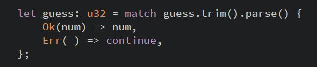

---

The underscore, `_`, is a catchall value; in this example,
we're saying we want to match all `Err` values,
no matter what information they have inside them.

---

What's the command to tell the program to go to the next iteration of the loop?

. . .

```rust
continue;
```

---

How do you make a new variable **shadow** the first?

. . .

You can declare a new variable with the same name as a previous variable.
Rustaceans say that the first variable is shadowed by the second, which means
that the second variable is what the compiler will see when you use the name of
the variable.

---

What is the possible bit range of integers?

. . .

8 to 128 bit

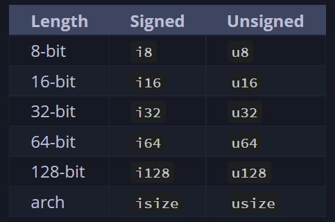

---

In this table of integer types, what do the `isize` or `usize` variants (in the
arch row) stand for?


. . .

Architecture. The `isize` and `usize` types depend on the architecture of the
computer your program is running on, which is denoted in the table as "arch":
64 bits if you're on a 64-bit architecture and 32 bits if you're on a 32-bit
architecture.

---

What's the integer type variant that gets the size of the bits of the
architecture the program is running on?

(64 bits if you're on a 64-bit architecture and 32 bits if you're on a 32-bit
architecture)

---

The variant with 'size' after its integer type (signed or unsigned,
respectively).


---

How do you create a signed integer with 128 bits named `hello_world`?

. . .

`let hello_world: i128;`

---

How do you create an unsigned integer with 128 bits named `hello_world`?

. . .

`let hello_world: u128;`

---

What is the range of numbers that can be stored using signed two's complement
representation (as a function of n)?

. . .

Each signed variant can store numbers from \([-(2^{n-1})\), \(2^{n-1}-1]\).

---

What is the range of numbers that can be stored using unsigned two's complement
representation (as a function of n)?

. . .

Each unsigned variant can store numbers from \(0\) to \(2^{n}-1\).

---

What is the range of number that an i8 signed integer can store?

. . .

It can store numbers from \(-128\) to \(127\).

---

What is the range of number that a u8 UNsigned integer can store?

. . .

It can store numbers from \(0\) to \(255\).

---

How to write a **number literal** that is an 8 bit unsigned integer with the
value 57?

. . .

Simply by adding to the literal a type suffix, like so: 57u8

---

How do you write a hexadecimal literal?

. . .

`0` and the number seperated by `x`


For example: `0xff`"

---

How can you make decimal literals more readable?

. . .

Using `_` as the thousands seperator.

For example: `let x = 28_222;`"

---

How do you make an octal base number literal?

. . .

`0` and the number seperated by an `o`

---

How do you write a binary literal?

. . .

`0` and the number seperated by `b`


e.g. `assert_eq!(0b101, 5)`"

---

What's the only integer type suitable for Byte representation?

. . .

`u8`


e.g. `b'A'`"

---

How do you represent a Byte literal?

. . .

`b`, and then its ASCII char (0-255) enclosed by single quotes, like so: `b'A'`

---

What is the primary situation in which you'd use isize or usize?

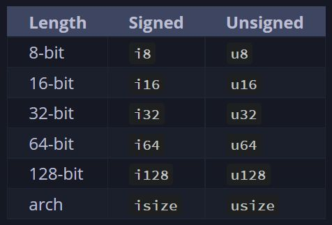

---

When indexing some sort of collection

---

How to write an unsigned floating point literal?

. . .

You can't. All floating-point types are signed.

---

What's the default floating point type?

. . .

`f64` (since it's roughly the same speed as `f32` but is capable of more
precision)

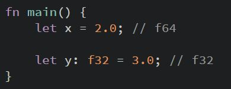

---

What's the precision degree of `f64`?

. . .

It's double precision (`f32` is single precision and both are represented
according to the IEEE-754 standard)

---

How do you define a boolean and how much space in memory does it occupy?

. . .

Booleans are one byte in size. The Boolean type in Rust is specified using
bool.

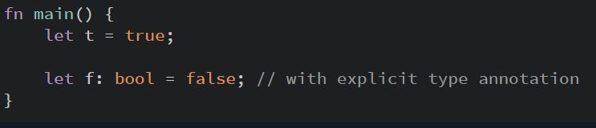

---

How much space in memory does a char occupy?

. . .

Rust's char type is **four bytes in size** and represents a Unicode Scalar
Value, which means it can represent a lot more than just ASCII.

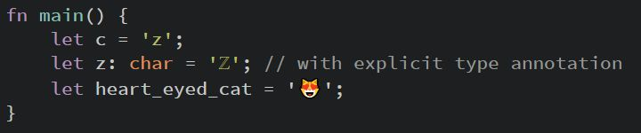

---

What's the difference between the way we define strings and the way we define
char literals?

. . .

We specify char literals with **single quotes**, as opposed to string literals,
which use **double quotes**.


---

What are compound types?

. . .

Compound types can group multiple values into one type

---

What primitive compound types does Rust have?

. . .

Rust has 2 primitive compound types:

- Tuples:
    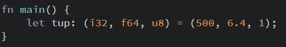
- Arrays:
    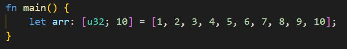

---

How can we create a tuple?

. . .

We create a tuple by writing a comma-separated list of values inside
parentheses.


---

How can we get the individual values out of a tuple? (2 ways)

. . .

- Destructuring via pattern matching: \
    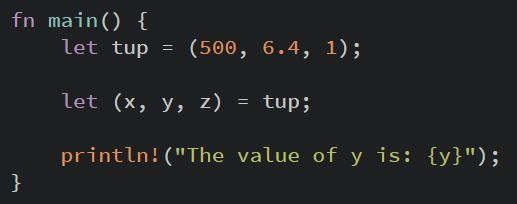
- Dot notation with indexes: \
    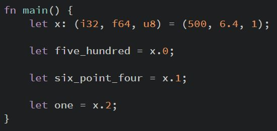

---

What's the name of a tuple without any value? when is does it come up?

. . .

The tuple without any values has a special name, **unit**.
This value and its corresponding type are both written `()`
and represent an empty value or an empty return type.

Expressions implicitly return the unit value if they don't return any other
value.

---

What can we say about the size of arrays?

. . .

Unlike arrays in some other languages, arrays in Rust have a fixed length.
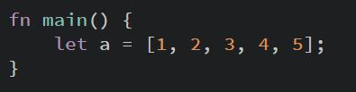

---

Name 2 good uses of arrays

---


- Arrays are useful when you want your data allocated **on the stack** rather
than the heap.
- When you want to ensure you always have a **fixed number of elements**. \

---

What can we say about arrays in relation to vectors?

. . .

Array isn't as flexible as the vector type, though. A vector is a similar
collection type provided by the standard library that **is** allowed to **grow
or shrink in size**. If you're unsure whether to use an array or a vector,
chances are you should use a vector.

---

2 ways to initialize an array

---


- Define each element individually \
    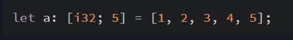


- Define them all at once \
    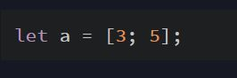

    Which is same as: \
    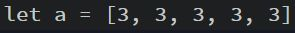


---

What's the difference between statements and expressions?

. . .

Statements are instructions that perform some action and do not return a value.
Expressions evaluate to a resulting value.

---

What's the difference between arguments and parameters?

. . .

Parameters are the variable definitions in the top area of the function,
arguments are the **concrete values**

---

Statement or expression?

Creating a variable and assigning a value to it with the let keyword is a
statement

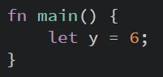

. . .

Statement

---

Statement or expression?

function definitions

. . .

Statement


---

Statement or expression?

Calling a function

. . .

Expression

---

Statement or expression?

Calling a macro

. . .

Expression

---

Statement or expression?

A new scope block created with curly brackets

. . .

Expression

For example,
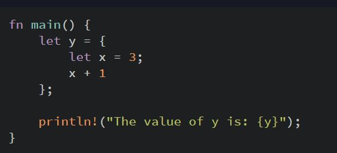
`y = 4`, in this case

---


Why doesn't `x + 1` have a semicolon at the end?

. . .

It is an expression, rather than a statement.
Expressions do not include ending semicolons.
If you add a semicolon to the end of an expression, you turn it
into a statement, and it will then not return a value.

---

How do we declare a function's type?

. . .

With an arrow:

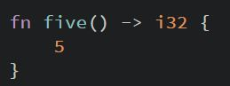

---

Statement or expression?

```rust
if … { … } else { … }
```

---

Expression.

Because `if` is an expression, we can use it on the right side of a `let`
statement
to assign the outcome to a variable:

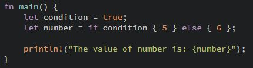

---

What does `continue;` in a loop do?

. . .

It makes the program skip over any remaining code in this iteration of the loop
and go to the next iteration.

---

Inside a loop, how can you return a value OUT of the loop
so you can use it after the `break;` expression
you use to stop the loop?

. . .

One can simply add the desired expression to be returned after the break:

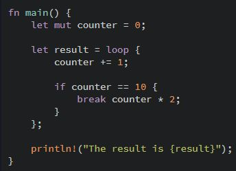

---

If you have loops within loops, how can you break / continue a specific loop
instead of the innermost loop?

. . .

With **loop labels**. Loop labels must begin with a single quote.

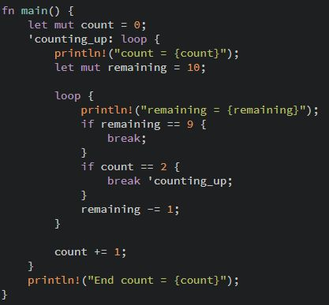

---

We want to use `while` to loop the program three times,
counting down each time, and then, after the loop,
print a message and exit.
Fill the black blank.

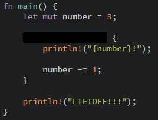

---

`while number != 0`

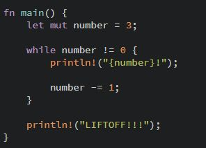

---

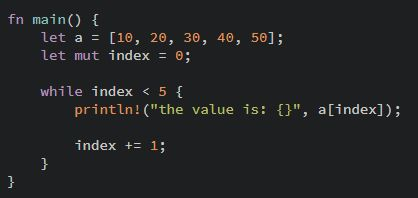

Looping through a collection like this is a bad idea. Give 2 reasons why.

---


- It's error prone;

- It's slow (due to bound checking);


<h4>Explanations:</h4>
<p>It's error prone because it could cause the program to panic if the index
value or test condition are incorrect.
  For example, if you changed the definition of the a array to have four
elements but forgot to update the condition to while `index < 4`, the code
would panic.
</p>
<p>It's slow because the compiler adds runtime code to perform the conditional
check of whether the index is within the bounds of the array on every iteration
through the loop.
</p>"

---

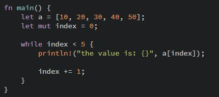

What is a better and more concise alternative to loop over the array?

. . .

To use a for loop:

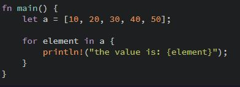

The safety and conciseness of for loops make them the most commonly used loop
construct in Rust.

---

Even in situations in which you want to run some code a certain number of times,
as in the countdown example that used a while loop in Listing 3-3,
most Rustaceans would use a `for` loop.


How would you do this with a `for` loop instead?

. . .

Using a **Range**, provided by the standard library:

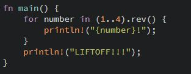

---

What are the 3 rules of ownership?

. . .


- Each value in Rust has an owner.
- There can only be one owner at a time.
- When the owner goes out of scope, the value will be dropped.

---

Why is a string literal not the best fit for some things?

. . .

String literals are convenient,
but they aren't suitable for every situation in which we may want to use text. \

- One reason is that they're immutable.
- Another is that not every string value can be known when we write our code.

For example, what if we want to take user input and store it?
For these situations, Rust has a second string type, `String`.

---

What is the difference between the `String` type and the `string` literal?

. . .

The `String` type manages data allocated **on the heap** and as such is able to
store an amount of text that is **unknown to us** at compile time.

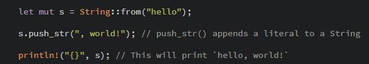

---

With a String type, besides the contents of the string, which data are created
and where are they stored?

. . .

A String is made up of three parts (shown on the left): \

- Pointer to the memory that holds the contents of the string
- Length
- Capacity

This group of data is stored on the stack.
On the right is the memory on the heap that holds the contents.

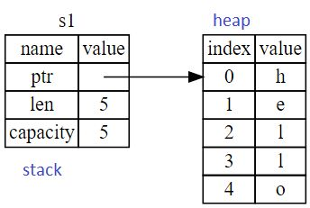

---

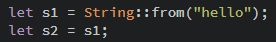

What happens in terms of the heap and stack
when we assign `s1` to `s2` in line 2?

. . .

The String data is copied, meaning we copy: \

- Pointer
- Length
- Capacity

that are on the stack.

We **do not** copy the data on the heap
that the pointer refers to.

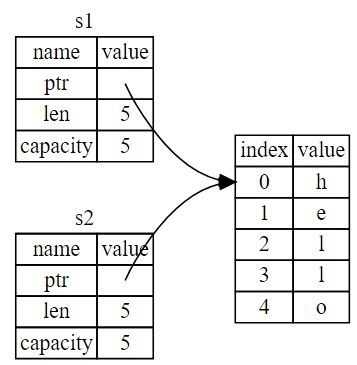

---

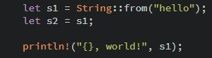

What happens to `s1` in this case?

. . .

Compile time error.
In this example, we would say that `s1` was moved into `s2`,
as Rust considers `s1` as no longer valid.

Because Rust invalidates the first variable, instead of calling it a shallow
copy,
it's known as a move.
So what actually happens is shown here:

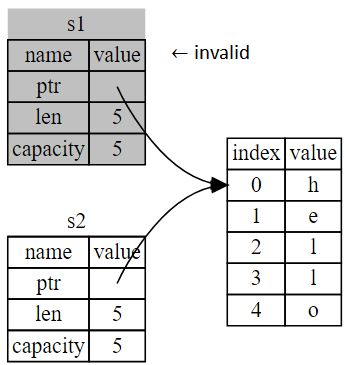

---

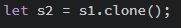

What could be a red flag?

. . .

This works just fine and explicitly produces the behavior where **the heap data
does get copied**.

And yet, when you see a call to clone, you know that some arbitrary code is
being executed and **that code may be expensive**. It's a visual indicator that
something different is going on.

---

How do you reference an object?

. . .

With an ampersand:

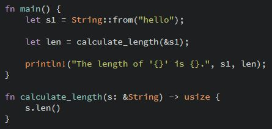

These ampersands represent references,
and they allow you to refer to some value without taking ownership of it.

---

What is one guarantee that a reference has and a conventional pointer doesn't?

. . .

Unlike a pointer, a reference is guaranteed to point to a valid value of a
particular type for the life of that reference.
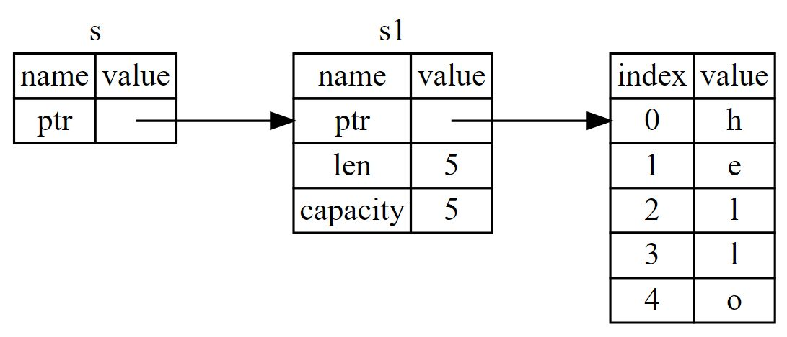

---

How do we call the action of **creating a reference**?

. . .

Borrowing

---

What is not possible **by default** when borrowing?

. . .

Mutating.

Just as variables are immutable by default, so are references. We're not
allowed to modify something we have a reference to.

---

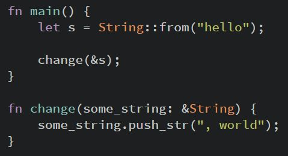

How can you make this reference mutable?

. . .

Put `&mut s` as parameter instead of `&s` and `&mut String` as parameter type
instead of `&String`.

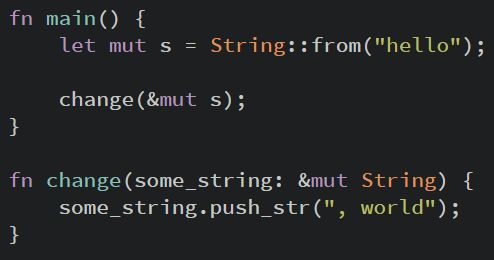

---

What's the restrictions that mutable references have?

. . .

If you have a mutable reference to a value, you can have no other (mutable or
otherwise) references to that value.

This will fail, for example:
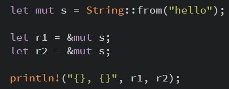

This as well:
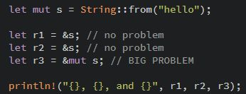

---

What's the benefit of the restriction preventing multiple mutable references to
the same data at the same time?

. . .

The benefit of having this restriction is that Rust can **prevent data races at
compile time**.

It allows for mutation but in a very controlled fashion. It's something that
new Rustaceans struggle with, because most languages let you mutate whenever
you’d like.

---

What are the 3 preconditions for a data race to occur?

. . .

A data race happens when these three behaviors occur:

- Two or more pointers access the same data at the same time.
- At least one of the pointers is being used to write to the data.
- There's no mechanism being used to synchronize access to the data.(Note: \
a
data race is similar to a race condition) \

---

What's a workaround we can use to allow multiple mutable references to the same
data?

. . .

We can use curly brackets to create a new scope, allowing for multiple mutable
references, jus not simultaneous ones:

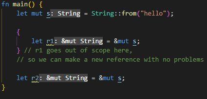

---

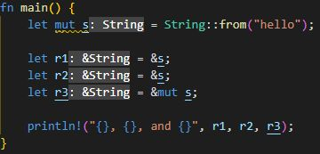

What's going to happen with this code?

. . .

Compile-time error!

Since Rust enforces a similar rule as the restriction preventing multiple
mutable references to the same data at the same time for combining mutable and
immutable references, this code results in an error:

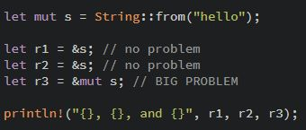

---

Why are mutable references not allowed to co exist with other references while
multiple immutable references are allowed?

. . .

Because users of an immutable reference don't expect the value to suddenly
change out from under them! However, multiple immutable references are allowed
because no one who is just reading the data has the ability to affect anyone
else's reading of the data.

---

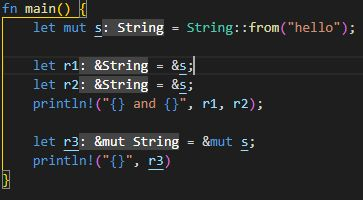

Why will this not trigger compile time errors involving mutable & immutable
rules?

. . .

Because a reference's scope starts from where it is introduced and continues
**through the last time that reference is used**. Therefore, this code will
compile because the last usage of the immutable references, the println!,
occurs before the mutable reference is introduced. These scopes don't overlap,
so this code is allowed

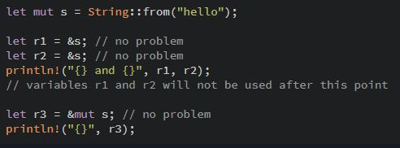

(See also: Non-Lexical Lifetimes or NLL)"

---

What's a "dangling pointer"?

. . .

It's a pointer **pointing to an invalid value.**

In other words: it's a pointer that references a location in memory that may
have been given to someone else, by freeing some memory while preserving a
pointer to that memory.

---

What guarantee do we have regarding "dangling pointers"?

. . .

In Rust, the compiler guarantees that references will never be dangling
references: if you have a reference to some data, the compiler will ensure that
the data will not go out of scope before the reference to the data does.

This will not compile:
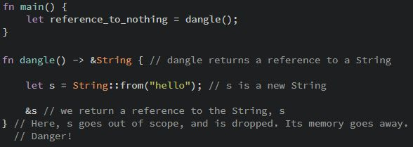

---

What's the problem with this code?

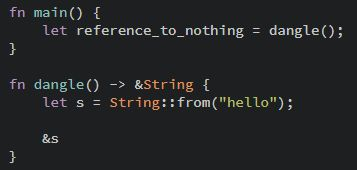

What could be a solution?

. . .

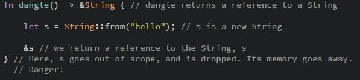

Because s is created inside dangle, when the code of dangle is finished, s will
be **deallocated**. But we tried to return a reference to it. That means this
reference would be pointing to an invalid String. That's no good! Rust won't
let us do this. The solution here is to return the String directly:

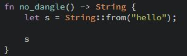

This works without any problems. Ownership is moved out, and nothing is
deallocated.

---

What are the 2 rules of references that are enforced by the compiler?

. . .


- At any given time, you can have either one mutable reference or any number of
immutable references.
- References must always be valid (and not 'dangling'). \

---

What's the Slice type?

. . .

Slices let you reference a **contiguous sequence of elements in a collection**
rather than the whole collection. \

---

What are the Slice type's ownership properties?

. . .

A slice is a kind of reference, so it does not have ownership.

---

What's a string Slice? What does it look like in action? (on a string named s)

---

A string slice is **a reference to part of a String**, and it looks like this:


Rather than a reference to the entire String, hello is a reference to a portion
of the String, specified in the extra [0..5] bit.

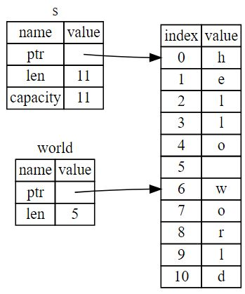

---

How do we create slices?

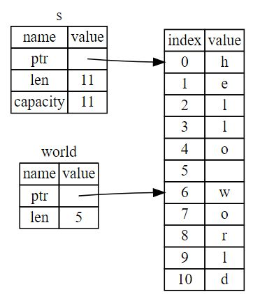

---

We create slices using a range within brackets by specifying
**[starting_index..ending_index]**, where starting_index is the first position
in the slice and ending_index is one more than the last position in the slice.


---


What can you say about those 2 values?

. . .

With Rust's .. range syntax, if you want to start at index zero, you can drop
the value before the two periods.

In other words, **these are equal**.

---


What can you say about those 2 values?

. . .

With Rust's .. range syntax, if your slice includes the last byte of the
String, you can drop the trailing number.

In other words, **these are equivalent**.

---


What can you say about those 2 values?

. . .

With Rust's .. range syntax, you can drop both values to take a slice of **the
entire string**.

In other words, **these are equal**.

---

What's a possible error inducing operation on string slice range indices?

. . .

String slice range indices must occur at valid UTF-8 character boundaries. If
you attempt to create a string slice in the middle of a multibyte character,
your program will exit with an error.


---


What's going to happen with this code?

. . .

Compile time error.

Explanation: \
If we have an immutable reference to something, we cannot also
take a mutable reference. Because clear needs to truncate the String, it needs
to get a mutable reference. The println! after the call to clear uses the
reference in word, so the immutable reference must still be active at that
point. Rust disallows the mutable reference in clear and the immutable
reference in word from existing at the same time, and compilation fails. Not
only has Rust made our API easier to use, but it has also eliminated an entire
class of errors at compile time!

---


How can we improve upon this function signature?

. . .

Knowing that you can take slices of literals and String values leads us to an
improvement on the function signature:


That's how a more experienced Rustacean would write the signature shown instead
because it allows us to use the same function first_word on both &String values
and &str values.

---


&my_string[..]

What is equal to that expression?

. . .

&my_string


---

How do you output assembly?

. . .

You can use Cargo's `cargo rustc` command to send arguments to rustc directly:


---

How do you output OPTIMIZED assembly?

. . .

You can use Cargo's `cargo rustc` command to send arguments to rustc directly,
for optimized assembly:


---

What can you do if you see multiple `<crate_name>-<hash>-<hash>.rcgu.s` files
instead of a single `<crate_name>-<hash>.s` file when outputting assembly?

. . .

Disable incremental compilation by setting the environment variable
`CARGO_INCREMENTAL=0`

---

What can you do if you just want to look at the assembly output instead of
saving it, e.g. to judge if it's well-optimized?

. . .

An easy option is to check out
<a href="https://rust.godbolt.org/">rust.godbolt.org</a>

(Don't forget to add `-O` to the compiler options box.)"

---


What type does this slice have?

. . .

This slice has the type `&[i32]`.

It works the same way as string slices do, by storing a reference to the first
element and a length. You'll use this kind of slice for all sorts of other
collections.

---

How do we use a struct after we've defined it?


---

We create an instance by stating the name of the struct and then add curly
brackets containing key: value pairs, where the keys are the names of the
fields and the values are the data we want to store in those fields.


---


How do we access this user's email address or change its value?

. . .

We use dot notation


Note: \
the entire instance must be mutable; Rust doesn't allow us to mark only
certain fields as mutable.

---


How can we somewhat shorten this?

. . .

Using **field init shorthand syntax**.

Because the parameter names and the struct field names can sometimes be exactly
the same, we can use the field init shorthand syntax to make it so that it
behaves exactly the same but doesn't have the repetition.


---


How do we shorten all these values in `user2` taken straight from `user1`?

. . .

With 2 dots, a.k.a the **struct update syntax**.

It's often useful to create a new instance of a struct that includes most of
the values from another instance, but changes **some**.


Notes:

- It's only 2 dots, not 3
- The syntax must come last to specify that any remaining fields should get
their values from the corresponding fields in user1, but we can choose to
specify values for as many fields as we want in any order, regardless of the
order of the fields in the struct's definition.


---


What can we say about user1?

. . .

In this example, ****we can no longer use user1 after creating user2****
because the String in the username field of user1 was moved into user2.

Note that the struct update syntax uses = like an assignment; this is because
it moves the data. If we had given user2 new String values for both email and
username, and thus only used the active and sign_in_count values from user1,
then user1 would still be valid after creating user2.

---


What are these called?

. . .

These are structs that look similar to tuples, called **tuple structs**.

---

What could tuple structs be useful for?(3 use cases)

---

Tuple structs are useful when:

- You want to give the whole tuple a name
- Make it a **different type** from other tuples
- Naming each field as in a regular struct would be verbose or
redundant.


Tuple structs have the **added meaning** the struct name provides but don't
have names associated with their fields; rather, they just have the types of
the fields.

---


Can `Color` and `Point` here be interchangeable?

. . .

No.
The black and origin values are different types,
because they're instances of different tuple structs.

Each struct you define is its own type, even though the fields within the
struct might have the same types.

---

Which type of structs are destructurable?

. . .

Both structs and tuple structs.


---

With which type of structs can you use a `.`
followed by the index to access an individual value?

. . .

With both structs and tuple structs.

---

What are unit-like structs?

. . .

They are structs that don't have any fields. These are called unit-like structs
because they behave similarly to `()`.


Unit-like structs can be useful when you need to implement a trait on some type
but don't have any data that you want to store in the type itself.

---


Why will this not print?

. . .

With structs, Rust doesn't try to guess what we want, and structs don't have a
provided implementation of `Display` to use with `println!` and the `{}`
placeholder.

---


What does putting the specifier `:?` inside the curly brackets change?

. . .

Putting the specifier `:?` inside the curly brackets tells `println!` we want
to use an output format called `Debug` (instead of the default `Display`).

The `Debug` trait enables us to print our struct in a way that is useful for
developers so we can see its value while we're debugging our code.

---


What's missing for this to print?

. . .

Adding the outer attribute `#[derive(Debug)]` just before the struct
definition.

Rust does include functionality to print out debugging information, but we have
to explicitly opt in to make that functionality available for our struct.


---


When we have larger structs, in order to have output that's a bit easier to
read, what can we do?

. . .

We can use `{:#?}` instead of `{:?}` in the `println!` string. In this example,
using the `{:#?}` style will output:


---

What's another way to print out a value using the Debug format besides using
println! with {:?} or {:#?} ?

. . .

Using the `dbg!` macro.


---


How can we slice 2 and 3 out of a?

. . .


---

What's similar between methods and functions?

. . .


- They are declared with the `fn` keyword and a name
- They can have parameters and a return value
- They contain some code that's run when the method is called from somewhere
else


---

What's different between methods and functions?

. . .

Unlike functions, methods are

- Defined within the context of a struct (or an `enum` or a trait object)
- Their first parameter can be self, which represents the instance of the
struct the method is being called on

---

How do we define the function area within the context of Rectangle?

. . .

We start an implementation block for Rectangle. Everything within this impl
block will be associated with the Rectangle type. Then we change the first (and
in this case, only) parameter to be self.


---

What is `&self` (in method syntax) actually short for?

. . .

The `&self` is actually short for `self: &Self`.

Note: \
We still need to use the `&` in front of the self shorthand to indicate
this method borrows the Self instance, just as we did in ` rectangle:
&Rectangle`. Methods can take ownership of self, borrow self immutably as we've
done here, or borrow self mutably, just as they can any other parameter.

---

When would we have a method that takes ownership of the instance by using just
self (instead of `&self` or `&mut self`)?

. . .

It is **rare**; this technique is usually used when the method transforms self
into something else and you want to **prevent the caller from using the
original** instance after the transformation.

---

Can you give a method the same name as one of the struct's field?

. . .

Yes. For example, we can define a method on Rectangle also named width:


---

Does rust implement getter methods to struct fields?

. . .

No. Sometimes, when we give methods with the same name as a field we want it to
only return the value in the field and do nothing else. Rust does not implement
these getters automatically for struct fields as some other languages do.

Getters are useful because you can make the field private but the method public
and thus enable read-only access to that field as part of the type's public API.

---

In C and C++, two different operators are used for calling methods: you use `.`
if you're calling a method on the object directly and `->` if you're calling
the method on a pointer to the object and need to dereference the pointer
first. In other words, if object is a pointer, `object->something()` is similar
to `(*object).something()`.

What about Rust?

. . .

Rust doesn't have an equivalent to the `->` operator.
Instead, Rust has what is called **automatic referencing and dereferencing**.

In other words, the following are the same:


Note: \
this automatic referencing behavior works because methods have a clear
receiver—the type of self. Given the receiver and name of a method, Rust can
figure out definitively whether the method is reading (`&self`), mutating
(`&mut self`), or consuming (`self`).

---

What are associated functions?

. . .

All functions defined within an `impl` block are called associated functions
because they're associated with the type named after the `impl`.


---

What are associated functions **that aren't methods** and what's a common use
for them?

. . .

We can define associated functions that don't have  `self` as their first
parameter (and thus are not methods) because they don't need an instance of the
type to work with (such as `String::from ` function that's defined on the
`String` type).

Associated functions that aren't methods are often used for **constructors that
will return a new instance of the struct**. These are often called new, but new
isn't a special name and isn't built into the language.


---


What is the `Self` keywords in the return type?

. . .

The `Self` keywords in the return type and in the body of the function are
**aliases for the type that appears after the `impl` keyword**, which in this
case is `Rectangle`.

---


How do we call this function with size of 3?

. . .

To call this associated function,
**we use the `::` syntax with the struct name**; \
`let sq = Rectangle::square(3);`"

---

What is the `::` syntax used for?

. . .

The `::` syntax is used for both associated functions and namespaces created by
modules.


```rust
let sq = Rectangle::square(3);
```


```rust
io::stdin()
  .read_line(&mut guess)
  .expect("Failed to read line");
```

---

What is the numerical limit on `impl` blocks of structs?

. . .

None.
Each struct is allowed to have multiple `impl` blocks.

For example,


is equivalent to:


---

What are enums / enumerations?

. . .

Enums allow you to define a type by enumerating its possible variants. In other
words, they give you a way of saying **a value is one of a possible set of
values**.

---


How do we create instances of these 2 variants?

. . .

With the `::` syntax


---


Why is it useful that the variants of the `enum` are namespaced under its
identifier?

. . .

This is useful because now both values `IpAddrKind::V4` and `IpAddrKind::V6`
are of the same type: `IpAddrKind`. We can then, for instance, define a
function that takes any `IpAddrKind`:


---


How do we represent the same concept using JUST an enum?

. . .

Using just an `enum` is more concise: rather than an `enum` inside a struct,
**we can put data directly into each `enum` variant**.


This new definition says that both V4 and V6 variants will have associated
String values.

---


How do enums with data attached to them work **under the hood**?

. . .

The name of each `enum` variant that we define also **becomes a function** that
**constructs an instance of the enum**.

That is, `IpAddr::V4()` is a function call that takes a String argument and
returns an instance of the `IpAddr` type. We automatically get this constructor
function defined as a `result` of defining the enum.

---


What could be a potential advantage to using an `enum` here rather than a
struct?

. . .

Let's say if each variant had **different types and amounts of associated
data**. Enums handle this case with ease.


In this case: version four type IP addresses will always have four numeric
components that will have values between 0 and 255. If we wanted to store V4
addresses as four u8 values but still express V6 addresses as one String value,
we wouldn't be able to with a struct.

---


This `enum` has four variants with different types. Explain the syntax used by
Move and Quit here.

---

Move has named fields like a struct does. Quit has no data associated with it
at all.

---


How would you define these `enum` variants as structs?

. . .


---


What else can we define on enums?

. . .

**Methods**. Just as we're able to define methods on structs (using impl),
we're also able to define methods on enums.


---


Rust does not have nulls. What does it have instead?

. . .

The `enum` `Option<T>`.
It's an `enum` that can encode the concept of a value being present or absent.
It is defined by the standard library as follows:


Note: \
the `Option<T>` `enum` is so useful that it's even included in the prelude;
you don't need to bring it into scope explicitly.

---


How can we mark specific struct fields as mutable?

. . .

We can't. The entire instance must be mutable. Rust doesn't allow us to mark
only certain fields as mutable.

Note: \
an alternative workaround could be to use public getters with private
fields while having the rest of the fields be mutable.

---

What is 'match'?

. . .

Rust has an extremely powerful control flow construct called match that allows
you to **compare a value against a series of patterns** and then **execute
code** based on which pattern matches.

Note: \
the power of match comes from the expressiveness of the patterns and the
fact that the compiler confirms that all possible cases are handled.

---


See if you can restore the blacked out blanks using `match`.

---

First, we list the match keyword followed by an expression.

Next are the match arms.
An arm has two parts:
A pattern and some code, and the `=>` operator
that separates the pattern and the code to run.
Each arm is separated from the next with a comma.


---

When following an `if`, an expression needs to return a `Boolean` value.
What comes after we use the `match` keyword?

. . .

An expression that can return **any** type.


The type of coin in this example is the Coin `enum` defined on the first line.

---


Why is there no comma here?

. . .

If you want to run multiple lines of code in a match arm, you must use curly
brackets,
and **the comma following the arm is then optional**.
But we don't typically use curly brackets if the match arm code is short.

---


How we can extract values out of `enum` variants (UsState in this case)?

. . .

We add a variable (called state, in this case) to the pattern that matches
values of the variant `Coin::Quarter`.


Then we can use state in the code for that arm.

---


What happens here?

. . .

We take special actions for a few particular values, but for all other values
take one default action (using the so called catch-all pattern).

---

What pattern can we use when we want a catch-all but don't want to use the
value in the catch-all pattern?

. . .

_


_ is a special pattern that matches any value and does not bind to that value.
This tells Rust we aren't going to use the value, so Rust won't warn us about
an unused variable.

---

How can we have one arm of a 'match' **do nothing** if its pattern matches?

. . .

By returning the unit value, `()`.


Here, we're telling Rust explicitly that we aren't going to use any other value
that doesn't match a pattern in an earlier arm, and we don't want to run any
code in this case.

---


How can we shorten this annoying boilerplate?

. . .

Instead, we could write this in a shorter way using **if let**.


The syntax if let takes a pattern and an expression separated by an equal sign.
It works the same way as a match, where the expression is given to the match
and the pattern is its first arm.

---

What is the `if let` syntax?

. . .

You can think of if let as syntax sugar for a match that runs code when the
value **matches one pattern and then ignores** all other values.

Note: \
choosing between match and if let depends on whether gaining conciseness
is an appropriate trade-off for losing the exhaustive checking of match.

---

Can we include an else with an if let?

. . .

Yes.


---

What are the 2 forms of a crate?

. . .

A binary crate or a library crate

Most of the time when Rustaceans say "crate", they mean library crate, and they
use "crate" interchangeably with the general programming concept of a "library".

---

What's a package?

. . .

A package is a bundle of one or more crates that provides a set of
functionality. It also contains a `Cargo.toml` file that describes how to build
those crates.

---

What can a package contain?

. . .

A package can contain as many binary crates as you like, but at most **only one
library crate**. Either way, a package must contain at least one crate, whether
that's a library or binary crate.

---

What is cargo's convention for the crate root file of a BINARY crate with the
same name as the package?

. . .

`src/main.rs`

---

What is cargo's convention for the crate root file of a LIBRARY crate with the
same name as the package?

. . .

`src/lib.rs`

---

What does it mean if if a package contains `src/main.rs` and `src/lib.rs`?

. . .

It means that it has (at least) two crates: a binary and a library, both with
the same name as the package.

---

What's the limit on the number of binary crates a package can have?

. . .

A package can have **multiple** binary crates.

Note: \
this can be done by placing files in the src/bin directory: each file
will be a separate binary crate.

---

What's the purpose of the use keyword?

. . .

To bring a path into scope

---

When compiling a crate, where does the compiler usually start from?

. . .

It starts from the **crate root**.

When compiling a crate, the compiler first looks in the crate root file
(usually `src/lib.rs` for a library crate or `src/main.rs` for a binary crate)
for code to compile.

---


What's the order of look ups (performed by the compiler) when declaring a
module, say, named garden in the root crate?

. . .


- Inline, within curly brackets that replace the semicolon following mod garden
- In the file `src/garden.rs`
- In the file `src/garden/mod.rs`

---

In any file other than the crate root, you can declare submodules.

For example, you might declare mod vegetables; in `src/garden.rs`.
In what order will the compiler look for the submodule's code?

. . .


- Inline, directly following mod vegetables, within curly brackets instead of
the semicolon
- In the file `src/garden/vegetables.rs`
- In the file `src/garden/vegetables/mod.rs`

---

Code within a module is private from its parent modules by default. How do you
make a module public?

. . .

Declare it with **pub** mod instead of mod.

---

How do you make items within a public module public as well?

. . .

Use pub before their declarations.

---

What is the 'use' keyword for?

. . .

Within a scope, the use keyword creates **shortcuts to items** to reduce
repetition of long paths.

In any scope that can refer to
, you can create a
shortcut with ; and
from then on you only need to write Asparagus to make use of that type in the
scope.

---

Why are the files `src/main.rs` and `src/lib.rs` called crate roots?

. . .

The reason for their name is that the contents of either of these two files
form a **module named crate** at the root of the crate's module structure,
known as the module tree.


---

What are paths for?

. . .

To show Rust where to find an item in a module tree, we use a path in the same
way we use a path when navigating a filesystem. To call a function, we need to
know its path.

---

What are the 2 forms of a path?

. . .

- An absolute path is the full path starting from a crate root; for code from
    an external crate, the absolute path begins with the crate name, and for code
    from the current crate, it starts with the literal crate.
- A relative path starts from the current module and uses self, super, or an
    identifier in the current module.Note: \
    both absolute and relative paths are
    followed by one or more identifiers separated by double colons (`::`).

---

When debating between relative and absolute paths, what is our likely
preference?

. . .

Our preference in general is to **specify absolute paths** because it's more
likely we'll want to move code definitions and item calls independently of each
other.

Generally speaking, choosing whether to use a relative or absolute path is a
decision you'll make based on your project, and depends on whether you're more
likely to move item definition code separately from or together with the code
that uses the item.

---

What is the default access modifier / privacy rule for all items (functions,
methods, structs, enums, modules, and constants)?

. . .

In Rust, all items (functions, methods, structs, enums, modules, and constants)
are private to parent modules by default. If you want to make an item like a
function or struct private, you simply put it in a module.

---

What is the accessABILITY relationship between parent and child modules?

. . .

Items in a parent module can't use the private items inside child modules, but
items in child modules can use the items in their ancestor modules.

Explanation: this is because child modules wrap and hide their implementation
details, but the child modules can see the context in which they're defined. To
continue with our metaphor, think of the privacy rules as being like the back
office of a restaurant: what goes on in there is private to restaurant
customers, but office managers can see and do everything in the restaurant they
operate.

---

What do we have to do in order to hide inner implementation details with
modules?

. . .

Nothing, basically. Rust chose to have the module system function this way so
that **hiding inner implementation details is the default**.

That way, you know which parts of the inner code you can change without
breaking outer code.

---

How do we expose certain inner parts of child modules' code?

. . .

Even though not by default, Rust does give you the option to expose inner parts
of child modules’ code to outer ancestor modules **by using the pub keyword to
make an item public**.

---


What's going to happen here?

. . .

Compile time error.


Explanation: the pub keyword on a module only lets code in its ancestor modules
refer to it, but the contents of the module are still private; **making the
module public doesn't make its contents public** (Because modules are
containers, there's not much we can do by only making the module public).

---

How do we construct relative paths that **begin in the parent module**, rather
than the current module or the crate root?

. . .

By using **super** at the start of the path (this is like starting a filesystem
path with the .. syntax).


---


What is the meaning of super here?

. . .

It allows us to construct **relative paths that begin in the parent module**,
rather than the current module or the crate root (like starting a filesystem
path with the .. syntax).

---

What's the extra few details we want to be aware of around the usage of pub
with structs?

. . .

We use pub before a struct definition, we make the struct public, but **the
struct's fields will still be private**. We can make each field public or not
on a case-by-case basis.


---


If we didn't have 'summer' here, what could have been a consequence?

. . .

Because of the private field, the struct needs to **provide a public associated
function that constructs an instance of Breakfast** (AKA summer).

If Breakfast didn't have such a function, we couldn't create an instance of
Breakfast in eat_at_restaurant because we couldn't set the value of the private
seasonal_fruit field in eat_at_restaurant.

---


What's the default access modifier / privacy rule for `enum` variants?

. . .

Public.

Enums aren't very useful unless their variants are public; it would be annoying
to have to annotate all `enum` variants with pub in every case, so the default
for `enum` variants is to be public.

---

What's the default access modifier / privacy rule for struct fields?

. . .

Private.

Structs are often useful without their fields being public, so struct fields
follow the general rule of everything being private by default unless annotated
with pub.

---


How can we call `add_to_waitlist`?

. . .

Since we've brought the module into the scope,
we only have to **specify `hosting::add_to_waitlist` to call the function**.


Hosting is now a valid name in that scope, just as though the hosting module
had been defined in the crate root.

---


What happens here?

. . .

Compile time error.


Note that use only creates the shortcut for the particular scope in which the
use occurs.

Since the child module named customer is a different scope than the use
statement, the function body won't compile. The error will let it be known that
the shortcut does not apply WITHIN the customer module.

---


How can we fix the scope related compilation error induced here?

. . .

We can move the use within the customer module too, or reference the shortcut
in the parent module with `super::hosting` within the child customer module.

---


Why did we specify use hosting and then called `hosting::add_to_waitlist` rather
than specifying the use path all the way out to the `add_to_waitlist` function to
achieve the same result?

. . .

This is the idiomatic way to bring a function into scope with use.

The following code, on the other hand,

is unclear as to
where `add_to_waitlist` is defined.

Bringing the function's parent module into scope with use means we have to
specify the parent module when calling the function. Specifying the parent
module when calling the function makes it clear that the function isn't locally
defined while still minimizing repetition of the full path.

---


When do we diverge from this idiom of **bringing the function's PARENT module
into scope** (in order to have to specify the parent module when calling the
function)?

. . .

When bringing in structs, enums, and other items with use, it's instead
idiomatic to specify the full path.


There's no strong reason behind this idiom: it's just the convention that has
emerged, and folks have gotten used to reading and writing Rust code this way.

---


What's the exception to this idiom of specifying the full path when bringing in
structs, enums, and other items with use?

. . .

The exception to this idiom is if we're bringing two items with the same name
into scope with use statements, because Rust doesn't allow that.


---


What's an alternative solution to bringing two types of the same name into the
same scope?

. . .

By renaming one of the two `Result` types using as.


---


Which of these 2 is considered an idiomatic way of importing two types of the
same name?

. . .

Both. The choice is up to you.

---

How can we RE export a name we brought into scope?

. . .

By combining pub and use.


When we bring a name into scope with the use keyword, the name available in the
new scope is private. To enable the code that calls our code to refer to that
name as if it had been defined in that code's scope, we can combine pub and use.

---

When is re-exporting names useful?

. . .

Re-exporting is useful when the internal structure of your code is different
from how programmers calling your code would think about the domain.

For example, in a restaurant metaphor, the people running the restaurant think
about "front of house" and "back of house." But customers visiting a restaurant
probably won't think about the parts of the restaurant in those terms. With pub
use, we can write our code with one structure but expose a different structure

---

Is there anything specific we need to do when using the standard library?

. . .

We DO need to **refer to it with use** to bring items from there into our
package's scope, since the standard std library is also a crate that's external
to our package.

On the other hand, we do NOT need to change `Cargo.toml` to include std, since
the standard library is shipped with the Rust language,


---


How can we shorten this?

. . .

With curly brackets.


---


How can we shorten this?

. . .

By using **self**.


This line brings both `std::io` and `std::io::Write` into scope.

---

How do we bring **all** public items defined in `std::collections` into scope?

. . .

With the glob operator `*`


Warning: be careful when using the glob operator! **Glob can drastically reduce
readability** by making it harder to tell what names are in scope and where a
name used in your program was defined.

---


What is a common use for the glob operator?

. . .

When **testing**, to bring everything under test into the tests module.

---

How often should we load a file using a mod declaration?

. . .

Note that you only need to load a file using a mod declaration **ONCE** in your
module tree.


Once the compiler knows the file is part of the project (and knows where in the
module tree the code resides because of where you’ve put the mod statement),
other files in your project should refer to the loaded file's code using a path
to where it was declared.

In other words, mod is not an "include" operation that you may have seen in
other programming languages.

---

For a module named `front_of_house` declared in the crate root,

- `src/front_of_house.rs`
- `src/front_of_house/mod.rs`
which of the paths above is idiomatic for the compiler to look for? \

---

1 is idiomatic, 2 is an older style but is still supported.

The main downside to the style that uses files named `mod.rs` is
that your project can end up with many files named `mod.rs`,
which can get confusing when you have them open in your editor at the same time.

---

For a module named hosting that is a submodule of front_of_house,

- `src/front_of_house/hosting/mod.rs`
- `src/front_of_house/hosting.rs`
    which of the paths above is idiomatic for the compiler to look for?

---

2 is idiomatic, 1 is an older style but still supported.

The main downside to the style that uses files named `mod.rs` is
that your project can end up with many files named `mod.rs`,
which can get confusing when you have them open in your editor at the same time.

---

What's the `Vec<T>` collection type?

. . .

Vectors allow you to store more than one value in a single data structure that
puts all the values next to each other in memory.

Vectors can only store values of the same type.

---

What's an example use for vectors?

. . .

They are useful when you have a list of items, such as the lines of text in a
file or the prices of items in a shopping cart.

---

How do we initialize an empty vector?

. . .

We call the `Vec::new` function.


---

How do we initialize a vector with pre existing initial values?

. . .

With the vec! macro.


---

How can we add elements to a vector?

. . .

We can use the push method.


---


What happens here?

. . .

Compile time error!

As with any variable, if we want to be able to change its value, we need to
make it mutable using the mut keyword.

---

What are the two ways to reference a value stored in a vector?

. . .


- Via indexing
- Using the get method


---


What's the difference between these two ways to reference an element (besides
the syntax)?

. . .


When we run this
code, this method will cause the program to panic because it references a
nonexistent element.


When this method is passed an index that is outside the vector,
it returns `None` without panicking.
Your code will then have logic to handle having either
`Some(&element)` or `None`.

---


When would we prefer this way of referencing a vector's element?

. . .

This method is best used when you want your program to crash if there's an
attempt to access an element past the end of the vector.

---


When would we prefer this way of referencing a vector's element?

. . .

You would use this method if accessing an element beyond the range of the
vector may happen occasionally under normal circumstances.

---


How do we use a for loop to get IMmutable references to each element in a
vector of `i32` values and print them?

. . .

By a for in and an immutable ref.


---


How do we iterate over mutable references to each element in a mutable vector
in order to make changes to all the elements?

. . .

With for in, a mutable ref, and the dereference operator.


---


What is a borrow checker's consequence of the ref to the vector that the for
loop holds?

. . .

The reference to the vector that the for loop holds **prevents simultaneous
modification** **of the WHOLE vector**.

Iterating over a vector, whether immutably or mutably, is safe because of the
borrow checker's rules. If we attempted to insert or remove items in the for
loop body, we would get a compile time error.

---

How do we store 'multiple types' in a sense with vectors?

. . .

Using Enums.


Vectors can only store values that are the same type. Fortunately, the variants
of an `enum` are defined under the same `enum` type, so when we need one type
to represent elements of different types, we can define and use an enum!"

---


At what point in time does Rust need to know what types will be in the vector?

. . .

Rust needs to know what types will be in the vector at **compile TIME** so it
knows exactly how much memory on the heap will be needed to store each element.

---

Of the String and string slices (&str) types, which are UTF-8 encoded?

. . .

Both.

---

How is String actually implemented?

. . .

String is actually implemented as a **wrapper around a vector of bytes**,
namely around Vec<u8>** (albeit with some extra guarantees, restrictions, and
capabilities).

---

What do strings have to do with collections?

. . .

Strings are **implemented as a collection of bytes**, plus some methods to
provide useful functionality when those bytes are interpreted as text.

---

How do we create a new string?

. . .

With the new function, just like a vector.


---

What are 2 ways that let us bootstrap a String directly from a literal?

. . .


- With the `to_string()` method
- The `String::from(…)` function
    

Note: \
This method is available on any type that implements the `Display` trait.


---

Convenient way to concatanate strings?

. . .

You can use

- The + operator to concatenate String values
- The format! macro


---

How can we grow a string?

. . .

By using the push_str() method.


---

What does the string concatanation + operator uses under the hood?

. . .

The + operator uses the add method, whose signature looks something like this:


---


Why does this work
even though the second parameter to add is of &str type and not &String type?

. . .

The reason this works is that **the compiler can coerce** the &String argument
into a &str.

Rust uses a deref coercion, which here turns &s2 into &s2[..]

---

If we need to concatenate multiple strings, the behavior of the + operator gets
unwieldy.


With all of the + and " characters, it's difficult to see what's going on. For
more complicated string combining, what could be a better alternative?

. . .

The format! macro


Note: \
the version of the code using format! is much easier to read (compared to
concatanating), and the code generated by the format! macro uses references so
that this call doesn't take ownership of any of its parameters.

---


What happens here?

. . .

Compile time error.

Rust strings don't support indexing.

---

Rust strings don't support access by indices. But why not?

. . .

Since an index into the string's bytes will not always correlate to a valid
Unicode scalar value.
(Since some unicode scalar values (e.g. `©`) take 2 bytes,
others can take 1, etc …).

---

What are the three ways to look at strings from Rust's perspective?

. . .

```rust
let word = "®ßðƒ";
for c in word.chars() {
  println!("{}", c.escape_unicode());
}
```

- A collection of bytes
    
    That's 18 bytes and is how computers ultimately store this data.

- Unicode scalar values
    (Diacritics that don't make sense on their own
    also count as one value in this case)
    

- Grapheme clusters
    

---

How can you create a string slice containing particular bytes out of a string?

. . .

With square brackets and a range.


---


Why is this a bad idea?

. . .

You should use ranges to create string slices with caution, because doing so
**can crash your program**.

If we were to try to slice only part of a character's bytes with something like
&hello[0..1], Rust would panic at runtime in the same way as if an invalid
index were accessed in a vector.

---


What's a better way than risking panic at runtime like this?

. . .

The best way to operate on pieces of strings is to **be explicit about whether
you want characters or bytes**.

- For individual Unicode scalar values, use the chars method.


- Alternatively, the bytes method returns each raw byte, which might be
appropriate for your domain.

Note: \
be sure to
remember that valid Unicode scalar values may be made up of more than 1 byte.

---

When can hash maps be useful?

. . .

Hash maps are useful when you want to look up data not by using an index, as
you can with vectors, but by **using a key that can be of any type**.

For example, in a game, you could keep track of each team's score in a hash map
in which each key is a team's name and the values are each team's score. Given
a team name, you can retrieve its score.

---

How can we initialize a new Hash Map?

. . .

With `Hashmap::new()`


---

How can we add a new element to a Hash Map?

. . .

With the insert() method


Note: \
we need to first bring it into scope by using the HashMap from the
collections portion of the standard library. Of our three common collections
(the other two being vectors and strings), this one is the least often used, so
it's not included in the features brought into scope automatically in the
prelude.

---

Where do hash maps store their data?

. . .

Just like vectors, hash maps store their data on the heap.

---


Explain the copied() method here"

---

The get method returns an `Option<&V>`; if there's no value for that key in the
hash map, get will return None. This program handles the Option by **calling
copied to get an `Option<i32>` rather than an `Option<&i32>`.

---


Explain the `unwrap_or(…)` method here"

---

The get method returns an `Option<&V>`; if there's no value for that key in the
hash map, get will return None. This program handles the Option by calling
copied to get an `Option<i32>` rather than an `Option<&i32>`, then unwrap_or to
**set score to zero if scores doesn't have an entry** for the key.

---


How do we iterate over each key/val pair in this hash map?

. . .

With a for loop on a reference, not unlike we do with vectors.


---


Which types are copied and which types are moved into the hashmap, making it
the owner of those values?

. . .

For types that implement the `Copy` trait, like `i32`, the values are copied into
the hash map. For owned values like String, the values will be moved and the
hash map will be the owner of those values.


---

In a hash map, how do we return a mutable reference to a particular key but if
the key doesn't exist, insert it first?

. . .

Using the `or_insert(…)` on Entry


The or_insert method on Entry is defined to return a mutable reference to the
value for the corresponding Entry key if that key exists, and if not, inserts
the parameter as the new value for this key and returns a mutable reference to
the new value.

---


Why do we deref here?

. . .

The or_insert method returns a mutable reference (&mut V) to the value for the
specified key. Here we store that mutable reference in the count variable, so
in order to assign to that value, we must first dereference count using the
asterisk (*).

---

What's the default hashing function of HashMap? What's the advantage? What's
the trade off?

. . .


- By default, HashMap uses a hashing function called SipHash that can provide
resistance to Denial of Service (DoS) attacks involving hash tables.
- This is not the fastest hashing algorithm available, but the trade-off for
better security that comes with the drop in performance is worth it.Note: \
if
you profile your code and find that the default hash function is too slow for
your purposes, you can switch to another function by specifying a different
hasher. \

---

What are the 2 kinds of errors?

. . .

Rust groups errors into two major categories: **recoverable and unrecoverable
errors**.

For a recoverable error, such as a file not found error, we most likely just
want to report the problem to the user and retry the operation. Unrecoverable
errors are always symptoms of bugs, like trying to access a location beyond the
end of an array, and so we want to immediately stop the program.

---

What do we have instead of exceptions handling?

. . .

Rust doesn't have exceptions. Instead, it has the type `Result<T, E>` for
recoverable errors and the panic! macro that stops execution when the program
encounters an unrecoverable error.

Most languages don't distinguish between these two kinds of errors and handle
both in the same way, using mechanisms such as exceptions.

---

How do we iterate over characters of a string?

. . .

For individual Unicode scalar values, use the chars() method.


---

What are the two ways to cause a panic in practice?

. . .

By taking an action that causes our code to panic (such as accessing an array
past the end) or by explicitly calling the panic! macro.


---

By default, when a panic occurs, what happens by default? What's the
alternative?

. . .


- The **program starts unwinding**, which means Rust walks back up the stack
and cleans up the data from each function it encounters.
  However, this walking back and cleanup is a lot of work.
- If in your project you need to make the resulting binary as small as
possible, Rust, therefore, allows you to choose **the alternative of
immediately aborting****, which ends the program without cleaning up.

---

How can you switch to aborting, instead of unwinding, upon a panic?

. . .

By adding **panic = 'abort'** to the appropriate [profile] sections in your
`Cargo.toml` file. For example, if you want to abort on panic in release mode,
add this:


---

What are the 2 possible variants of a `Result` type enum?

. . .

`Ok(result)` and `Err(error)`


---

What is the `unwrap_or_else` method?

. . .

A method that can be used on `Result<T, E>` types - and is cleaner to read -
instead of the long match expression.


---

What might deter one from using the **match** expression all the time?

. . .

Using match works well enough, but it can be a bit verbose and doesn't always
communicate intent well.

Note: \
the `Result<T, E>` type has many helper methods defined on it to do
various, more specific tasks.

---

What is the **unwrap** method?

. . .

The unwrap method is a shortcut method implemented just like the match
expression.


Explanation: if the `Result` value is the `Ok` variant, unwrap will return the
value inside the `Ok`. If the `Result` is the `Err` variant, unwrap will call the
panic! macro for us.

---

How is the **expect** method different than the **unwrap** method?

. . .

The expect method lets us **choose the panic! error message**. Using expect
instead of unwrap and providing good error messages can convey your intent and
make tracking down the source of a panic easier.


---

What is often most preferred in production quality code, unwrap or expect (for
operations that are expected to always succeed)?

. . .

In production-quality code, **most Rustaceans choose expect** rather than
unwrap and give more context about why the operation is expected to always
succeed.

That way, if your assumptions are ever proven wrong, you have more information
to use in debugging.

---

What is the longer way to propagate errors **upwards**?

. . .

By returning a Result<T,E>


Explanation: \
This is known as propagating the error and gives more control to
the calling code, where there might be more information or logic that dictates
how the error should be handled than what you have available in the context of
your code.

---

What is the shortcut for propagating errors upward?

. . .

The pattern of propagating errors is so common in Rust that Rust provides **the
question mark operator ?** to make this easier.


Explanation: \
The `?` placed after a `Result` value is defined to work in almost the
same way as a match expression. If the value of the `Result` is an `Ok`, the value
inside the `Ok` will get returned from this expression, and the program will
continue. If the value is an Err, the `Err` will be returned from the whole
function as if we had used the return keyword so the error value gets
propagated to the calling code.

---


What can you say about these statements?

. . .

**They are equivalent, except in one specific difference**: error values that
have the `?` operator called on them go through the from function, defined in the
`From` trait in the standard library, which is used to convert values from one
type into another.

This is useful when a function returns one error type to represent all the ways
a function might fail, even if parts might fail for many different reasons.

---


How can we allow the `?` operator to convert between the io:Error type to the
`OurError` type?

. . .

If we define `impl From<io::Error>` for `OurError` to construct an instance of
`OurError` from an `io::Error`, then the `?` operator calls in the body of
`read_username_from_file` will call from and convert the error types without
needing to add any more code to the function.

---

Where can the `?` operator be used?

. . .

The `?` operator can only be used in functions whose
**return type is compatible with the value the `?` is used on**.

This is because the `?` operator is defined to perform an early return of a value
out of the function, in the same manner as a match expression.

---

What are the alternatives to using the `?` operator?

. . .

The other technique is to use a match or one of the `Result<T, E>` methods to
handle the `Result<T, E>` in whatever way is appropriate.

---

How can you do the conversion of a `Result` to an Option or vice versa
(which a `?` operator cannot do)?

. . .

You can use methods like the `ok` method on `Result` or the ok_or method on Option
to do the conversion explicitly.

---

What can `main()` return besides ()?

. . .

Main can also return a `Result<(), E>`


---


What does `Box<dyn Error>` mean here?

. . .

The `Box<dyn Error>` type is a trait object.
Broadly speaking, it means "any kind of error".
In this case, it allows any `Err` value to be returned early.

---

Which types may the main function return?

. . .

The main function may return any types
that implement the `std::process::Termination` trait,
which contains a function report that returns an `ExitCode`.

---

What is preferred? To panic! or not to panic!?

. . .

**Not to panic**. Returning `Result` is a good default choice when you're
defining a function that might fail, since you give the calling code options,
the choice.

In situations such as examples, prototype code, and tests, it's more
appropriate to write code that panics instead of returning a Result.

---

When prototyping, before you're ready to decide how to handle errors, which
methods can be handy?

. . .

**The unwrap and expect methods** are very handy when prototyping, before
you're ready to decide how to handle errors.

They leave clear markers in your code for when you're ready to make your
program more robust.

---

If you know that whatever operation you're calling still has the possibility of
failing in general,
but it's logically impossible in this particular situation (which the compiler
might not understand),
what could be appropriate?

. . .

It would also be appropriate to **call unwrap or expect in this situation**,
and even better to document the reason you think you'll never have an Err
variant in the expect text.


---

When is it ABSOLUTELY advisable to panic!?

. . .

It's advisable to have your code panic **when it's possible that your code
could end up in a bad state**.

In this context, a bad state is when some assumption, guarantee, contract, or
invariant has been broken, such as when invalid values, contradictory values,
or missing values are passed to your code, the bad state is something that is
unexpected and so on …

---

If someone calls your code and passes in values that don't make sense, better
to panic! or return an error?

. . .

It's **best to return an error** if you can so the user of the library can
decide what they want to do in that case.

Warning: in cases where continuing could be insecure or harmful, the best
choice might be to call panic! and alert the person using your library to the
bug in their code so they can fix it during development. Similarly, panic! is
often appropriate if you're calling external code that is out of your control
and it returns an invalid state that you have no way of fixing.

---


What would be a better way than having a manual check like this, possibly in
many different occasions (and possibly also performance impacting)?

. . .

Instead, we **can make a new type** and **put the validations in a function to
create an instance of the type** rather than repeating the validations
everywhere.


That way, it's safe for functions to use the new type in their signatures and
confidently use the values they receive (notice that value is private and only
accessible with the getter and setter).

---

How do we define a function named largest, that is generic over some type T
(and has one parameter named list, which is a slice of values of type T)?

. . .

With angle brackets


---

How do we define structs to use a generic type parameter?

. . .

With angle brackets


---

How do we create a generic enum?

. . .

With angle brackets


---

How do we create a method for a generic enum, using its generic type in the
process?

. . .

By adding the type with angle brackets after `Impl`


---

When defining methods on generic types, what else can we do on these methods?

. . .

We can also specify constraints on generic types when defining methods on the
type.


We could, for example, implement methods only on Point<f32> instances rather
than on Point<T> instances with any generic type.

---

Are generic type parameters in a struct definition always the same as those you
might use in that same struct's method signatures?

. . .

No.


We show here a
situation in which some generic parameters are declared with `impl` and some are
declared with the method definition. Here, the generic parameters X1 and Y1 are
declared after `impl` because they go with the struct definition. The generic
parameters X2 and Y2 are declared after `fn` mixup, because they're only relevant
to the method.

---

What are the performance costs of using generic type parameters?

. . .

None. Using generic types **won't make your program run any slower than it
would with concrete types**.


Rust accomplishes this by performing monomorphization of the code using
generics at compile time. The process of monomorphization makes Rust's generics
extremely efficient at runtime. Because Rust compiles generic code into code
that specifies the type in each instance, we pay no runtime cost for using
generics. When the code runs, it performs just as it would if we had duplicated
each definition by hand.

---

How do we create a trait?

. . .

- With the `trait` keyword
- After the method signature, instead of providing an implementation within
curly brackets, **we use a semicolon**.


---

How do we make it so that a struct fulfills a certain trait?

. . .

**With the `impl` and for keywords**. After `impl`, we put the trait name we want
to implement, then use the for keyword, and then specify the name of the type
we want to implement the trait for.


In this case,
`Summary` is a trait and `NewsArticle` is a struct"

---

What's the difference between using regular (struct / enum / …) methods
and trait methods?

. . .

The only difference is that the user must bring the trait into scope as well as
the types.


Summary is the
trait in this case, summarize() is a trait method, and Tweet is a struct.

---

What is one restriction regarding traits implementation?

. . .

One restriction to note is that we can implement a trait on a type only if **at
least one of the trait or the type is local to our crate**.

Therefore, we can't implement external traits on external types. For example,
we can't implement the `Display` trait on `Vec<T>` within our aggregator crate,
because `Display` and `Vec<T>` are both defined in the standard library and
aren't local to our aggregator crate.

---

How do we create a default implementation/behavior for some or all of the trait
methods (instead of requiring implementations for all methods on every type)?

. . .

By defining the method instead of only defining the method signature.


Then, as we implement the trait on a particular type, we can keep or override
each method's default behavior"

---


What happens here?

. . .

**Default implementations** (of a trait method) **can call other methods in the
same trait**, **even if those other methods don't have a default
implementation**. In this way, a trait can provide a lot of useful
functionality and only require implementors to specify a small part of it.

---

What is the less verbose way to define a function named notify, which accepts a
parameter named item, which has the trait Summary?

. . .

With the `impl` keyword


This is actually syntax sugar for a longer form known as a `trait bound`.
The `impl` Trait syntax is convenient and makes for more concise code in simple
cases, while the fuller trait bound syntax can express more complexity in other
cases.

---

What is the MORE verbose way to define a function named notify, which accepts a
parameter named item, which has the trait `Summary`?

. . .

With **trait bound syntax**. We place trait bounds with the declaration of the
generic type parameter after a colon and inside angle brackets.


---

What's the difference between these two?


---

Using `impl` Trait is appropriate if we want this function to allow item1 and
item2 to have different types (as long as both types implement `Summary`)

On the other hand, if we want to force both parameters to have the same type,
however, we must use a trait bound, like this:


---

How can we specify in the notify definition that item parameter must implement
**both** `Display` and `Summary` traits?

. . .

**With a +**

- `impl` Trait (shorter) syntax:
    
- Trait bound syntax:
    "

---


How to make this less cluttered and more readable?

. . .

With the alternate where syntax


---

How do we, instead of returning a concrete type, create a function's return
type that basically means: "ANY type that fulfills the `Summary` trait"??

. . .

With the `impl` keyword


---


When can returning Types that implement Traits be useful?

. . .

The ability to specify a return type only by the trait it implements is
especially useful **in the context of closures and iterators**.

Closures and iterators create types that only the compiler knows or types that
are very long to specify. The `impl` Trait syntax lets you concisely specify that
a function returns some type that implements the `Iterator` trait without needing
to write out a very long type.

---

How do we use trait bounds to conditionally implement methods?

. . .

By using a trait bound with an `impl` block that uses generic type parameters (or
in other words by basically specifying the conditions for which the method
implementation could come to fruition),


Here, for example, `Pair<T>` only implements the `cmp_display` method
if its inner type `T` implements the `PartialOrd` trait
that enables comparison and the `Display` trait that enables printing.

---

What are **blanket implementations**?

. . .

It's when we **conditionally implement a trait for any type that implements
another trait**. Implementations of a trait on any type that satisfies the
trait bounds are thus called blanket implementations and are extensively used
in the Rust standard library.


For example, the standard library implements the `ToString` trait on any type
that implements the `Display` trait.

---

What does it mean that a variable `r` "lives longer" than another variable `x`?

. . .

It means that **its scope is larger**.


Here the variable `x` doesn't "live long enough".
The reason is that `x` will be
out of scope when the inner scope ends on line 7.
But `r` is still valid for the
outer scope; because its scope is larger, we say that it "lives longer." If
Rust allowed this code to work, `r` would be referencing memory that was
deallocated when `x` went out of scope, and anything we tried to do with `r`
wouldn't work correctly.

---


How does Rust determine that this code is invalid?

. . .

The Rust compiler has a borrow checker that compares scopes to determine
whether all borrows are valid.


Here, we've annotated the lifetime of `r` with `'a`
and the lifetime of `x` with `'b`.
As you can see, the inner `'b` block is much smaller
than the outer `'a` lifetime block.

---

What's the lifetime annotation syntax?

. . .

Lifetime annotations have a slightly unusual syntax: the names of lifetime
parameters **must start with an apostrophe** (`'`) and are usually all
**lowercase and very short**, like generic types. Most people use the name 'a
for the first lifetime annotation. We place lifetime parameter annotations
after the & of a reference, using a space to separate the annotation from the
reference's type.


---

How do we use lifetime annotations in **function signatures**?

. . .

To use lifetime annotations in function signatures, we need to declare the
generic lifetime parameters inside angle brackets between the function name and
the parameter list, just as we did with generic type parameters.


---


When returning a reference from a function, why must the lifetime parameter for
the return type match the lifetime parameter for one of the parameters?

. . .

To prevent a dangling reference.

Since if the reference returned does not refer to one of the parameters, it
must refer to a value created within this function. However, this would be a
dangling reference because the value will go out of scope at the end of the
function.


---

What is **lifetimes syntax** really about?

. . .

Ultimately, lifetime syntax is about
<b>connecting the lifetimes of various parameters
and return values of functions</b>.
Once they're connected, Rust has
enough information to allow memory-safe operations and disallow operations that
would create dangling pointers or otherwise violate memory safety.

---

Can we use lifetimes with structs?

. . .

Yes

---


What does this lifetime annotation here mean?

. . .

This annotation means **an instance of ImportantExcerpt can't outlive the
reference it holds in its part field**.

---

What are the patterns programmed into Rust's analysis of references, such that
if your code fits these cases, you don't need to write the lifetimes explicitly?

. . .

These patterns are called the **lifetime elision rules**.

These aren't rules for programmers to follow; they're simply a set of
particular cases that the compiler will consider, and will at times make
writing explicit lifetimes redundant.

---

What are lifetimes on function or method parameters called?

. . .

Input lifetimes

---

What are lifetimes on return values called?

. . .

Output lifetimes

---

How many lifetime parameters does a function with one parameter (and no
explicit lifetime annotations) get? By which of the lifetime elision rules?

. . .

A function with one parameter gets one lifetime parameter.

```rust
fn foo<'a>(x: &'a i32)
```

The rule is that the compiler
**assigns a lifetime parameter to each parameter that's a reference**.

---

How many lifetime parameters does a function with TWO parameters (and no
explicit lifetime annotations) get? a function with THREE, and so on … ? By
which of the lifetime elision rules?

. . .

A function with two parameters gets two separate lifetime parameters, and so
on …

```rust
fn foo<'a, 'b>(x: &'a i32, y: &'b i32)
```

The rule is that the compiler
**assigns a lifetime parameter to each parameter that's a reference**.

---

What happens according to the lifetime elision rules, if there is exactly one
input lifetime parameter?

. . .

That lifetime is assigned to all output lifetime parameters.

```rust
fn foo<'a>(x: &'a i32) -> &'a i32
```

In this case, after applying this and one other lifetime elision rule (the one
regarding input lifetimes), all the references in this function signature have
lifetimes, and the compiler can continue its analysis without needing the
programmer to annotate the lifetimes in this function signature.

---

What happens according to the lifetime elision rules if there are multiple
input lifetime parameters, but one of them is `&self` or `&mut self`?

. . .

This rule only really applies in method signatures. Because this is a method,
**the lifetime of `self` is assigned to all output lifetime parameters**.

This third rule makes methods much nicer to read and write because fewer
symbols are necessary.

---

What's the lifetime of all string LITERALS?

. . .

`'static`

One special lifetime we need to discuss is `'static`, which denotes that the
affected reference can live for the entire duration of the program. All string
literals have the `'static` lifetime.


The text of this string is stored directly in the program's binary, which is
always available. Therefore, the lifetime of all string literals is `'static`.

---

What's the catch when you get an error message
that suggests to use the `'static` lifetime?

. . .

Before actually using the `'static` lifetime, think about **whether the reference
you have actually lives the entire lifetime of your program** or not, and
whether you want it to.

Most of the time, an error message suggesting the `'static` lifetime results from
attempting to create a dangling reference or a mismatch of the available
lifetimes. In such cases, the solution is fixing those problems, not specifying
the `'static` lifetime.

---

How do you turn a function into a test?

. . .

With `#[test]`


---

When do tests fail?

. . .

Tests fail when **something in the test function panics**.

Each test is run in a new thread, and when the main thread sees that a test
thread has died, the test is marked as failed.

---

How do you turn a module into a unit test module?

. . .


- Adding the `#[cfg(test)]` annotation right before the module
- Calling the module 'tests'
    

---

Why do we have to annotate #[test] before every unit test function if we
already annotate the module with #[cfg(test)]?

. . .

We might also have non-test functions in the tests module to help set up common
scenarios or perform common operations, so we always need to indicate which
functions are tests.

---

How do you panic if 2 values are EQUAL / NOT EQUAL?

. . .

With the assert_eq! or assert_ne! macros


Note: \
They'll also print the two values if the assertion fails, which makes it
easier to see why the test failed (in contrast to using the assert! macro with
==, which only indicates that it got a false value for the == expression,
without printing the values that led to the false value.).

---

How do you panic if an expression is NOT TRUE?

. . .

With the assert! macro


---

How do you add a custom message to be printed with the failure message as
optional arguments to the assert!, assert_eq!, and assert_ne! macros?

. . .

Any arguments specified after the required arguments are passed along to the
format! macro, so you can pass a format string that contains {} placeholders
and values to go in those placeholders.


Note: \
Custom messages are useful for documenting what an assertion means; when
a test fails, you'll have a better idea of what the problem is with the code.

---

When unit testing, what is important besides checking return values?

. . .

It's important to also check that our code handles error conditions as we
expect.

---

When unit testing, how can we check for Panics?

. . .

We do this by adding the attribute **should_panic** to our test function.


The test passes if the code inside the function panics; the test fails if the
code inside the function doesn't panic.

---

Tests that use should_panic can be imprecise. A should_panic test would pass
even if the test panics for a different reason from the one we were expecting.

How can we make should_panic tests more precise?

. . .

We can add an optional expected parameter to the should_panic attribute.


**The test harness will make
sure that the failure message contains the provided text**. (!)"

---

What is an alternative to tests that panic when they fail?

. . .

We can also write tests that use `Result<T, E>`


Note: \
Writing tests so they return a `Result<T, E>` enables you to use the
question mark operator in the body of tests, which can be a convenient way to
write tests that should fail if any operation within them returns an Err
variant.

---

How can we use the #[should_panic] annotation on tests that use `Result<T, E>`?

. . .

You can't.

To assert that an operation returns an `Err` variant, **don't** use the question
mark operator on the `Result<T, E>` value. Instead, use assert!(value.is_err()).

---


Do you HAVE to return an error in a test that returns `Result<T, E>`, for the
test to FAIL?

. . .

No. You can still panic! as usual in a test that returns `Result<T, E>`.

---

What's the default behavior of `cargo test`?

. . .

The default behavior of the binary produced by `cargo test` is:

**Run all the tests in parallel
and capture output generated during test runs, preventing the output from being
displayed**, thus making it easier to read the output related to the test
results.

---

How do we differentiate between which custom commandline arguments go into
'**go test**' and which go to
the **resulting binary**?

. . .

To separate these two types of arguments,
you list the arguments that go to `cargo test first`,
followed by the separator `--`
and **then the ones that go to the test binary**.

Running `cargo test --help` displays the options you can use with `cargo test`,
and running `cargo test -- --help` displays the options you can use after the
separator.

---

Do tests run in parallel by default, or consecutively?

. . .

When you run multiple tests, by default they run in parallel using threads,
meaning they finish running faster and you get feedback quicker.

---

What's one caveat to the default behavior of running tests in parallel?

. . .

Because the tests are running at the same time, you must make sure your tests
**don't depend on each other or
on any shared state**, including a shared environment, such as the current
working directory or environment variables.

---

What are 2 ways can we ensure correctness and prevent data races in **tests that create a file** and
write some data to it, for example?

. . .

One solution is to make sure each test writes to a different file; another
solution is to run the tests one at a time.

---

How can we customize the number of threads used in tests (or run them in
sequence, for that matter)?

. . .

With the `--test-threads` flag


---

When do we get the standard output of a **function being tested**?

. . .

Only if it **fails**.

By default, if a test passes, Rust's test library captures anything printed to
standard output. If a test fails, we'll see whatever was printed to standard
output with the rest of the failure message.

---

What do we do if we want to see printed values / standard output for successful
tests as well?

. . .

We can tell Rust to also show the output of successful tests
**with the `--show-output` flag**.


---

How can we run one specific test?

. . .

By passing the name to `cargo test`.


---

How can we run a SUBSET of tests?

. . .

We can pass part of a test name to `cargo test`, and ANY test whose name
matches that value (i.e. whose name contains this value as a substring) will be
run.


---

How can we run all tests that belong to a certain module?

. . .

Note that the module in which a test appears becomes part of the test's name,
so we can run all the tests in a module by filtering on the module's name.

---

How do we ignore specific (i.e. time-consuming, and so on …) tests and exclude
them during most of the runs of `cargo test`?

. . .

With the #[ignore] annotation!


---

How can we run ONLY the ignored tests?

. . .

By using --ignored argument: `cargo test -- --ignored`


---

How can we run ALL tests (fast tests AND ignored tests)?

. . .

With the `--include--ignored argument`:
```sh
cargo test -- --include-ignored
```


---

Why do we have to add the `#[cfg(test)]` annotation just before a unit testing
module?

. . .

The `#[cfg(test)]` annotation on the tests module **tells Rust to compile and run
the test code only when you run `cargo test`, not when you run `cargo build`.

This saves compile time when you only want to build the library and saves space
in the resulting compiled artifact because the tests are not included.

---

Why do we have to add the `#[cfg(test)]` annotation to INTEGRATION tests outside
of /src?

. . .

We don't. Because they are in a different folder to src, Rust knows to not
compile then unless we run `cargo test`.

Note: \
we still want to add the #[test] annotation right before individual
functions within the (integration) tests folder, to differentiate them from
internal functions that set up data and are not to be tested.

---

What do we have to do in order to create integration tests?

. . .


- We create a tests directory at the top level of our project directory,
    next to src.
    Cargo knows to look for integration test files in this directory.
- We can then make as many test files as we want, and **Cargo will compile each
    of the files as an individual crate**.
    

---


Why do we need to bring our library into each test crate's scope
(in integration tests)?

. . .

Since each file in the tests directory is a separate crate.


For that reason we add use the lib name at the top of the code,
which we didn't need in the unit tests.

---

How do we run all the tests in a particular integration test file?

. . .

We can use the `--test` argument of `cargo test` followed by the name of the file.


---

What can we do if we want to create a `common.rs` file to share between
integration test files but we don't want it to be treated as a test of its own
and show up in `cargo test`?

. . .

To avoid having common appear in the test output, instead of creating
`tests/common.rs`, we'll create `tests/common/mod.rs`.


Naming the file this way tells Rust not to treat the common module as an
integration test file. Files in subdirectories of the tests directory don't get
compiled as separate crates or have sections in the test output.

---

How can we create integration tests for binary crates?

. . .

****We CANNOT create integration tests**** in the tests folder and bring
functions defined in the `src/main.rs` file into scope with a use statement, if
our project is a binary crate only.

Only library crates expose functions that other crates can use; binary crates
are meant to be run on their own. Therefore usually Rust projects that provide
a binary have a straightforward `src/main.rs` file that calls logic that lives
in the `src/lib.rs` file.

---

What's a shortcut to define some custom, non-panic! error handling on a
`Result<T, E>`?

. . .

Using unwrap_or_else()


If the `Result` is an `Ok` value, this method's behavior is similar to unwrap: it
returns the inner value `Ok` is wrapping. However, if the value is an `Err` value,
this method calls the code in the closure, which is an anonymous function we
define and pass as an argument to unwrap_or_else.

---

How do we print to standard error instead of standard output?

. . .

With the `eprintln!(…)` macro


---

Why is sometimes standard output not sufficient?

. . .

Errors.

We want to print errors to standard error instead so that redirecting output >
would not redirect errors as well but rather output only.

---

What's one difference between closures and functions?

. . .

Unlike functions, closures can capture values from the scope in which they're
defined. Functions, on the other hand, are not able to capture their
environment in this way.

---

What is another way to add crates to a project
(without messing with `cargo.toml`)?

. . .

```sh
cargo add package_name
```

---

How to right align text with a width of 12 characters?

. . .

With the format! macro: {:>12}


---

How to left align text with a width of 12 characters?

. . .

With the format! macro, using **{:<12}**


---

How to center align text with a width of 12 characters?

. . .

With the format! macro, using {:^12}


---

What type can we call the `unwrap_or_else` method on?

. . .

`Option<T>`

---

Which arguments does the `unwrap_or_else` (defined on `Option<T>`) method
take?

. . .

It takes one argument: a closure without any arguments that returns a value T
(the same type stored in the Some variant of the `Option<T>`)

---

Which parts of the closures syntax are optional? (2 parts)

---


- The parameters / return types (as long as these are inferrable)
- Curly bracket


---


What happens here?

. . .

Compile time error.


The first time we call the closure with the String value, the compiler infers
the type of x and the return type of the closure to be String. Those types are
then locked into the closure, and we get a type error when we next try to use a
different type with the same closure.

---


What'd printing the list inbetween those 2 lines do?

. . .

Compile time error.

When the closure is defined, **it captures a mutable reference to list** (even
though at that point in time it hasn't yet been used). Between the closure
definition and the closure call, an immutable borrow to print isn't allowed
because no other borrows are allowed when there's a mutable borrow.

---

What'd you do if you want to force the closure to **take ownership** of the
values it uses in the environment even though the body of the closure doesn't
strictly need ownership?

. . .

You can use the **move** keyword before the parameter list.


This technique is mostly useful when passing a closure to a new thread to move
the data so that it's owned by the new thread.

---


In this example, even though the closure body still only needs an immutable
reference, we need to specify that list should be moved into the closure by
putting the **move** keyword at the beginning of the closure definition. Why is
that?

. . .

The new thread might finish before the rest of the main thread finishes, or the
main thread might finish first. If the main thread maintained ownership of list
but ended before the new thread did and dropped list, the immutable reference
in the thread would be invalid. Therefore, the compiler requires that list be
moved into the closure given to the new thread so the reference will be valid.

---

What's the `FnOnce` closure trait?

. . .

`FnOnce` applies to closures that can be called once. All closures implement at
least this trait, because all closures can be called. A closure that moves
captured values out of its body will only implement `FnOnce` and none of the
other `Fn` traits, because it can only be called once.

---

What's the `FnMut` closure trait?

. . .

`FnMut` applies to closures that don't move captured values out of their body,
but that might mutate the captured values. These closures can be called more
than once.

---

What's the `Fn` closure trait?

. . .

`Fn` applies to closures that don't move captured values out of their body and
that don't mutate captured values, as well as closures that capture nothing
from their environment. These closures can be called more than once without
mutating their environment, which is important in cases such as calling a
closure multiple times concurrently.

---

What else can implement all three of the `Fn` traits
(that we previously called 'closure traits')?

. . .

Functions can implement these too.

Therefore, if what we want to do doesn't require capturing a value from the
environment, we can use the name of a function rather than a closure where we
need something that implements one of the `Fn` traits.

For example, on an `Option<Vec<T>>` value,
we could call `unwrap_or_else(Vec::new)`
to get a new, empty vector if the value is None.

---

What trait must all iterators implement?

. . .

The `Iterator` trait.


---

What are iterator adaptors?

. . .

Iterator adaptors are **methods defined on the `Iterator` trait** that **don't
consume** the iterator. Instead, they produce different iterators by changing
some aspect of the original iterator.


For example, the closure here creates a new iterator in which each item from
the vector will be incremented by 1.

---

What are consuming adaptors?

. . .

**Methods that call next on the Iterator** are called consuming adaptors,
because calling them uses up the iterator.


One example is sum(), which takes ownership of the iterator and iterates the
items (by repeatedly calling next and thus consuming the iterator).

---

Are iterators eager or lazy?

. . .

Iterator adaptors are lazy, and do nothing unless consumed.

---

What's one way to consume an iterator and produce a `vec![…]`?

. . .

With collect()


---

What is the `filter(…)` iterator adapter?

. . .

The filter iterator adapter is a method that takes a closure.


The closure gets an item from the iterator and returns a bool. If the closure
returns true, the value will be included in the iteration produced by filter.
If the closure returns false, the value won't be included.

---

What are **release profiles**?

. . .

In Rust, release profiles are **predefined and customizable profiles with
different configurations** that allow a programmer to have more control over
various options for compiling code. Each profile is configured independently of
the others.

---

What's the opt-level setting?

. . .

The opt-level setting controls the number of optimizations Rust will apply to
your code, with a range of 0 to 3.


Applying more optimizations extends compiling time, so if you're in development
and compiling your code often, you'll want fewer optimizations to compile
faster even if the resulting code runs slower.

---

What's the deafult opt-level for the dev profile?

. . .

The **default opt-level for dev is therefore 0**.


---

What's the deafult opt-level for the release profile?

. . .

When you're ready to release your code, it's best to spend more time compiling.
You'll only compile in release mode once, but you'll run the compiled program
many times,
so release mode trades longer compile time for code that runs faster.
That is why the **default opt-level for the release profile is 3**.


---

How do we change the default settings for each of the release profiles?

. . .

For each of the profiles, **by adding `[profile.*]` sections for any profile**
you want to customize,
you override any subset of the default settings.


---

How to use doc comments?

. . .

Documentation comments use three slashes, ///, instead of two and support
Markdown notation for formatting the text. Place documentation comments just
before the item they're documenting.

---

What are doc comments for?

. . .

This particular kind of comment, known conveniently as a documentation comment,
will generate HTML documentation. The HTML displays the contents of
documentation comments for public API items intended for programmers interested
in knowing how to use your crate as opposed to how your crate is implemented.

---

How do you write doc tests (5 steps)?

. . .

Right before the function to document:

- Use triple slashes ///
- Give a description of what the function does
- Start a section with the `# Examples` Markdown heading
- Use triple backticks ``` to enclose the doc tests

- Provide code that demonstrates how to use the function. This code serves
double purpose, by both **illustrating to other humans** how to use your code
AND **being verifiable, and thus acting as a live spec of
sorts**"

---

What can we do with the doc tests we wrote for our code?

. . .

We can generate the HTML documentation from this documentation comment.

---

How can we generate the HTML documentation based on the doc comments we wrote
for the code (and those of our dependencies)?

. . .

By running the command `cargo doc`
(and potentially adding `--open` to open the `result` in a web browser).

This command runs the rustdoc tool distributed with Rust and puts the generated
HTML documentation in the target/doc directory.

---

When documenting a function (with ///), what could be a use for a `# Panics`
Markdown heading?

. . .

It could illustrate the scenarios in which **the function being documented
could panic**. Thus, callers of the function who don't want their programs to
panic should make sure they don't call the function in these situations.

Note: \
Most documentation comments might not necessarily need this section, but
it could be an aspect users will be interested in knowing about.

---

When documenting a function (with ///), what could be a use for a `# Errors`
Markdown heading?

. . .

If the function returns a Result, describing **the kinds of errors that might
occur and what conditions might cause those errors to be returned** can be
helpful to callers so they can write code to handle the different kinds of
errors in different ways.

Note: \
Most documentation comments might not necessarily need this section, but
it could be an aspect users will be interested in knowing about.

---

When documenting a function (with ///), what could be a use for a `# Safety`
Markdown heading?

. . .

If the function is unsafe to call, there should be a section explaining why the
function is unsafe and covering the invariants that the function expects
callers to uphold.

Note: \
Most documentation comments might not necessarily need this section, but
it could be an aspect users will be interested in knowing about.

---

How do we add doc tests to the CRATE itself, rather than to a specific function?

. . .

With //!

The style of doc comment //! adds documentation to the item that CONTAINS the
comments rather than to the items FOLLOWING the comments.


We typically use these doc comments **inside the crate root file**
(`src/lib.rs` by convention)
**or inside a module** to document the crate or the module as a whole.

---

What's the potential benefits of using `pub use` to organize the structure of
your public API?

Name 2.

---


- A common use of pub use is to **re-export definitions of a dependency in the
current crate** to make that crate's definitions part of your crate's public
API.
- **If the internal structure of the API isn't relevant or convenient for
others to use** from another library, you don't have to rearrange your internal
organization: instead, you can re-export items to make a public structure
that's different from your private structure by using pub use. Re-exporting
takes a public item in one location and makes it public in another location, as
if it were defined in the other location instead.


---

What does this command mean?

```sh
cargo yank --vers 1.0.1
```

. . .

Yanking a version prevents new projects from depending on that version while
allowing all existing projects that depend on it to continue. Essentially, a
yank means that all projects with a `Cargo.lock` will not break, and any future
`Cargo.lock` files generated will not use the yanked version.

Note:

This can also be undone with `--undo`
to allow projects to start depending on a version again.

---

What's a workspace in Rust?

. . .

It's a feature Cargo offers that can help manage multiple related packages that
are developed in tandem.

Differently worded, workspace is a set of packages that share the same
`Cargo.lock` and output directory.

---

What's the main difference in the `Cargo.toml` of a **workspace** compared to a
"normal" `Cargo.toml`?

Name 2.

---


- [workspace] section
- Members array


The `Cargo.toml` file configures the entire workspace.
This file won't have a [package] section.
Instead, it will start with a [workspace] section
that will allow us to add members to the workspace
by specifying the path to the package with our binary crate.

---

How do we add inter dependencies among packages in the workspace?

. . .

We'll need to add a path dependency and the name of the **dependency package**
(add_one in this case) in the **dependent package**'s `Cargo.toml`.


Cargo doesn't assume that crates in a workspace will depend on each other, so
we need to be explicit about the dependency relationships.

---

How do we run a binary crate from the top of a workspace directory?

. . .

We can specify which package in the workspace we want to run
**by using the `-p` argument and the package name with `cargo run`.


---

What does the `cargo install` allows one to do?

. . .

The `cargo install` command allows you to install and use binary crates locally
(as tools).

Notes:

- This isn't intended to replace system packages;
    it's meant to be a convenient way for Rust developers
    to install tools that others have shared on [crates.io](https://crates.io).
- You can only install packages that have binary targets.

---

What's a pointer?

. . .

A pointer is a general concept for a variable that contains an address in
memory. This address refers to, or "points at," some other data.

---

What's the most common kind of pointer in Rust?

. . .

The most common kind of pointer in Rust is a reference. References are
indicated by the & symbol and borrow the value they point to.

---

What are smart pointers?

. . .

Smart pointers are data structures that act like a pointer but also have
additional metadata and capabilities.

Note: \
The concept of smart pointers isn't unique to Rust: smart pointers
originated in C++ and exist in other languages as well.

---

What is the benefot of the reference counting smart pointer?

. . .

This pointer enables you to allow data to have multiple owners by keeping track
of the number of owners and, when no owners remain, cleaning up the data.

---

What's an additional difference between references and smart pointers?

. . .

While references only borrow data, in many cases, smart pointers **own** the
data they point to.

(Note: \
This question can be safely removed or suspended, test its usefulness)

---

Why are String and `Vec<T>` considered **smart pointers**?

. . .

Both these types count as smart pointers because

- **They own some memory and allow you to manipulate it**
- They also **have metadata and some extra capabilities or guarantees**
    String, for example, stores its capacity as metadata
    and has the extra ability to ensure its data will always be valid UTF-8.

---

How are smart pointers usually implemented?

. . .

Using structs.

---

What's the difference between ordinary structs and "smart pointers
implementing" structs?

. . .

Unlike an ordinary struct,
smart pointers implement the `Deref` and `Drop` traits.

---

What's the `Deref` trait?

. . .

The `Deref` trait allows an instance of the smart pointer struct to behave like a
reference so you can write your code to work with either references or smart
pointers.

---

What's the `Drop` trait?

. . .

The `Drop` trait allows you to customize the code that's run when an instance of
a smart pointer goes out of scope.

---

What does the `Box<T>` smart pointer allow you?

. . .

Boxes allow you to store data on the heap rather than the stack.

Note: \
What remains on the stack is the pointer to the heap data.

---

What does the `Rc<T>` smart pointer allow us?

. . .

It's a reference counting type that enables multiple ownership

---

What's unique about `RefCell<T>`?

. . .

It's a type that enforces the borrowing rules at **runtime** instead of compile
time

---

What's the performance overhead of using Boxes?

. . .

Boxes don't have performance overhead, other than storing their data on the
heap instead of on the stack. But they don't have many extra capabilities
either.

---

What's the 3 most common use cases for Boxes?

. . .


- When you have a type whose size **can't be known at compile time** and you
    want to use a value of that type in a context that requires an exact size
- When you have a large amount of data and you want to transfer ownership but
    **ensure the data won't be copied** when you do so
- When you want to own a value and you **care only that it's a type that
    implements a particular trait** rather than being of a specific type"

---

How often do you use a box to put a single value on the heap (roughly)?

. . .

Putting a single value on the heap **isn't very useful**,
so you won't use boxes by themselves in this way very often.

---


Why will this not compile?

. . .

This code won't compile because the List type doesn't have a known size (since
it's recursive).

---


How can we fix to make this compile?

. . .

Use a box


---

What's the **special capabilities** of boxes?

. . .

Boxes provide only the **indirection **and **heap allocation**; **they don't
have any other special capabilities**, like those we'll see with the other
smart pointer types.

Note: \
They also don't have the performance overhead that these special
capabilities incur, so they can be useful in cases where the indirection is the
only feature we need.

---

What does implementing the `Deref` trait allows you to do?

. . .

Implementing the `Deref` trait allows you to **customize the behavior of the
dereference operator** *, and **use the same code that operates on references
with smart pointers** too, since a smart pointer can be treated like a regular
reference.

---

What is `Deref` coercion?

. . .

`Deref` coercion is a feature that allows the compiler to automatically convert a
reference to a type that implements the `Deref` trait into a reference to another
type, for example, &String to &str.

---

How does deref coercion work?

. . .

`Deref` coercion works by **automatically inserting references and dereferences
in function and method calls** when a type that implements the `Deref` trait is
used as an argument. It is a convenience provided by Rust to make code more
concise and easier to read.

---

What are the benefits of using deref coercion?

. . .

The benefits of using deref coercion include **making the code more concise and
easier to read**, and making it possible to write code that can work for both
references and smart pointers, **making it more flexible and reusable**.

---

When does deref coercion happen?

. . .

If you have a `&T`, and `T` implements `Deref` to some type `U`,
you can get a `&U` transparently.
This holds for mutable references as well.

---

When the `Deref` trait is defined,
what is the limit to how many times can `Deref` coersion take place?

. . .

No limit.
When the `Deref` trait is defined for the types involved, Rust will
analyze the types and use `Deref::deref` **as many times as necessary** to get a
reference to match the parameter's type.

Note: \
The number of times that `Deref::deref` needs to be inserted is resolved at
compile time, so there is no runtime penalty for taking advantage of deref
coercion!"

---

How can we benefit from `Deref` but for muteable references?

. . .

Similar to how you use the `Deref` trait
to override the `*` operator on immutable references,
you can use the `DerefMut` trait
to override the `*` operator on mutable references.

---

Can Rust coerce a mutable reference to an immutable one?

. . .

Yes

---

Can Rust coerce an immutable reference to a mutable one?

. . .

No

---

What does the `Drop` trait allows you to do?

. . .

It lets you customize what happens when a value is about to go out of scope.
You can provide an implementation for the `Drop` trait on ANY type, and that code
can be used to release resources like files or network connections.

---

Occasionally, you might want to clean up a value early. How'd you do that?

. . .

Rust doesn't let you call the `Drop` trait's drop method manually; instead you
have to call the `std::mem::drop` function provided by the standard library
if you want to force a value to be dropped before the end of its scope.

---

What does `Rc<T>` do?

. . .

The `Rc<T>` type, which is an abbreviation for reference counting, keeps track of
the number of references to a value to determine whether or not the value is
still in use. If there are zero references to a value, the value can be cleaned
up without any references becoming invalid.

---

When would we use `Rc<T>`?

. . .

We use the `Rc<T>` type when we want to allocate some data on the heap for
multiple parts of our program to read and **we can't determine at compile time
which part will finish using the data last**.

If we knew which part would finish last, we could just make that part the
data's owner, and the normal ownership rules enforced at compile time would
take effect.

---

Can `Rc<T>` be used for multi threading?

. . .

No. `Rc<T>` is only for use in single-threaded scenarios.

---

How do we create a new reference with `Rc<T>`?

. . .

Every time we call `Rc::clone`, the reference count to the data within the
Rc<List> will increase, and the data won't be cleaned up unless there are zero
references to it.


---

Is `Rc<T>` in the prelude?

. . .

No.

---

How do we bring `Rc<T>` into scope?

. . .

Use `std::rc::Rc`;

---

Say `a` is of type `Rc<T>`, which is more idiomatic?

- `a.clone()`
- `Rc::clone(&a)`

Why?

---

`Rc::clone(&a)`

By using `Rc::clone` for reference counting, we can visually distinguish between
the deep-copy kinds of clones and the kinds of clones that increase the
reference count.

---

How do we get the STRONG reference count of an `Rc<T>`?

. . .

With `Rc::strong_count(…)`


Note: \
This function is named strong_count rather than count because the `Rc<T>`
type also has a weak_count.

---

How can we borrow data in an `Rc<T>` as mutable?

. . .

We can't.

If `Rc<T>` allowed you to have multiple mutable references too, you might violate
one of the borrowing rules: multiple mutable borrows to the same place can
cause data races and inconsistencies.

---

What is interior mutability in Rust?

. . .

Interior mutability is a design pattern in Rust that allows you to mutate data
even when there are immutable references to that data, using unsafe code inside
a data structure to bend Rust's usual rules that govern mutation and borrowing.
The unsafe code involved is then wrapped in a safe API, and the outer type is
still immutable.

---

What's unique about the `RefCell<T>` smart pointer?

. . .

With references and Box<T>, the borrowing rules’ invariants are enforced at
compile time. With `RefCell<T>`, **these invariants are enforced at runtime**.
With references, if you break these rules, you'll get a compiler error. With
`RefCell<T>`, **if you break these rules, your program will panic and exit**.

---

When is the `RefCell<T>` type useful?

. . .

The `RefCell<T>` type is useful when you're sure your code follows the
borrowing rules but the compiler is unable to understand and guarantee that.

---

Can `RefCell<T>` be used for multi-threaded scenarios?

. . .

No

---

What is the equivalent in Rust to the objects or mock objects of other
languages?

. . .

**Rust doesn't have objects in the same sense** as other languages have
objects, and Rust doesn't have mock object functionality built into the
standard library as some other languages do. **However, you can definitely
create a struct** that will serve the same purposes as a mock object.

---

How do we get an IMmutable reference on a `RefCell<T>`?

. . .

We call borrow on it


---

How do we get a MUTABLE reference on a `RefCell<T>`?

. . .

We call borrow_mut on it


---

How does `RefCell<T>` work?

. . .

With `RefCell<T>`, The borrow method returns the smart pointer type Ref<T>, and
borrow_mut returns the smart pointer type RefMut<T>. The `RefCell<T>` **keeps
track of how many Ref<T> and RefMut<T> smart pointers are currently active**.
`RefCell<T>` lets us have many immutable borrows or one mutable borrow at any
point in time.

---

What's a possible way to get mutability with `Rc<T>`?

. . .

Rc<T> lets you have multiple owners of some data, but it only gives immutable
access to that data. If you have an **Rc<T> that holds a `RefCell<T>`, you
can get a value that can have multiple owners AND that you can mutate!"

---

Are reference cycles / memory leaks possible in Rust?

. . .

Yes.

Creating reference cycles is not easily done, but it's not impossible either.
Creating a reference cycle would be considered a logic bug in your program that
you should use automated tests, code reviews, and other software development
practices to minimize.

---

How can you create a weak reference to the value within an `Rc<T>`?

. . .

By calling `Rc::downgrade` (instead of `Rc::clone`)
and passing a reference to the `Rc<T>`

---

With `Rc<T>` smart pointers, how are weak references different to strong ones?

. . .

Strong references are how you can share ownership of an `Rc<T>` instance. In
contrast, **weak references don't express an ownership relationship**, and
their count doesn't affect when an `Rc<T>` instance is cleaned up

---

How do we do anything with Weak<T> references?

. . .

By calling the **upgrade method** on a Weak<T> instance, which will return an
Option<Rc<T>.

---

What's the type of a weak `Rc<T>` reference?

. . .

Weak<T>


---

What's a good analogy for a program and a process?

. . .

The code is analogous to a cooking recipe, and a process is analogous to the
execution of its actual cooking (including gathering ingredients, measuring
quantities, etc.)

---

What's the name of the independent parts that run simultaneously within a
program?

. . .

(The features that run) **these independent parts are called threads**.

---

Why can splitting a program into threads add complexity?

. . .

Because threads can run simultaneously, there's no inherent guarantee about the
order in which parts of your code on different threads will run.

---

What are the complexities that splitting the computation in your program into
multiple threads to run multiple tasks at the same time add?

. . .


- Race conditions
- Deadlocks
- Hard to reproduce bugs

---

How can we create a new thread?

. . .

We call `thread::spawn` and pass it a closure


---

What happens when the main thread of a Rust program completes? (In a
multithreading scenario)

---

All spawned threads are shut down, whether or not they have finished running

---

How do we force a thread to pause its execution for a short duration, allowing
a different thread to run?

. . .

With `thread::sleep `


---

How can we fix the problem of the spawned thread not running or ending
prematurely?

. . .

By saving the return value of `thread::spawn` in a variable, and call the join
method on it, so that it will wait for its thread to finish.


---


What happens to the main thread when calling join?

. . .

Calling join on the handle **blocks the thread currently running** until the
thread represented by the handle terminates. Blocking a thread means that
thread is prevented from performing work or exiting.

---

What happens by adding the move keyword before a closure?

. . .

We force the closure to take ownership of the values it's using rather than
allowing Rust to infer that it should borrow the values.


---

What is one popular alternative to multi thread communication by the sharing of
memory?

. . .

**Message passing**, where threads or actors communicate by sending each other
messages containing data, thereby ensuring safe concurrency.

Here's the idea in a slogan: "Do not communicate by sharing memory; instead,
share memory by communicating.""

---

How is message sending concurrency accomplished?

. . .

To accomplish message-sending concurrency, Rust's standard library provides an
implementation of channels.

---

What's a channel in programming like (analogy)?

. . .

You can imagine a channel in programming as being like a **directional channel
of water**, such as a stream or a river. If you put something like a rubber
duck into a river, it will travel downstream to the end of the waterway.

---

What are the 2 parts of a channel?

---

A channel has two halves: a **transmitter **and a **receiver**.

---

How do we create a new channel (for multithreading)?

. . .

Using the `mpsc::channel()` (multiple producer, single consumer) function


---

What does the `mpsc::channel` function return? (Type & Functionality)

---

The `mpsc::channel` function returns a **tuple**,

- The first element of which is the sending end -- the **transmitter**
- And the second element is the receiving end -- the **receiver**.
    

---

How do we send a message with mpsc?

. . .

With the `send(val)` function


---

What does using the function `recv()` of an mpsc channel do?

. . .

Using recv, short for receive, will block the main thread's execution and wait
until a value is sent down the channel.

- Either the transmitter closes, and recv will return an error to signal that
no more values will be coming.
- Or a value is sent, in which case recv will return it in a `Result<T, E>`.

---

What does using the function `try_recv()` of an mpsc channel do?

. . .

The `try_recv` method doesn't block,
but will instead return a `Result<T, E>` immediately:

- An `Ok` value holding a message if one is available
- And an `Err` value if there aren't any messages this time.

---

When could using the non blocking `try_recv()`
instead of the blocking `recv()` of an mpsc channel be useful?

. . .

Using `try_recv` is useful **if this thread has other work to do while waiting**
for messages: we could write a loop that calls `try_recv` every so often, handles
a message if one is available, and otherwise does other work for a little while
until checking again.

---

What happens to a variable after sending it with the send() function of an mpsc
channel?

. . .

The **send function takes ownership of its parameter**, and when the value is
moved, the receiver takes ownership of it.

This stops us from accidentally using the value again after sending it; the
ownership system checks that everything is okay.

---

What's a mutex?

. . .

Mutex is an abbreviation for mutual exclusion, as in, a mutex allows only one
thread to access some data at any given time.

---

How do we access data in a mutex?

. . .

To access the data in a mutex, a thread must first signal that it wants access
by asking to **acquire the mutex's lock**.


---

What are the 2 rules of using mutexes?

. . .


- You must attempt to **acquire the lock** before using the data.
- When you're done with the data that the mutex guards, you must **unlock **the
data so other threads can acquire the lock.

---

When could attempting to acquire a mutex lock fail?

. . .

The call to lock would fail if **another thread holding the lock panicked**. In
that case, no one would ever be able to get the lock, so can choose to unwrap
or do any myriad of other things we can do on `result` types if we're in that
situation.

---

How do we use a mutex with multiple ownership with multiple threads?

. . .

We don't. At least not on its own. We wrap it with an `Arc<T>` instead
(atomic reference counting)


---

What's the difference between `Arc<T>` and `Rc<T>` in terms of functionality?

. . .

Arc's operations are atomic and thread safe

---

What's the difference between `Arc<T>` and `Rc<T>` in terms of API?

. . .

None. `Arc<T>` and `Rc<T>` have the same API

---

How do we use a mutex with primitive types?

. . .

We don't. Note that if you are doing simple numerical operations, there are
types simpler than `Mutex<T>` **types provided by `std::sync::atomic`.
These types provide safe, concurrent, atomic access to primitive types.

---

Using `Rc<T>` comes with the risk of creating reference cycles, what risk entail
using Mutex<T>?

. . .

Creating deadlocks

---

In what way is `Mutex<T>` similar to `RefCell<T>`?

. . .

Mutex<T> provides interior mutability, as the Cell family does.

---

What does the `Send` marker trait indicates?

. . .

The `Send` marker trait indicates that ownership of values of the type
implementing `Send` can be transferred between threads.

---

What's the benefit of the `Send` marker trait?

. . .

Rust's type system and trait bounds ensure that you can never accidentally send
the value of a type that doesn't implement `Send` across threads unsafely.

---

How does the `Send` or `Sync` marker traits behave when composing new types on top
of `Send` or `Sync` types?

. . .

Any type composed entirely of `Send` types is automatically marked as `Send` as
well.

Similar to `Send`, primitive types are `Sync`,
and types composed entirely of types that are `Sync` are also `Sync`.

---

What does the `Sync` marker trait indicates?

. . .

The `Sync` marker trait indicates
that it is safe for the type implementing `Sync`
to be **referenced** from multiple threads.

In other words, any type `T` is `Sync` if `&T` (an immutable reference to `T`)
is `Send`, meaning the reference can be sent safely to another thread.

---

Is `Rc<T>` `Sync`?

. . .

No. The smart pointer `Rc<T>` is also not `Sync` for the same reasons that it's not
`Send`.

---

Are `RefCell<T>` and other `Cell<T>` types `Sync`?

. . .

No. The `RefCell<T>` type and the family of related `Cell<T>` types are not
`Sync`.

---

Why is RunCell<T> not sync?

. . .

The implementation of borrow checking that `RefCell<T>` does at runtime is not
thread-safe.

---

What's a `Sync` alternative to `RefCell<T>`?

. . .

The smart pointer `Mutex<T>` is `Sync` and can be used to share access with
multiple threads.

---

What does a trait object point to?

. . .

A trait object points to both an instance of a type implementing our specified
trait and a table used to look up trait methods on that type at runtime.

---

How do we create a trait object?

. . .

We create a trait object by

- **specifying some sort of pointer**, such as a & reference or a `Box<T>` smart
pointer, then the dyn keyword,
- And then **specifying the relevant trait**.


---

How is defining a trait object different than defining a struct that uses a
generic type parameter with trait bounds?

. . .

A generic type parameter can only be substituted with one concrete type at a
time, whereas trait objects allow for multiple concrete types to fill in for
the trait object at runtime.

---

Between defining a trait object and defining a struct that uses a generic type
parameter with trait bounds, what is preferrable?

. . .

If you'll only ever have homogeneous collections, using generics and trait
bounds is preferable because the definitions will be monomorphized at compile
time to use the concrete types.

---

What's an added functionality of a trait object compared to defining a struct
that uses a generic type parameter with trait bounds?

. . .

Using trait objects, one instance can hold a `Vec<T>` for example that contains
2 elements of **different** types.


---

What's a performance disadvantage to trait objects caused by the lack of
monomorphization?

. . .

Dynamic dispatch.

Namely, Rust uses the pointers inside the trait object to know which method to
call. This lookup incurs a runtime cost that doesn't occur with static dispatch.

---

What's a performance disadvantage to trait objects BESIDES the need for runtime
lookups?

. . .

The fact that dynamic dispatch (which is responsible for the need for said
runtime lookups) also prevents the compiler from choosing to inline a method's
code, which in turn prevents some optimizations.

---


Note that rather than having `self`, `&self`,
or `&mut self` as the first parameter of the method,
we have `self: Box<Self>`.
What does this syntax with the `Box<Self>` mean?

. . .

This syntax means the method is only valid
when called on a `Box` holding the type.

Note: \
This syntax takes ownership of `Box<Self>`, invalidating the old state.

---


In such a case, why might we need to set state to None temporarily (with
`take()`) rather than setting it directly with code like

```rust
self.state = self.state.request_review()?
```

. . .

To get ownership of the state value.
This ensures `Post` can't use the old state value
after we've transformed it into a new state.

---

How do you consume ownership out of an `Option<T>` and invalidate it?

. . .

With `take()`

---

What are the rules on `if let`, `else if`, and `else if let` interoperability?

. . .

**It's also possible to mix and match** `if let`, `else if`,
and `else if let` expressions.


Doing so gives us more flexibility than a match expression in which we can
express only one value to compare with the patterns.
Also, Rust doesn't require that the conditions in a series of
`if let`, `else if`, `else if let` arms relate to each other.

---


What happens here?

. . .

That line introduces a new shadowed age variable that contains the value inside
the `Ok` variant.

---


What happens here?

. . .

Compile time error.

We can't combine these two conditions like that.
The shadowed age we want to compare to 30 isn't valid until the new scope
starts with the curly bracket.


---

What's the white let pattern?

. . .

Similar in construction to if let, the while let conditional loop allows a
while loop to run for as long as a pattern continues to match.


---


Can we destructure arguments in functions?

. . .

Yes! The `x` part is a pattern!
Just like we can do with let,
we could match a tuple in a function's arguments to the pattern.


---

Can we also destructure arguments in closures?

. . .

Yes. We can also use patterns in closure parameter lists in the same way as in
function parameter lists, because closures are similar to functions.


---

What are the 2 forms of patterns?

. . .

Patterns come in two forms: refutable and irrefutable.

---

What are irrefutable patterns?

. . .

Patterns that will match for any possible value passed are irrefutable.

An example would be `x` in the statement `let x = 5;`,
because `x` matches anything and therefore cannot fail to match.

---

What are refutable patterns?

. . .

Patterns that can fail to match for some possible value are refutable.

An example would be `Some(x)` in the expression `if let Some(x) = a_value`,
because if the value in the `a_value` variable is `None` rather than `Some`,
the `Some(x)` pattern will not match.

---

Function parameters, let statements, and for loops.

REFUTABLE / IRREFUTABLE patterns?

. . .

Function parameters, let statements, and for loops can only accept
**IRrefutable patterns**, because the program cannot do anything meaningful
when values don't match.

---

`If let` and `while let` expressions

REFUTABLE or IRREFUTABLE patterns?

. . .

The `if let` and while let expressions
**accept both refutable and irrefutable patterns**,
but the compiler warns against irrefutable patterns because by definition
they're intended to handle possible failure:
The functionality of a conditional is in its ability to perform differently
depending on success or failure.


---


What happens when you use named variables in match expressions with the same
name as variables in an outer scope like `y` in this scenario?

. . .

Because match starts a new scope, variables declared as part of a pattern
inside the match expression will shadow those with the same name outside the
match construct, as is the case with all variables.

---

How do we match multiple values in a single match arm?

. . .

Using the `|` operator:


---

How do we match an inclusive range of values in a single match arm?

. . .

The `..=` syntax allows us to match to an inclusive range of values.


This syntax is more convenient for multiple match values than using the `|`
operator to express the same idea.
If we were to use `|` we would have to specify `1 | 2 | 3 | 4 | 5`.
Specifying a range is much shorter, especially if we want to
match, say, any number between 1 and 1000!"

---

Which types of values are allowed in ranges?

. . .

`Char` and numeric values


---

Why are only numeric or `char` values allowed in ranges?

. . .

The compiler checks that the range isn't empty at compile time, and because the
only types for which Rust can tell if a range is empty or not are char and
numeric values, ranges are only allowed with numeric or char values.


---


How can we make this shorter?

. . .


---

How do we test some of the fields (of a struct) for particular values while
creating variables to destructure the other fields in a match?

. . .

With literal values for the fields we want to test as part of the struct
pattern rather than creating variables for all the fields.


---

Can we match structs or enums more than 1 level deep (nested)?

. . .

Ya, matching can work on nested items too.


---


Can we destructure this expression into 4 different variables?

. . .

Yes. We can mix, match, and nest destructuring patterns in complex ways. The
example shows a complicated destructure where we nest structs and tuples inside
a tuple and destructure all the primitive values out.


---

How flexible is `_` for ignoring values in patterns?

. . .

We can use it **more than once** in the same match arm,
and **in nested ways**, for example.


---

What is the subtle difference between using only `_` and using a name that starts
with an underscore?

. . .

The syntax `_x` still binds the value to the variable,
whereas `_` doesn't bind at all.

---

What's a way to ignore variables of a struct `en masse`
(other than using `_` individually)?

. . .

With `..`


---

What's a way to ignore variables of a tuple `en masse`
(other than using `_` individually)?

. . .

With `..`


---

What's a match guard?

. . .

A match guard is an additional if condition, specified after the pattern in a
match arm, that must also match for that arm to be chosen.


---

What is a way to match on a pattern that includes a range of values
(like `1..=5`), but also exclude a specific value (3 for example)
within that range in Rust?

. . .

With a match guard.


---

What's the downside of the additional expressiveness of match guards?

. . .

The downside of this additional expressiveness is that the compiler doesn't try
to check for exhaustiveness when match guard expressions are involved.

---


How do we create a match expression
that compares the values of the outer `x` and `y`,
rather than introducing a shadowed variable?

. . .

With a match guard.


---

What happens when you use the or operator `|` in a match guard?

. . .

You can use the or operator `|` in a match guard
to **specify multiple patterns**.
The **match guard condition will apply to all the patterns**.


The important part of this example is that the if y match guard applies to 4,
5, and 6, even though it might look like if y only applies to 6.
The match condition states that the arm only matches
if the value of `x` is equal to 4, 5, or 6 **and** if `y` is true.

---


Explain this match condition.

---

The match condition states that the arm only matches
if the value of `x` is equal to 4, 5, or 6 **and** if `y` is true.
So in terms of operator precedence,
the if `y` match guard applies to 4, 5, and 6,
even though it might look like if `y` only applies to 6.

---


What's the operator precedence in this match arm?

. . .

Like so,


and NOT like so,


---

What is the at operator `@` in Rust?

. . .

Using `@` lets us test a value **and** save it in a variable within one pattern
(without it we could test a value but might not have the value to use in the
arm's code).


---

What is a useful technique for creating a variable that holds a value while
testing it for a pattern match in Rust?

. . .

With the at operator `@`


---


What's the difference between the first two match arms?

. . .

In **the second arm**, the code associated with the arm
**doesn't have a variable that contains the actual value of the `id` field**.

For example, the `id` field's value could have been 10, 11, or 12, but the code
that goes with that pattern doesn't know which it is.
The pattern code isn't able to use the value from the `id` field,
because we haven't saved the `id` value in a variable.

---


What's the difference between the last 2 match arms?

. . .

In **the second arm**, the code associated with the arm
**doesn't have a variable that contains the actual value** of the `id` field.
Whereas **in the last arm**, where we've specified a variable without a range,
**we do have** the value available to use in the arm's code
in a variable named `id`.
The reason is that we've used the struct field shorthand syntax,
but we haven't applied any test to the value in the `id` field in this arm.

---

How to switch to unsafe Rust?

. . .

Use the `unsafe` keyword and then start a new block
that holds the unsafe code.

---

What can you do with a raw pointer in unsafe Rust?

. . .

Dereference a raw pointer.

---

What can you do in unsafe Rust that relates to functions or methods?

. . .

You can call an unsafe function or method.

---

What can you do in unsafe Rust that relates to variables?

. . .

You can access or modify a **mutable static variable**

---

What can you do in unsafe Rust that relates to traits?

. . .

You can implement an unsafe trait

---

What can you do in unsafe Rust that relates to unions?

. . .

You can access fields of unions

---

What can you do in unsafe Rust that relates to the borrow checker?

. . .

**Nothing**. \
It's important to understand that unsafe doesn't turn off the
borrow checker or disable any other of Rust's safety checks outside of five
features for that matter:
If you use a reference in unsafe code, it will still be checked.
Some degree of safety inside of an unsafe block is thus inevitable.

---

Using [cargo-watch], how would you command chain so that after every code change
it would `check`, then `test`, then `run`?

[cargo-watch]: https://github.com/watchexec/cargo-watch

. . .

Utilizing `-x`, as follows:

```sh
cargo watch -x check -x test -x run
```

---

How do you install [cargo-watch]?

. . .

```sh
cargo install cargo-watch
```

---

In our CI pipeline we would like to fail the linter check
if it emits any warnings.
How'd we go about doing this?

. . .

```sh
cargo clippy -- -D warnings
```

---

What does immutable mean in the context of raw pointers?

. . .

Immutable means that the pointer can't be directly assigned to after being
dereferenced.

---

Let's say I have a type `T`.

What does the type of an immutable raw pointer to it look like?

. . .

`*const T`

---

Let's say I have a type `T`.

What does the type of a mutable raw pointer to it look like?

. . .

`*mut T`

---

When dealing with raw pointers `*const T` or `*mut T`
is `*` the deference operator?
If not, what is it?

. . .

The asterisk isn't the dereference operator.
It's part of the type name.

---

Do raw pointers implement any automatic "clean up"?

. . .

No.
By opting out of having Rust enforce such guarantees,
you can give up guaranteed safety in exchange for greater performance
or the ability to interface with another language
or hardware where Rust's guarantees don't apply.

---


How do we reference num with an immutable raw pointer?

. . .

By strictly casting it.


---


How do we reference num with a mutable raw pointer?

. . .

By strictly casting it


---


What happens here?

. . .

We created a raw pointer (to a specific address in memory)
whose validity we can't be so certain of.
There might be data at that address or there might not,
the compiler might optimize the code so there is no memory access,
or the program might error with a segmentation fault.
Usually, there is no good reason to write code like this, but it is possible.

---

How do you convert an entire function's body into an unsafe block?

. . .

By declaring it 'unsafe'


---

Does an unsafe block within require declaring a function unsafe?

. . .

No. Just because a function contains unsafe code doesn't mean we need to mark
the entire function as unsafe.
In fact, wrapping unsafe code in a safe function is a common abstraction.

---

How to set up an FFI with C?

. . .

Use the extern keyword followed by "C" and then start a new block that holds
the names and signatures of external functions from C we want to call.


---


What's the problem here?

. . .

Functions declared within extern blocks are always unsafe to call from Rust
code. The reason is that other languages don't enforce Rust's rules and
guarantees, and Rust can't check them, so responsibility falls on the
programmer to ensure safety.
**Calling `abs()` thus requires either an unsafe function or block**.


---

How do create an interface that allows other languages to call Rust functions?

. . .


- Instead of creating a whole extern block,
    we add the extern keyword and specify the ABI to use
    just before the `fn` keyword for the relevant function.
- We also need to add a `#[no_mangle]` annotation
    to tell the Rust compiler not to mangle the name of this function.
    

---

What are global variables called in Rust?

. . .

**static** variables


---

What's the name convention of static variables?

. . .

The names of static variables are in `SCREAMING_SNAKE_CASE` by convention.

---

What's the lifetime of static variables?

. . .

Static variables can only store references with the `'static` lifetime,
which means the Rust compiler can figure out the lifetime and we aren't
required to annotate it explicitly.

---

What's the difference(s) between constants and immutable static variables?

. . .

A subtle difference between constants and immutable static variables is that

- **Values in a static variable have a fixed address in memory**. \
    Using the value will always access the same data.
    Constants, on the other hand, are allowed to duplicate their data
      whenever they're used.
- **static variables can be mutable**. \
    Accessing and modifying mutable static variables is unsafe.

---

Just like clippy, the official Rust formatter is included in the set of default
components installed by rustup.
If missing, how can you bring it back?

. . .

```sh
rustup component add rustfmt
```

---

How can you format your **whole project**?

. . .

```sh
cargo fmt
```

---

In our CI pipeline, how can we add a formatting step that will fail when a
commit contains unformatted code?

. . .

```sh
cargo fmt -- --check
```

---

How can we audit crates for known vulnerabilities as part of our CI pipeline?

. . .

- Install cargo-audit:
    
- Once installed,
    "

---

What is an unsafe trait?

. . .

A trait is unsafe when at least one of its methods has some invariant that the
compiler can't verify.
By using unsafe `impl`, we're promising that we'll uphold the invariants
that the compiler can't verify.

---

How do we implement an unsafe trait?

. . .

To implement an unsafe trait in Rust, we can use the `unsafe` keyword.


---

Give one example use case of using an unsafe trait

. . .

An example use case of using an unsafe trait is when
<b>we want to mark a type as `Send` or `Sync`,
but the type contains a non-`Send` or non-`Sync` type</b>,
such as raw pointers.
When the compiler can't automatically implement the `Send` or `Sync`
trait for our type due to this non-`Send` or non-`Sync` type, we need to manually
indicate that our type upholds the guarantees for safe sending or accessing
from multiple threads, and do those checks manually using unsafe code.
